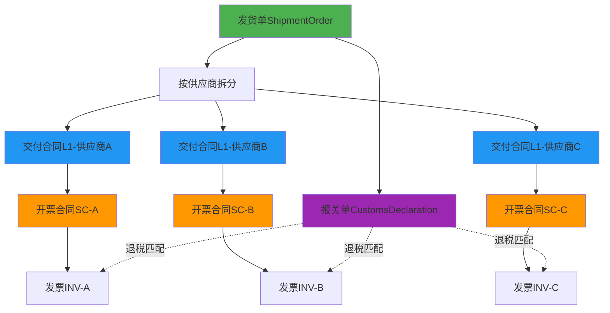
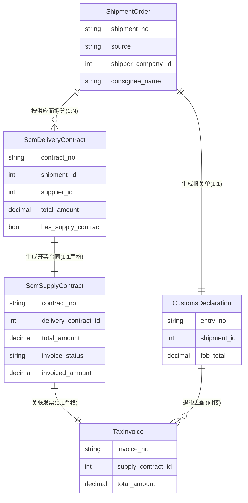

# 发货单驱动的双轨制合同系统设计方案

**版本**: v2.0  
**日期**: 2025-12-17  
**状态**: 设计评审  
**更新**: 强化严格1对1关系，删除合并开票方案  

---

## 📢 v2.0 核心更新说明

**🔴 重大设计调整：删除"合并开票"方案，强化严格1对1关系**

### 为什么不合并开票？

**错误做法 ❌：** N个交付合同 → 1个开票合同 → 1张发票（合并开票）

**问题：**
- 🔴 退税归档困难：1张发票原件无法同时归档到N个报关单档案盒
- 🔴 三单匹配失败：税务系统无法录入"1发票→N报关单"关系
- 🔴 发票作废风险：1个报关单有问题，整张发票作废影响其他正常报关单

**正确做法 ✅：** N个交付合同 → N个开票合同 → N张发票（严格1对1）

**优势：**
- ✅ 每个报关单都有完整配套材料（发票原件）
- ✅ 系统自动三单匹配，符合退税申报规范
- ✅ 独立处理，互不影响

### 月结供应商怎么办？

**解决方案：批量操作 ≠ 合并开票**

- **UI层**：提供批量生成、批量下载、批量上传工具，简化操作流程
- **数据层**：保持严格1对1关系，确保税务合规

**示例：**
```
月底批量操作：
1. 财务点击"批量生成开票合同" → 系统生成3个独立合同
2. 供应商收到通知 → 开具3张独立发票
3. 财务批量上传发票 → 系统自动匹配（INV-001→SC-001, INV-002→SC-002, ...）
4. 退税归档 → 每个报关单都有完整材料
```

**详见：**
- 1.3 核心设计原则
- 2.3 月结供应商的批量处理方案
- 案例3：月结供应商批量处理

---

## 一、文档概述

### 1.1 背景

在跨境电商出口业务中，存在以下核心痛点：

1. **物流与票据分离**：实际发货的商品（散件）与供应商开票品名（整机）不一致
2. **多供应商集货**：一个出口集装箱包含多个供应商的货物
3. **出口退税归档**：每个报关单需要完整的配套发票，不可交叉使用
4. **税务合规要求**：出口退税需要"报关单-发票-合同"三单匹配

### 1.2 设计目标

建立**"双轨制合同体系"**，在保证税务合规的前提下，实现业务灵活性：

- ✅ **交付合同（L1）**：记录真实的物理交付，用于业务对账
- ✅ **开票合同（Supply Contract）**：记录财务票据信息，用于开票结算
- ✅ **核心约束**：两种合同总金额必须严格一致

### 1.3 核心设计原则 ⭐

#### 严格1对1关系（关键设计决策）

```
1个交付合同 ← 1对1 → 1个开票合同 ← 1对1 → 1张发票
```

**为什么不采用"合并开票"（N个交付合同 → 1个开票合同）？**

| 问题维度 | 合并开票的严重缺陷 | 1对1的优势 |
|---------|------------------|-----------|
| **退税归档** | 🔴 1张发票对应N个报关单，无法决定发票原件归档位置 | ✅ 每个报关单档案盒都有完整配套发票 |
| **三单匹配** | 🔴 税务系统无法录入"1发票→N报关单"关系 | ✅ 系统自动匹配，符合退税申报规范 |
| **发票作废** | 🔴 1个报关单有问题，整张发票作废，影响其他正常报关单 | ✅ 独立处理，互不影响 |
| **财务对账** | 🔴 需要拆分明细，付款状态模糊 | ✅ 每张发票状态清晰，催款明确 |
| **税务稽查** | 🟡 需要大量说明材料解释交叉关系 | ✅ 快速核对，单据不交叉 |

**国家税务总局要求（国税发〔2012〕24号）：**
> "出口企业应**按出口报关单**进行退税申报"

**实践指导原则：**
- ✅ **一个报关单一套完整材料**（发货单+交付合同+开票合同+发票）
- ✅ **单据不交叉使用**（避免复印件、避免拆分发票）
- ✅ **状态独立管理**（每个合同/发票状态独立，不连锁影响）

---

## 二、业务流程设计

### 2.1 总体流程图



### 2.2 详细步骤

#### Step 1: 发货单创建与确认

**来源渠道：**
1. 手工创建
2. Excel 批量导入
3. 领星 ERP API 同步
4. 易仓 WMS API 同步

**关键数据：**
```json
{
  "shipment_no": "SH-20241217-001",
  "shipper_company_id": 1,
  "consignee_name": "US客户",
  "items": [
    {
      "sku": "P001",
      "product_name": "零件A",
      "supplier_id": 10,
      "quantity": 100,
      "unit_price": 50
    },
    {
      "sku": "P002",
      "product_name": "零件B",
      "supplier_id": 10,
      "quantity": 200,
      "unit_price": 50
    }
  ]
}
```

#### Step 2: 自动生成交付合同（按供应商拆分）

**系统逻辑：**
```python
# 伪代码
def generate_delivery_contracts(shipment):
    # 按 supplier_id 分组
    grouped_items = group_by(shipment.items, 'supplier_id')
    
    contracts = []
    for supplier_id, items in grouped_items:
        contract = ScmDeliveryContract(
            shipment_id=shipment.id,
            supplier_id=supplier_id,
            total_amount=sum(item.total_price for item in items),
            items=items
        )
        contracts.append(contract)
    
    return contracts
```

**生成结果：**
```json
{
  "contract_no": "DC-20241217-001",
  "shipment_id": 123,
  "supplier_id": 10,
  "total_amount": 15000,
  "items": [
    { "product_name": "零件A", "qty": 100, "unit": "个", "price": 50 },
    { "product_name": "零件B", "qty": 200, "unit": "个", "price": 50 }
  ]
}
```

#### Step 3: 生成开票合同

**模式A：自动复制（标准流程）**
```python
# 品名、数量、单位完全一致
supply_contract = copy(delivery_contract)
```

**模式B：手工调整（特殊场景）**
```python
# 允许调整品名/数量/单位，但必须满足：
assert supply_contract.total_amount == delivery_contract.total_amount
if supply_contract.items != delivery_contract.items:
    require supply_contract.notes  # 强制填写说明
```

**调整示例：**
```json
// 交付合同（实际发货）
{
  "items": [
    { "product_name": "零件A", "qty": 100, "unit": "个", "total": 5000 },
    { "product_name": "零件B", "qty": 200, "unit": "个", "total": 10000 }
  ],
  "total_amount": 15000
}

// 开票合同（按整机开票）
{
  "items": [
    { "product_name": "汽车制动系统总成", "qty": 30, "unit": "台", "total": 15000 }
  ],
  "total_amount": 15000,  // ✅ 金额一致
  "notes": "按整机开票，实际交付为散件，详见交付合同DC-20241217-001"
}
```

#### Step 4: 通知供应商开票

**开票通知单：**
- 附件1：开票合同（正式文件）
- 附件2：交付合同（对账参考）
- 说明：请按开票合同品名/数量开具增值税专用发票

#### Step 5: 录入发票并挂载

```python
TaxInvoice {
  invoice_no: "INV-2024-001",
  supply_contract_id: SC.id,  # 关联开票合同
  amount: 15000,
  tax_amount: 1950,  # 13%
  total_amount: 16950,
  items: [...]  # 发票明细必须与开票合同一致
}

# 更新开票合同状态
supply_contract.invoiced_amount += invoice.amount
supply_contract.invoice_status = 'invoiced'
```

#### Step 6: 生成报关单（并行）

```python
# 从发货单生成报关单（不区分供应商）
CustomsDeclaration {
  shipment_id: shipment.id,
  items: [...]  # 所有商品明细
}
```

---

### 2.3 月结供应商的批量处理方案

#### 问题场景

月结供应商本月可能有多次交付（如3次），如果严格1对1，是否需要开3张发票，增加供应商工作量？

#### 解决方案：批量操作 ≠ 合并开票

**核心思路：** 保持数据独立（N个合同→N张发票），但提供批量操作界面简化操作流程。

##### 方案A：批量生成开票合同

```python
def batch_create_supply_contracts(supplier_id, month):
    """月底批量生成该供应商的所有开票合同"""
    
    # 查询本月所有未开票的交付合同
    delivery_contracts = ScmDeliveryContract.query.filter(
        ScmDeliveryContract.supplier_id == supplier_id,
        ScmDeliveryContract.delivery_date.between(month_start, month_end),
        ScmDeliveryContract.has_supply_contract == False
    ).all()
    
    # 批量创建（但每个都是独立的1对1关系）
    supply_contracts = []
    for dc in delivery_contracts:
        sc = create_supply_contract(dc)  # 严格1对1
        supply_contracts.append(sc)
    
    # 批量通知供应商（一次性发送N个开票通知）
    notify_supplier_batch(supplier_id, supply_contracts)
    
    return supply_contracts
```

**效果：**
- ✅ 供应商一次性收到通知（包含N个开票合同）
- ✅ 供应商开N张独立发票
- ✅ 但每张发票都有明确的归属（1个报关单 → 1套完整材料）

##### 方案B：供应商协同平台

```typescript
// 供应商登录界面
┌─────────────────────────────────────────────────┐
│ 【供应商A】本月待开票合同列表                      │
├─────────────────────────────────────────────────┤
│ ☑ 开票合同SC-001  ¥30,000  交付日期:12/5         │
│ ☑ 开票合同SC-002  ¥40,000  交付日期:12/15        │
│ ☑ 开票合同SC-003  ¥30,000  交付日期:12/25        │
├─────────────────────────────────────────────────┤
│ 总计：3个合同，合计金额：¥100,000                  │
├─────────────────────────────────────────────────┤
│ [批量下载合同PDF] [批量上传发票] [确认完成]        │
└─────────────────────────────────────────────────┘

操作流程：
1. 点击"批量下载" → 下载3个合同PDF（打包成ZIP）
2. 供应商在自己的开票系统开3张独立发票
3. 点击"批量上传" → 一次性上传3张发票扫描件
4. 系统自动关联：
   - INV-001（30万）→ SC-001
   - INV-002（40万）→ SC-002
   - INV-003（30万）→ SC-003
```

**优势：**
- ✅ 用户体验：供应商感觉是"批量处理"，操作便捷
- ✅ 数据结构：底层是独立的1对1关系，税务合规
- ✅ 系统智能：自动按金额/日期匹配发票与合同

##### 方案C：月度对账单（视图层聚合）

```python
# 月度对账单（仅用于展示和对账，不影响数据结构）
def generate_monthly_statement(supplier_id, month):
    """生成月度对账单"""
    
    contracts = ScmSupplyContract.query.filter(
        ScmSupplyContract.supplier_id == supplier_id,
        ScmSupplyContract.contract_date.between(month_start, month_end)
    ).all()
    
    return {
        "supplier": supplier,
        "month": month,
        "summary": {
            "total_contracts": len(contracts),
            "total_amount": sum(c.total_amount for c in contracts),
            "invoiced_count": len([c for c in contracts if c.invoice_status == 'invoiced']),
            "pending_count": len([c for c in contracts if c.invoice_status == 'uninvoiced'])
        },
        "details": contracts  # 每个合同独立展示
    }
```

**对账单示例：**
```
=================================
     供应商A - 2024年12月对账单
=================================
合同明细：
├── SC-001  12/5   ¥30,000  [已开票 INV-001]
├── SC-002  12/15  ¥40,000  [已开票 INV-002]
└── SC-003  12/25  ¥30,000  [待开票]

汇总信息：
- 合同总数：3个
- 合同总额：¥100,000
- 已开票：2个（¥70,000）
- 待开票：1个（¥30,000）

说明：虽然是月度汇总，但每个合同和发票都是独立的，
     便于出口退税时按报关单进行档案归档。
=================================
```

**价值：**
- ✅ 满足月结需求（月度视图汇总）
- ✅ 保持数据独立（底层1对1）
- ✅ 便于对账催款（状态清晰）

---

## 三、数据模型设计

### 3.1 核心实体关系



### 3.2 表结构详细设计

#### 表1：发货单（shipment_orders）

| 字段名 | 类型 | 说明 |
|-------|------|------|
| id | bigint | 主键 |
| shipment_no | varchar(50) | 发货单号（唯一） |
| source | varchar(20) | 来源：manual/excel/lingxing/yicang |
| external_order_no | varchar(100) | 外部订单号 |
| shipper_company_id | bigint | 发货公司ID |
| consignee_name | varchar(255) | 收货人名称 |
| consignee_country | varchar(100) | 收货国家 |
| status | varchar(20) | 状态：draft/confirmed/declared/contracted |
| is_declared | boolean | 是否已生成报关单 |
| is_contracted | boolean | 是否已生成交付合同 |
| total_amount | decimal(18,2) | 总金额 |
| created_at | timestamp | 创建时间 |

#### 表2：交付合同（scm_delivery_contracts）

| 字段名 | 类型 | 约束 | 说明 |
|-------|------|------|------|
| id | bigint | PK | 主键 |
| contract_no | varchar(50) | UNIQUE | 合同号（唯一） |
| shipment_id | bigint | FK | 关联发货单 |
| supplier_id | bigint | FK | 供应商ID |
| total_amount | decimal(18,2) | NOT NULL | 总金额 |
| currency | varchar(10) | DEFAULT 'CNY' | 币种（默认CNY） |
| status | varchar(20) | | 状态 |
| has_supply_contract | boolean | DEFAULT FALSE | 是否已生成开票合同（冗余字段，方便查询） |
| delivery_date | date | | 交付日期 |
| created_at | timestamp | | 创建时间 |

**关键说明：**
- `has_supply_contract` 是冗余字段，可通过反查 `ScmSupplyContract` 获得，但为了查询性能保留
- 通过 `supply_contract.delivery_contract_id` 的反向关系判断是否已开票

#### 表3：交付合同明细（scm_delivery_contract_items）

| 字段名 | 类型 | 说明 |
|-------|------|------|
| id | bigint | 主键 |
| contract_id | bigint | 合同ID |
| product_id | bigint | 产品ID |
| sku | varchar(100) | SKU |
| product_name | varchar(255) | 实际商品名称 |
| quantity | decimal(12,4) | 数量 |
| unit | varchar(20) | 单位 |
| unit_price | decimal(18,4) | 单价 |
| total_price | decimal(18,2) | 小计 |

#### 表4：开票合同（scm_supply_contracts）

| 字段名 | 类型 | 约束 | 说明 |
|-------|------|------|------|
| id | bigint | PK | 主键 |
| contract_no | varchar(50) | UNIQUE | 合同号（唯一） |
| delivery_contract_id | bigint | FK, **UNIQUE** | 关联交付合同（1对1，唯一约束） |
| supplier_id | bigint | FK | 供应商ID |
| total_amount | decimal(18,2) | NOT NULL | 总金额（必须与L1一致） |
| tax_rate | decimal(5,4) | | 税率 |
| total_amount_with_tax | decimal(18,2) | | 含税总额 |
| status | varchar(20) | | 状态 |
| invoice_status | varchar(20) | | 开票状态：uninvoiced/partial/invoiced |
| invoiced_amount | decimal(18,2) | DEFAULT 0 | 已开票金额 |
| notes | text | | 开票说明（必填，如果调整了品名/数量） |
| contract_date | date | | 合同日期 |
| created_at | timestamp | | 创建时间 |

**关键约束说明：**
- `delivery_contract_id` 添加 **UNIQUE 约束**，强制实现严格的1对1关系
- 一个交付合同只能生成一个开票合同，防止重复开票
- 删除了"合并开票"相关的 `related_contracts` 字段

#### 表5：开票合同明细（scm_supply_contract_items）

| 字段名 | 类型 | 说明 |
|-------|------|------|
| id | bigint | 主键 |
| contract_id | bigint | 开票合同ID |
| product_name | varchar(255) | 开票商品名称 |
| specification | varchar(255) | 规格型号 |
| quantity | decimal(12,4) | 数量 |
| unit | varchar(20) | 单位 |
| unit_price | decimal(18,4) | 单价 |
| total_price | decimal(18,2) | 小计 |
| tax_amount | decimal(18,2) | 税额 |
| source_delivery_item_ids | jsonb | 源交付合同明细ID列表（溯源） |

#### 表6：发票（tax_invoices）

| 字段名 | 类型 | 约束 | 说明 |
|-------|------|------|------|
| id | bigint | PK | 主键 |
| invoice_no | varchar(50) | UNIQUE | 发票号码（唯一） |
| invoice_code | varchar(50) | | 发票代码 |
| supply_contract_id | bigint | FK | 关联开票合同 |
| supplier_id | bigint | FK | 供应商ID |
| amount | decimal(18,2) | NOT NULL | 不含税金额 |
| tax_amount | decimal(18,2) | | 税额 |
| total_amount | decimal(18,2) | | 价税合计 |
| invoice_type | varchar(20) | | 发票类型 |
| status | varchar(20) | DEFAULT 'valid' | 状态：valid/cancelled |
| invoice_date | date | | 开票日期 |
| received_date | date | | 收票日期 |
| attachment_url | varchar(255) | | 发票扫描件 |

**关键说明：**
- **标准流程**：1个开票合同 → 1张发票（1对1）
- **特殊情况**：1个开票合同可能分多张发票开具（1对多），此时需更新 `supply_contract.invoiced_amount`
- **强烈推荐**：遵循1对1原则，避免分批开票增加复杂度

---

## 四、税务合规性评估

### 4.1 税法依据

#### 📜 相关法规

1. **《中华人民共和国增值税暂行条例》**
   - 第二十一条：纳税人购进货物或者接受应税劳务，应当向销售方取得增值税专用发票

2. **《出口货物劳务增值税和消费税管理办法》（国家税务总局公告2012年第24号）**
   - 第四条：出口企业应在货物报关出口之日次月起至次年4月30日前的各增值税纳税申报期内申报退税

3. **《关于〈出口货物劳务增值税和消费税管理办法〉有关问题的公告》**
   - 要求"出口货物报关单"、"进货发票"、"采购合同"三单匹配

### 4.2 合规性分析

#### ✅ **合规点**

| 合规要求 | 系统设计 | 说明 |
|---------|---------|------|
| **金额一致性** | ✅ 强制校验 | 交付合同与开票合同总金额必须一致 |
| **发票合法性** | ✅ 录入验证 | 发票必须来自合法供应商，系统记录发票代码/号码 |
| **三单匹配** | ✅ 数据关联 | 报关单 ← 发货单 → 交付合同 → 开票合同 → 发票 |
| **真实交易** | ✅ 业务溯源 | 交付合同记录真实交易，可对账验证 |
| **附件完整** | ✅ 附件管理 | 交付合同作为开票合同附件保存 |

#### ⚠️ **潜在风险点**

| 风险点 | 风险等级 | 描述 | 应对措施 |
|-------|---------|------|---------|
| **品名不一致** | 🔴 高 | 发票品名与实际交易不符，可能被认定为虚开 | 1. 开票合同必须填写说明<br>2. 保留交付合同作为真实交易证明<br>3. 供应商需提供"品名调整说明函" |
| **数量差异** | 🟡 中 | 发票数量与实际交货不符 | 1. 系统强制要求填写换算关系<br>2. 保留发货单/装箱单原始单据 |
| **单位转换** | 🟡 中 | 发票单位与采购单位不同 | 1. 记录换算比例（如：30台 = 3000个零件）<br>2. 审计时提供计算依据 |
| **税务稽查** | 🟡 中 | 税务局可能要求解释"双合同"原因 | 1. 准备业务场景说明文档<br>2. 提供完整的单据链路证明 |

### 4.3 税务稽查应对方案

#### 📋 **标准答复模板**

**问题：为何同一笔业务有两份合同（交付合同+开票合同）？**

**答复要点：**

> 尊敬的税务机关：
> 
> 我司出口业务中采用"交付合同+开票合同"双合同模式，系基于以下**正当商业理由**：
> 
> 1. **业务真实性**：交付合同记录真实的货物交付明细，用于仓库对账、质量追溯
> 
> 2. **开票合理性**：因供应商开票系统限制（如：ERP只能按整机开票，无法按零件开票），我司与供应商协商调整开票品名/数量，但**总金额保持不变**
> 
> 3. **完整证据链**：
>    - 发货单（ShipmentOrder） → 证明货物实际发出
>    - 交付合同（L1） → 证明真实交易，可与发货单/装箱单核对
>    - 开票合同（Supply Contract） → 供应商开票依据
>    - 增值税专用发票 → 按开票合同开具
>    - 出口报关单 → 与发货单一致
> 
> 4. **税务合规**：
>    - ✅ 交付合同总额 = 开票合同总额（金额一致）
>    - ✅ 发票金额 = 开票合同金额（发票真实）
>    - ✅ 已取得合法增值税专用发票
>    - ✅ 报关单数据真实，可与实际出口货物核对
> 
> 附件：
> - 交付合同PDF
> - 开票合同PDF
> - 发货单/装箱单
> - 增值税专用发票扫描件
> - 出口报关单
> - 供应商"品名调整说明函"（如有）

### 4.4 税务合规建议

#### 🔒 **强制措施**

1. **系统强制校验**
   ```python
   # 开票合同提交前
   def validate_supply_contract(sc, dc):
       # 1. 严格1对1检查（数据库层也有UNIQUE约束）
       existing = ScmSupplyContract.query.filter_by(
           delivery_contract_id=sc.delivery_contract_id
       ).first()
       if existing and existing.id != sc.id:
           raise ValidationError("该交付合同已生成开票合同，禁止重复开票")
       
       # 2. 金额必须一致
       if sc.total_amount != dc.total_amount:
           raise ValidationError("开票合同金额必须与交付合同一致")
       
       # 3. 如果品名/数量不同，必须填写说明
       if sc.items != dc.items and not sc.notes:
           raise ValidationError("调整品名/数量时必须填写业务说明")
       
       # 4. 开票合同必须关联交付合同
       if not sc.delivery_contract_id:
           raise ValidationError("开票合同必须关联交付合同")
   ```

2. **审计日志**
   - 记录所有"品名/数量调整"操作
   - 保留操作人、操作时间、调整原因

3. **附件强制上传**
   - 开票合同必须附：交付合同PDF
   - 如有品名调整，强制上传：供应商说明函

#### 📝 **操作规范**

1. **命名规则**
   ```
   交付合同：DC-[日期]-[流水号]
   开票合同：SC-[日期]-[流水号]
   说明：命名规则体现两者关联性
   ```

2. **档案管理**
   ```
   档案盒目录结构：
   ├── 发货单 ShipmentOrder
   ├── 交付合同 DeliveryContract
   ├── 开票合同 SupplyContract (附：交付合同作为附件)
   ├── 增值税专用发票
   ├── 出口报关单
   └── 其他辅助单据（装箱单/提单等）
   ```

3. **定期自查**
   - 每月核对：交付合同总额 = 开票合同总额
   - 每季度核对：发票金额 = 开票合同金额
   - 每年审计：抽查"品名调整"合理性

---

## 五、业务风险与改进建议

### 5.1 核心风险矩阵

| 风险类型 | 风险描述 | 发生概率 | 影响程度 | 风险等级 | 应对策略 |
|---------|---------|---------|---------|---------|---------|
| **合并开票风险** ⭐ | N个交付合同合并开票导致退税归档失败 | 🔴 高(如允许) | 🔴 高 | 🔴 **极高危** | 🔒 **系统层面禁止**：delivery_contract_id添加UNIQUE约束 |
| **虚开发票风险** | 品名/数量与实际交易严重不符 | 🟡 中 | 🔴 高 | 🔴 **高危** | 1. 限制调整幅度（如：品名调整需领导审批）<br>2. 保留真实交易证据<br>3. 供应商出具说明函 |
| **税务稽查风险** | "双合同"被质疑为虚构交易 | 🟡 中 | 🟡 中 | 🟡 **中危** | 1. 准备标准答复模板<br>2. 完整保留单据链路<br>3. 定期税务自查 |
| **操作失误风险** | 人工调整时金额不一致 | 🟢 低 | 🟡 中 | 🟢 **低危** | 1. 系统强制校验<br>2. 审批流程 |
| **数据追溯风险** | 历史数据无法溯源到真实交易 | 🟡 中 | 🟡 中 | 🟡 **中危** | 1. source_delivery_item_ids字段溯源<br>2. 归档完整单据 |
| **供应商配合风险** | 供应商拒绝按调整后品名开票 | 🟡 中 | 🟢 低 | 🟢 **低危** | 1. 事前沟通确认<br>2. 签订补充协议 |

### 5.2 业务操作注意事项

#### ⚠️ **严禁的操作**

| 禁止行为 | 后果 | 正确做法 |
|---------|-----|---------|
| ❌ **合并开票（N个交付合同→1个开票合同）** ⭐ | 退税归档失败/三单匹配失败 | ✅ **严格1对1**，使用批量操作简化流程 |
| ❌ 调整总金额 | 虚开发票/偷逃税款 | ✅ 总金额必须与交付合同一致 |
| ❌ 完全虚构品名 | 虚开发票/税务稽查 | ✅ 品名调整需有业务依据（如：零件→整机） |
| ❌ 删除交付合同 | 无法证明真实交易 | ✅ 交付合同作为附件永久保留 |
| ❌ 跨供应商合并开票 | 发票与实际交易主体不符 | ✅ 一个开票合同只能对应一个供应商 |
| ❌ 无说明调整数量 | 审计时无法解释 | ✅ 调整时必须填写业务说明 |
| ❌ 绕过系统重复生成开票合同 | 重复开票 | ✅ delivery_contract_id有UNIQUE约束防止 |

#### ✅ **推荐的操作**

1. **标准流程优先**
   - 80%的业务应走"自动复制"模式（品名/数量不变）
   - 只有在供应商明确要求时才走"手工调整"模式

2. **调整规则限制**
   ```python
   # 建议的调整范围
   允许调整：
   - 品名：零件 → 整机（合并）
   - 数量：散件数量 → 整机数量（换算）
   - 单位：个/kg → 台/套（换算）
   
   禁止调整：
   - 总金额
   - 供应商
   - 核心HS编码分类
   ```

3. **审批流程**
   ```mermaid
   graph LR
       A[创建开票合同] --> B{是否调整?}
       B -->|否| C[自动通过]
       B -->|是| D[财务审核]
       D --> E[领导审批]
       E --> F[通知供应商开票]
   ```

### 5.3 系统改进建议

#### 🚀 **短期优化（1个月内）**

1. **批量操作工具集** ⭐
   ```typescript
   // 月结供应商批量处理界面
   interface BatchOperations {
     // 批量生成开票合同
     batchCreateSupplyContracts(
       supplier_id: number,
       delivery_contract_ids: number[]
     ): Promise<SupplyContract[]>
     
     // 批量下载合同PDF（打包成ZIP）
     batchDownloadContracts(
       contract_ids: number[]
     ): Promise<Blob>
     
     // 批量上传发票（OCR识别 + 智能匹配）
     batchUploadInvoices(
       files: File[]
     ): Promise<MatchResult[]>
     
     // 生成月度对账单
     generateMonthlyStatement(
       supplier_id: number,
       month: string
     ): Promise<Statement>
   }
   ```

2. **智能预警系统**
   ```python
   # 开票合同创建时
   if supply_contract.product_name != delivery_contract.product_name:
       alert("⚠️ 品名调整，请填写业务说明并上传供应商函件")
   
   if abs(supply_contract.quantity - delivery_contract.quantity) / delivery_contract.quantity > 0.1:
       alert("⚠️ 数量差异超过10%，需领导审批")
   ```

4. **自动生成说明模板**
   ```
   系统检测到品名调整：
   [实际交付] 零件A(100个) + 零件B(200个)
   [开票调整] 汽车制动系统总成(30台)
   
   建议说明模板：
   "因供应商开票系统限制，实际交付的零件A、零件B按整机'汽车制动系统总成'开票。
   换算关系：1台整机 = 零件A(3.33个) + 零件B(6.67个)。
   总金额保持不变(¥15,000)。真实交易详见交付合同DC-20241217-001。"
   ```

5. **发票OCR识别**
   - 自动提取发票品名/金额
   - 与开票合同自动比对
   - 不符时预警

#### 🔥 **中期优化（3个月内）**

1. **供应商协同平台**
   ```
   供应商登录系统 → 查看待开票合同列表（批量） → 批量下载合同PDF
   → 开具多张独立发票 → 批量上传发票扫描件 → 系统自动匹配
   ```

2. **月度对账单生成器**
   ```python
   # 自动生成月度对账单（视图层聚合）
   def generate_monthly_statement(supplier_id, month):
       """按供应商+月份生成对账单"""
       contracts = get_contracts_by_month(supplier_id, month)
       return {
           "summary": {
               "total_contracts": len(contracts),
               "total_amount": sum(c.total_amount for c in contracts),
               "invoiced": filter(lambda c: c.invoice_status == 'invoiced', contracts),
               "pending": filter(lambda c: c.invoice_status == 'uninvoiced', contracts)
           },
           "details": contracts  # 每个合同独立展示
       }
   ```

3. **税务风控引擎**
   ```python
   # 定期自动检查
   checks = [
       "交付合同总额 = 开票合同总额",
       "开票合同总额 = 发票总额",
       "品名调整比例 < 20%",
       "数量调整有说明",
       "高风险调整已审批",
       "delivery_contract_id唯一性约束"  # 防止重复开票
   ]
   ```

4. **智能匹配算法**
   ```python
   # 发票与开票合同的智能匹配（支持批量）
   def match_invoice_to_contract(invoice):
       # 1. 基于合同号精确匹配
       # 2. 基于供应商+金额模糊匹配（自动匹配多张发票）
       # 3. 基于时间窗口+品名相似度匹配
       # 4. 人工干预（显示候选列表）
   ```

#### ⚡ **长期优化（6个月内）**

1. **批量操作的高级功能**
   ```python
   # 智能建议系统
   def suggest_batch_operations(supplier_id):
       """根据历史数据预测月底需要批量开票"""
       
       # 分析供应商开票习惯
       patterns = analyze_invoice_patterns(supplier_id)
       
       if patterns.is_monthly_settlement:
           # 月底自动提醒
           notify("供应商{}有{}个待开票合同，建议批量处理".format(
               supplier_id,
               pending_contracts_count
           ))
   ```

3. **区块链存证**
   - 关键单据（交付合同/开票合同/发票）上链
   - 防止篡改，增强公信力
   - 支持批量存证（月结场景）

4. **AI税务合规审查**
   ```python
   # 训练模型识别"虚开风险"
   risk_score = ai_model.predict({
       "product_name_similarity": 0.3,  # 品名相似度低
       "quantity_ratio": 10,  # 数量比例异常
       "supplier_history": "normal"  # 供应商历史正常
   })
   
   if risk_score > 0.8:
       alert("🔴 高风险，建议人工复核")
   ```

5. **税务数据报送接口**
   - 对接税务局"金税四期"系统
   - 自动报送三单匹配数据

---

## 六、实施路线图

### 6.1 Phase 1：基础架构（2周）

**目标：** 搭建双轨制合同基础框架

**交付物：**
- ✅ 数据库表创建（6张核心表）
- ✅ 基础API（CRUD）
- ✅ 前端页面框架

**验收标准：**
- 能创建发货单
- 能自动生成交付合同（按供应商拆分）
- 能手工创建开票合同

### 6.2 Phase 2：核心功能（3周）

**目标：** 实现完整业务流程

**交付物：**
- ✅ 开票合同自动/手工模式
- ✅ 金额一致性强制校验
- ✅ 发票录入与挂载
- ✅ 审批流程
- ✅ **批量操作功能**（月结供应商支持）

**验收标准：**
- 能完成"发货单 → 交付合同 → 开票合同 → 发票"全流程
- 金额不一致时无法提交
- 调整品名/数量时必须填写说明
- **能批量生成多个开票合同并通知供应商**
- **能批量上传发票并自动匹配合同**

### 6.3 Phase 3：风控优化（2周）

**目标：** 税务合规与风险防控

**交付物：**
- ✅ 智能预警系统
- ✅ 审计日志
- ✅ 单据归档管理
- ✅ 税务自查报表

**验收标准：**
- 高风险操作自动预警
- 所有调整操作可追溯
- 能导出税务稽查所需材料

### 6.4 Phase 4：集成优化（2周）

**目标：** 外部系统对接

**交付物：**
- ✅ 领星/易仓 API 对接
- ✅ 供应商协同平台
- ✅ 发票 OCR 识别

**验收标准：**
- 能自动同步外部订单
- 供应商能在线确认开票信息
- 发票自动识别并比对

---

## 七、案例演示

### 案例1：标准流程（无调整）

**业务场景：** 向供应商A采购汽车零件，品名/数量与开票一致

**操作步骤：**

1. **创建发货单**
   ```
   发货单号：SH-20241217-001
   供应商：A公司
   商品：制动器总成 × 100个
   金额：¥50,000
   ```

2. **自动生成交付合同**
   ```
   合同号：DC-20241217-001
   品名：制动器总成
   数量：100个
   金额：¥50,000
   ```

3. **自动生成开票合同（模式：自动复制）**
   ```
   合同号：SC-20241217-001
   品名：制动器总成（与L1一致）
   数量：100个（与L1一致）
   金额：¥50,000（与L1一致）
   说明：无需调整
   ```

4. **供应商开票**
   ```
   发票号：INV-2024-001
   品名：制动器总成
   数量：100个
   金额：¥50,000
   税额：¥6,500（13%）
   价税合计：¥56,500
   ```

5. **结果**
   - ✅ 三单完全匹配
   - ✅ 税务零风险
   - ✅ 操作最简化

---

### 案例2：复杂流程（品名调整）

**业务场景：** 采购零件，但供应商要求按整机开票

**操作步骤：**

1. **创建发货单**
   ```
   发货单号：SH-20241217-002
   供应商：B公司
   商品1：前制动盘 × 100个 @ ¥50 = ¥5,000
   商品2：后制动盘 × 200个 @ ¥50 = ¥10,000
   总金额：¥15,000
   ```

2. **自动生成交付合同**
   ```
   合同号：DC-20241217-002
   品名：前制动盘(100个) + 后制动盘(200个)
   总金额：¥15,000
   ```

3. **手工创建开票合同（模式：手工调整）**
   ```
   合同号：SC-20241217-002
   品名：汽车制动系统总成（调整）
   数量：30台（调整）
   金额：¥15,000（不变 ✅）
   
   说明：
   "因供应商B公司开票系统限制，实际交付的前制动盘、后制动盘
   按整机'汽车制动系统总成'开票。
   
   换算关系：
   1台整机 = 前制动盘(3.33个) + 后制动盘(6.67个)
   
   总金额保持不变(¥15,000)。
   真实交易详见交付合同DC-20241217-002。"
   
   附件：
   - 交付合同PDF
   - 供应商开票说明函（B公司盖章）
   ```

4. **系统校验**
   ```
   ✅ 金额一致：DC.total_amount == SC.total_amount
   ✅ 说明已填写：SC.notes != null
   ⚠️ 品名差异预警：已上传供应商说明函
   ✅ 审批通过：财务经理已审核
   ```

5. **供应商开票**
   ```
   发票号：INV-2024-002
   品名：汽车制动系统总成（按开票合同）
   数量：30台
   金额：¥15,000
   税额：¥1,950（13%）
   价税合计：¥16,950
   ```

6. **税务档案**
   ```
   档案袋：
   ├── 发货单 SH-20241217-002（证明实际发出零件）
   ├── 交付合同 DC-20241217-002（证明真实交易）
   ├── 开票合同 SC-20241217-002（开票依据）
   │   └── 附件：交付合同PDF + 供应商说明函
   ├── 增值税专用发票 INV-2024-002
   └── 业务说明备忘录
   ```

7. **结果**
   - ✅ 单据链路完整
   - ✅ 业务说明充分
   - ✅ 税务可解释

---

### 案例3：月结供应商批量处理

**业务场景：** 供应商C是月结客户，本月有3次交付，月底统一开票

**数据准备：**

| 发货单 | 交付日期 | 交付合同 | 商品 | 金额 |
|-------|---------|---------|-----|-----|
| SH-001 | 12/5 | DC-001 | 零件A × 100 | ¥30,000 |
| SH-002 | 12/15 | DC-002 | 零件B × 200 | ¥40,000 |
| SH-003 | 12/25 | DC-003 | 零件C × 150 | ¥30,000 |

**操作步骤：**

1. **12月30日：财务批量生成开票合同**
   ```python
   # 系统操作
   batch_create_supply_contracts(
       supplier_id=100,  # 供应商C
       month='2024-12'
   )
   
   # 生成结果
   SC-001 ← DC-001  ¥30,000
   SC-002 ← DC-002  ¥40,000
   SC-003 ← DC-003  ¥30,000
   ```

2. **系统自动通知供应商**
   ```
   邮件标题：【12月开票通知】待开票合同3个，合计¥100,000
   
   附件：
   - 开票合同SC-001.pdf
   - 开票合同SC-002.pdf
   - 开票合同SC-003.pdf
   
   说明：请按各合同分别开具增值税专用发票（共3张）
   ```

3. **供应商开票（一次性开3张独立发票）**
   ```
   INV-001：¥30,000 + 税¥3,900 = ¥33,900
   INV-002：¥40,000 + 税¥5,200 = ¥45,200
   INV-003：¥30,000 + 税¥3,900 = ¥33,900
   ```

4. **财务批量录入发票**
   ```
   使用批量上传功能：
   1. 拖入3个发票PDF文件
   2. OCR自动识别发票号、金额
   3. 系统自动匹配：
      - INV-001 → SC-001（金额匹配）
      - INV-002 → SC-002（金额匹配）
      - INV-003 → SC-003（金额匹配）
   4. 确认后批量保存
   ```

5. **退税归档（各自独立）**
   ```
   档案盒1（报关单对应SH-001）：
   ├── 报关单
   ├── 发货单 SH-001
   ├── 交付合同 DC-001
   ├── 开票合同 SC-001
   └── 发票原件 INV-001  ✅ 完整材料
   
   档案盒2（报关单对应SH-002）：
   ├── 报关单
   ├── 发货单 SH-002
   ├── 交付合同 DC-002
   ├── 开票合同 SC-002
   └── 发票原件 INV-002  ✅ 完整材料
   
   档案盒3（报关单对应SH-003）：
   ├── 报关单
   ├── 发货单 SH-003
   ├── 交付合同 DC-003
   ├── 开票合同 SC-003
   └── 发票原件 INV-003  ✅ 完整材料
   ```

6. **月度对账视图**
   ```
   供应商C - 2024年12月对账单
   ────────────────────────────
   合同编号    日期    金额        状态
   SC-001    12/5   ¥30,000    ✅ 已开票(INV-001) 已付款
   SC-002    12/15  ¥40,000    ✅ 已开票(INV-002) 待付款
   SC-003    12/25  ¥30,000    ✅ 已开票(INV-003) 待付款
   ────────────────────────────
   合计：3个合同，¥100,000
   已付款：¥30,000
   待付款：¥70,000
   ```

**关键优势：**
- ✅ **供应商体验**：月底一次性通知，批量操作，便捷高效
- ✅ **税务合规**：每个报关单都有完整配套发票，符合退税要求
- ✅ **状态独立**：DC-002退税有问题，不影响DC-001和DC-003
- ✅ **对账清晰**：每个合同状态独立，催款目标明确
- ✅ **系统智能**：批量上传发票后自动匹配，无需人工一一对应

**结论：**

**"批量操作"≠"合并开票"**

- ❌ **错误做法**：3个交付合同 → 1个开票合同 → 1张发票（无法归档）
- ✅ **正确做法**：3个交付合同 → 3个开票合同 → 3张发票（批量操作简化流程）

通过UI层面的批量操作工具，既满足了月结供应商的便捷需求，又保持了数据结构的独立性和税务合规性。

---

## 八、常见问题（FAQ）

### Q1: 为什么不能合并开票？月结供应商不是更方便吗？

**A:** 合并开票会导致**出口退税归档失败**，这是税务合规的硬性要求。

**问题分析：**

```
场景：供应商A本月有3笔交付 → 生成3个报关单
方案1（合并开票 ❌）：
  3个交付合同 → 1个开票合同 → 1张发票（金额30万）
  
问题：
  - 报关单1档案盒：需要发票原件 ❌ 但发票在报关单2档案盒
  - 报关单2档案盒：有发票原件 ✅
  - 报关单3档案盒：需要发票原件 ❌ 但发票在报关单2档案盒
  
结果：报关单1和3退税材料不完整，无法退税！

方案2（严格1对1 ✅）：
  3个交付合同 → 3个开票合同 → 3张发票（各10万）
  
结果：
  - 报关单1档案盒：发票1原件 ✅
  - 报关单2档案盒：发票2原件 ✅
  - 报关单3档案盒：发票3原件 ✅
  
所有报关单材料完整，顺利退税！
```

**月结供应商的正确处理方式：**

使用**批量操作工具**，既方便又合规：
1. 财务月底点击"批量生成" → 系统生成3个独立开票合同
2. 供应商收到通知 → 开具3张独立发票
3. 财务"批量上传" → 系统自动匹配

**关键：** UI层简化操作流程，数据层保持独立性。

---

### Q2: 1张发票用复印件归档到其他报关单不行吗？

**A:** 不行，税务局明确要求**发票原件**。

**法规依据：**

根据《出口货物劳务增值税和消费税管理办法》：
> "出口企业申报退税时，应提供增值税专用发票**原件**。"

**实际操作中的问题：**

1. **税务稽查**：稽查时要求提供发票原件，复印件不被认可
2. **退税审核**：部分地区税务局要求发票原件必须归档在出口退税档案盒
3. **审计风险**：使用复印件可能被质疑材料不完整

**正确做法：**

每个报关单必须有独立的配套发票原件 → 必须是独立的开票合同 → 必须是独立的发票。

---

### Q3: 如果供应商已经开了1张合并发票怎么办？

**A:** 需要作废重开（如果已跨月，则开红字发票冲销）。

**处理流程：**

```
步骤1：沟通说明
  - 向供应商解释出口退税的合规要求
  - 出示本文档第四章"税务合规性评估"

步骤2：发票处理
  情况A（当月内）：
    - 供应商作废原发票（如：30万的大发票）
    - 重新开具3张独立发票（各10万）
  
  情况B（已跨月）：
    - 开具红字发票冲销原发票
    - 重新开具3张独立发票

步骤3：系统调整
  - 删除原开票合同
  - 重新生成3个独立开票合同
  - 关联新的3张发票
```

**预防措施：**

1. **事前沟通**：在生成开票合同前与供应商明确说明要求
2. **合同条款**：在采购合同中约定"供应商需按每次交付分别开票"
3. **系统通知**：开票通知邮件中明确标注"请分别开具N张发票"

---

### Q4: 分批开票会增加供应商工作量，如何说服供应商配合？

**A:** 从供应商角度说明好处，并提供便捷工具。

**说服话术：**

```
尊敬的供应商：

我司因出口退税合规要求，需要按每次交付分别开票。
虽然发票张数增加，但对贵司也有以下好处：

1. 账期管理更清晰
   - 每张发票独立对应一笔交付
   - 催款目标明确，不会"合并发票部分未付"的纠纷

2. 对账更简单
   - 月度对账时，每笔交易状态清晰
   - 如有质量问题，可暂缓支付单笔发票，不影响其他正常发票

3. 操作并不复杂
   - 我司提供批量开票通知（一次性发送N个合同）
   - 贵司可使用"发票批量打印"功能（大部分ERP系统都支持）
   - 我司提供批量上传发票扫描件功能

示例：本月3笔交付
  - 传统方式：1张30万发票（账期30天，到期一次性催款）
  - 新方式：3张10万发票（分别对应3笔交付，分别管理账期）

感谢配合！
```

**系统支持：**

在供应商协同平台提供：
- 批量下载合同（ZIP打包）
- 开票清单Excel（可直接导入供应商ERP）
- 批量上传发票扫描件

---

### Q5: 系统如何防止用户"绕过"1对1约束进行合并开票？

**A:** 多层防护机制。

**防护层级：**

```python
# Layer 1: 数据库约束（最强保障）
ALTER TABLE scm_supply_contracts 
ADD CONSTRAINT uk_delivery_contract_id 
UNIQUE (delivery_contract_id);
# 即使应用层代码有漏洞,数据库也会拒绝插入

# Layer 2: 应用层校验
def create_supply_contract(delivery_contract_id):
    existing = ScmSupplyContract.query.filter_by(
        delivery_contract_id=delivery_contract_id
    ).first()
    
    if existing:
        raise ValidationError(
            f"交付合同{dc.contract_no}已生成开票合同{existing.contract_no}，"
            "禁止重复开票。\n"
            "如需月结，请使用'批量生成'功能。"
        )
    # 继续创建...

# Layer 3: UI层提示
<Button 
  disabled={deliveryContract.has_supply_contract}
  title="该交付合同已生成开票合同"
>
  生成开票合同
</Button>

# Layer 4: 审计日志
logger.warning(
    "用户尝试重复生成开票合同",
    extra={
        "user_id": current_user.id,
        "delivery_contract_id": dc.id,
        "existing_supply_contract_id": existing.id
    }
)
```

**权限控制：**

- 普通用户：只能使用"自动生成"和"批量生成"功能，无法绕过
- 管理员：如需特殊处理（如作废重开），需提供审批单

---

### Q6: 如果真的有特殊场景必须合并，怎么办？

**A:** 特殊审批流程，但强烈不推荐。

**极端场景示例：**

```
场景：供应商倒闭，无法联系，但有历史欠款需要处理
  - 历史交付：3笔，共30万
  - 供应商状态：已注销
  - 发票情况：无法补开
  
处理方案：
  1. 财务经理申请"特殊处理"审批
  2. 附材料：供应商注销证明、历史交付凭证
  3. CFO审批通过
  4. 系统管理员使用"特权模式"合并处理
  5. 审计日志记录完整流程
```

**系统实现：**

```python
@permission_required('finance:special_merge')  # 仅CFO有此权限
def special_merge_supply_contracts(delivery_contract_ids, reason, attachments):
    """特殊情况下的合并开票（需审批）"""
    
    # 1. 检查审批单
    approval = get_approval(reason, attachments)
    if approval.status != 'approved':
        raise ValidationError("必须经CFO审批")
    
    # 2. 创建合并开票合同（特殊字段标记）
    sc = ScmSupplyContract(
        delivery_contract_ids=delivery_contract_ids,  # 特殊字段：数组
        is_special_merge=True,  # 标记为特殊合并
        merge_reason=reason,
        merge_approval_id=approval.id
    )
    
    # 3. 审计日志
    AuditLog.create(
        action='SPECIAL_MERGE',
        user_id=current_user.id,
        details={'contracts': delivery_contract_ids, 'reason': reason}
    )
    
    return sc
```

**重要提醒：**

此功能应极少使用，每年不超过1-2次。如果频繁使用，说明业务流程设计有问题。

---

## 九、总结与建议

### 9.1 核心价值

| 价值维度 | 说明 |
|---------|------|
| **业务真实性** | 交付合同记录真实交易，可对账验证 |
| **财务灵活性** | 开票合同适配供应商开票规则 |
| **税务合规性** | 完整的单据链路，可应对稽查 |
| **数据溯源** | 通过字段关联可反查原始交易 |
| **系统约束** | 强制校验金额一致，防止操作失误 |
| **退税归档** ⭐ | 严格1对1关系，每个报关单都有完整配套材料 |
| **批量操作** ⭐ | UI层批量处理，满足月结需求的同时保持数据独立 |

### 9.2 关键成功因素

1. ✅ **严格1对1关系** ⭐：delivery_contract_id 添加 UNIQUE 约束，防止合并开票
2. ✅ **金额强约束**：系统层面强制校验，无法绕过
3. ✅ **说明强制填写**：调整品名/数量时必须有业务理由
4. ✅ **单据完整保留**：交付合同永久作为附件
5. ✅ **审批流程**：高风险调整需领导审批
6. ✅ **审计日志**：所有操作可追溯
7. ✅ **批量操作工具** ⭐：UI层简化月结流程，底层保持数据独立

### 9.3 风险提示

⚠️ **本设计方案适用于以下前提：**

1. **业务真实**：所有交易都有真实的货物流转
2. **合理调整**：品名/数量调整基于合理商业理由（如供应商系统限制）
3. **金额不变**：严格遵守"总金额一致"原则
4. **单据齐全**：保留完整的证据链路

⚠️ **不适用于以下情况：**

1. ❌ 虚构交易（无实际货物流转）
2. ❌ 调整金额（虚增/虚减开票金额）
3. ❌ 跨供应商开票（A供应商的货，B供应商开票）
4. ❌ 恶意规避税务监管

### 9.4 最终建议

**建议在实施前：**

1. 📞 **咨询专业税务师**：将本方案提交给税务师事务所评审
2. 🏛️ **税务局沟通**：向主管税务机关说明业务模式，获取指导意见
3. 📋 **内部培训**：对财务、业务团队进行税务合规培训
4. 🔍 **试运行**：选择少量业务试运行3个月，观察税务反馈

**持续改进：**

1. 每季度进行税务自查
2. 定期更新税法变化
3. 收集税务稽查案例，优化系统规则
4. 建立与税务机关的良好沟通机制

---

**免责声明：**

本文档仅为技术设计方案，不构成法律或税务建议。实际实施前，请务必咨询专业税务师和法律顾问，确保符合最新税法规定。税务合规性最终以税务机关的认定为准。

---

**版本历史：**
- v1.0 (2025-12-17)：初始版本，包含完整设计方案、税务评估、风险分析
- v2.0 (2025-12-17)：**重大更新**
  - ✅ 删除"合并开票"方案，强化严格1对1关系
  - ✅ 添加"不合并开票"的优势分析（退税归档、三单匹配等）
  - ✅ 添加 delivery_contract_id 的 UNIQUE 约束设计
  - ✅ 新增"月结供应商批量处理方案"章节（2.3）
  - ✅ 新增"月结批量处理案例"（案例3）
  - ✅ 更新实施路线图，添加批量操作功能点
  - ✅ 更新系统改进建议，添加批量操作工具集

**作者：** AI助手 + CTO评审  
**审核状态：** 待税务师/法律顾问审核

**核心设计原则（v2.0强调）：**
> "批量操作 ≠ 合并开票"  
> UI层提供批量处理工具简化操作，数据层保持严格1对1关系确保税务合规。

---

## 附录A：数据库约束DDL

### A.1 核心约束（必须实施）

```sql
-- 开票合同表：添加1对1唯一约束
ALTER TABLE scm_supply_contracts
ADD CONSTRAINT uk_delivery_contract_id 
UNIQUE (delivery_contract_id);

-- 说明：防止一个交付合同被多次用于生成开票合同
-- 如果违反约束，数据库将拒绝插入并报错：
-- ERROR: duplicate key value violates unique constraint "uk_delivery_contract_id"

-- 索引优化（提升查询性能）
CREATE INDEX idx_supply_contracts_invoice_status 
ON scm_supply_contracts(invoice_status) 
WHERE invoice_status != 'invoiced';
-- 说明：快速查询"待开票"和"部分开票"的合同

CREATE INDEX idx_supply_contracts_supplier_date
ON scm_supply_contracts(supplier_id, contract_date);
-- 说明：支持"按供应商+月份"快速查询（月度对账单）

CREATE INDEX idx_delivery_contracts_shipment
ON scm_delivery_contracts(shipment_id);
-- 说明：从发货单反查所有交付合同
```

### A.2 数据完整性约束

```sql
-- 金额一致性约束（数据库层强制校验）
ALTER TABLE scm_supply_contracts
ADD CONSTRAINT chk_amount_positive
CHECK (total_amount > 0);

ALTER TABLE scm_supply_contracts
ADD CONSTRAINT chk_tax_calculation
CHECK (total_amount_with_tax = total_amount * (1 + tax_rate));

-- 开票状态约束
ALTER TABLE scm_supply_contracts
ADD CONSTRAINT chk_invoice_status
CHECK (invoice_status IN ('uninvoiced', 'partial', 'invoiced'));

ALTER TABLE scm_supply_contracts
ADD CONSTRAINT chk_invoiced_amount_range
CHECK (invoiced_amount >= 0 AND invoiced_amount <= total_amount);

-- 发票金额约束
ALTER TABLE tax_invoices
ADD CONSTRAINT chk_invoice_amount_positive
CHECK (amount > 0 AND tax_amount >= 0 AND total_amount > 0);

ALTER TABLE tax_invoices
ADD CONSTRAINT chk_invoice_total
CHECK (total_amount = amount + tax_amount);
```

### A.3 触发器（自动维护冗余字段）

```sql
-- 触发器1：自动更新交付合同的has_supply_contract标志
CREATE OR REPLACE FUNCTION update_delivery_contract_flag()
RETURNS TRIGGER AS $$
BEGIN
    UPDATE scm_delivery_contracts
    SET has_supply_contract = TRUE
    WHERE id = NEW.delivery_contract_id;
    RETURN NEW;
END;
$$ LANGUAGE plpgsql;

CREATE TRIGGER trg_supply_contract_created
AFTER INSERT ON scm_supply_contracts
FOR EACH ROW
EXECUTE FUNCTION update_delivery_contract_flag();

-- 触发器2：自动更新发货单的is_contracted标志
CREATE OR REPLACE FUNCTION update_shipment_contracted_flag()
RETURNS TRIGGER AS $$
DECLARE
    v_shipment_id BIGINT;
    v_total_count INT;
    v_contracted_count INT;
BEGIN
    -- 获取发货单ID
    SELECT shipment_id INTO v_shipment_id
    FROM scm_delivery_contracts
    WHERE id = NEW.delivery_contract_id;
    
    -- 统计该发货单的所有交付合同数
    SELECT COUNT(*) INTO v_total_count
    FROM scm_delivery_contracts
    WHERE shipment_id = v_shipment_id;
    
    -- 统计已生成开票合同的交付合同数
    SELECT COUNT(*) INTO v_contracted_count
    FROM scm_delivery_contracts dc
    INNER JOIN scm_supply_contracts sc ON sc.delivery_contract_id = dc.id
    WHERE dc.shipment_id = v_shipment_id;
    
    -- 如果全部交付合同都已生成开票合同，更新发货单标志
    IF v_total_count = v_contracted_count THEN
        UPDATE shipment_orders
        SET is_contracted = TRUE
        WHERE id = v_shipment_id;
    END IF;
    
    RETURN NEW;
END;
$$ LANGUAGE plpgsql;

CREATE TRIGGER trg_auto_update_shipment_contracted
AFTER INSERT ON scm_supply_contracts
FOR EACH ROW
EXECUTE FUNCTION update_shipment_contracted_flag();
```

### A.4 视图（便于查询）

```sql
-- 视图1：完整的单据关联链路
CREATE OR REPLACE VIEW v_document_chain AS
SELECT
    so.id AS shipment_id,
    so.shipment_no,
    dc.id AS delivery_contract_id,
    dc.contract_no AS delivery_contract_no,
    sc.id AS supply_contract_id,
    sc.contract_no AS supply_contract_no,
    inv.id AS invoice_id,
    inv.invoice_no,
    cd.id AS declaration_id,
    cd.entry_no,
    so.shipper_company_id,
    dc.supplier_id,
    dc.total_amount AS delivery_amount,
    sc.total_amount AS supply_amount,
    inv.total_amount AS invoice_amount,
    cd.fob_total AS declaration_amount
FROM shipment_orders so
LEFT JOIN scm_delivery_contracts dc ON dc.shipment_id = so.id
LEFT JOIN scm_supply_contracts sc ON sc.delivery_contract_id = dc.id
LEFT JOIN tax_invoices inv ON inv.supply_contract_id = sc.id
LEFT JOIN customs_declarations cd ON cd.shipment_id = so.id;

-- 使用示例：
-- SELECT * FROM v_document_chain WHERE shipment_no = 'SH-20241217-001';

-- 视图2：月度对账单（按供应商汇总）
CREATE OR REPLACE VIEW v_monthly_settlement AS
SELECT
    sc.supplier_id,
    DATE_TRUNC('month', sc.contract_date) AS month,
    COUNT(sc.id) AS contract_count,
    SUM(sc.total_amount) AS total_amount,
    COUNT(CASE WHEN sc.invoice_status = 'invoiced' THEN 1 END) AS invoiced_count,
    SUM(CASE WHEN sc.invoice_status = 'invoiced' THEN sc.total_amount ELSE 0 END) AS invoiced_amount,
    COUNT(CASE WHEN sc.invoice_status = 'uninvoiced' THEN 1 END) AS pending_count,
    SUM(CASE WHEN sc.invoice_status = 'uninvoiced' THEN sc.total_amount ELSE 0 END) AS pending_amount
FROM scm_supply_contracts sc
GROUP BY sc.supplier_id, DATE_TRUNC('month', sc.contract_date);

-- 使用示例：
-- SELECT * FROM v_monthly_settlement 
-- WHERE supplier_id = 100 AND month = '2024-12-01';
```

---

## 附录B：API接口设计

### B.1 批量操作API

```typescript
/**
 * 批量生成开票合同
 * POST /api/v1/supply-contracts/batch-create
 */
interface BatchCreateRequest {
  supplier_id: number;          // 供应商ID
  delivery_contract_ids: number[]; // 交付合同ID列表
  mode: 'auto' | 'manual';      // 自动复制/手工调整
}

interface BatchCreateResponse {
  success_count: number;
  failed_count: number;
  results: Array<{
    delivery_contract_id: number;
    supply_contract_id?: number;
    supply_contract_no?: string;
    error?: string;
  }>;
}

/**
 * 批量下载合同PDF
 * POST /api/v1/supply-contracts/batch-download
 */
interface BatchDownloadRequest {
  contract_ids: number[];
}

// Response: application/zip (包含多个PDF文件)

/**
 * 批量上传发票（OCR识别+智能匹配）
 * POST /api/v1/invoices/batch-upload
 */
interface BatchUploadRequest {
  files: File[];              // 发票扫描件（支持多文件上传）
  supplier_id: number;        // 供应商ID（用于过滤候选合同）
}

interface BatchUploadResponse {
  success_count: number;
  failed_count: number;
  results: Array<{
    file_name: string;
    invoice_no?: string;        // OCR识别的发票号
    amount?: number;            // OCR识别的金额
    matched_contract_id?: number; // 自动匹配的合同ID
    matched_contract_no?: string;
    confidence: number;         // 匹配置信度(0-1)
    status: 'matched' | 'pending' | 'failed';
    error?: string;
  }>;
}

/**
 * 生成月度对账单
 * GET /api/v1/settlements/monthly
 */
interface MonthlySettlementRequest {
  supplier_id: number;
  month: string; // 格式：'2024-12'
}

interface MonthlySettlementResponse {
  supplier: {
    id: number;
    name: string;
  };
  month: string;
  summary: {
    total_contracts: number;
    total_amount: number;
    invoiced_count: number;
    invoiced_amount: number;
    pending_count: number;
    pending_amount: number;
  };
  contracts: Array<{
    delivery_contract_no: string;
    supply_contract_no: string;
    contract_date: string;
    amount: number;
    invoice_status: 'uninvoiced' | 'partial' | 'invoiced';
    invoice_no?: string;
    payment_status?: 'unpaid' | 'partial' | 'paid';
  }>;
}
```

### B.2 数据验证API

```typescript
/**
 * 验证开票合同（创建前校验）
 * POST /api/v1/supply-contracts/validate
 */
interface ValidateRequest {
  delivery_contract_id: number;
  total_amount: number;
  items: Array<{
    product_name: string;
    quantity: number;
    unit: string;
    unit_price: number;
  }>;
}

interface ValidateResponse {
  is_valid: boolean;
  errors: Array<{
    field: string;
    message: string;
    code: string;
  }>;
  warnings: Array<{
    field: string;
    message: string;
    suggestion: string;
  }>;
}

// 示例错误码：
// - 'DUPLICATE_CONTRACT': 该交付合同已生成开票合同
// - 'AMOUNT_MISMATCH': 开票合同金额与交付合同不一致
// - 'MISSING_NOTES': 调整品名/数量时必须填写说明
```

---

## 附录C：前端组件示例

### C.1 批量操作界面（React + Ant Design）