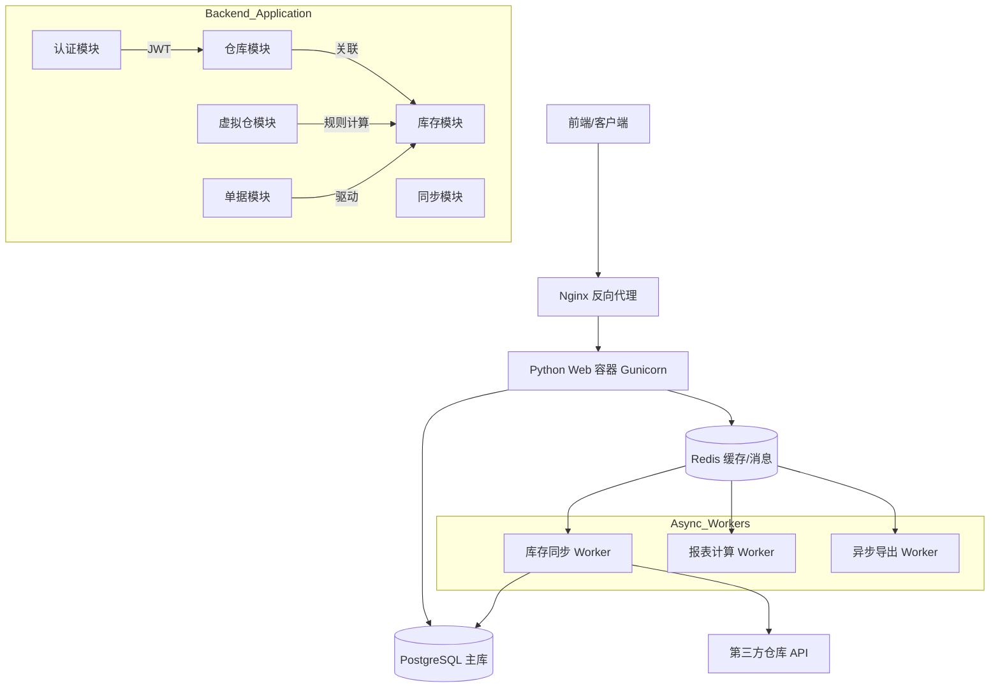

# 跨境电商仓库管理系统 - 技术设计文档

## 文档版本
- **版本**: 1.3 (评审修订版 - Final)
- **日期**: 2025年12月10日
- **作者**: 技术架构团队
- **状态**: 待开发
- **修订记录**: 
  - v1.0: 初始草案
  - v1.1: 调整技术栈为 Python/APIFlask，对齐项目统一技术框架
  - v1.2: 补充跨境电商与供应链视角的设计增强
  - v1.3: 内部专家评审后修订：重构仓库模型（三维分类）、完善虚拟仓双轨制与四层规则体系、明确三方仓同步机制、增加 PDA 与未来演进指导。

## 1. 项目概述

### 1.1 业务背景
公司作为跨境电商企业，仓库管理具有多维度、多形态的特征。实际业务中，仓库从不同角度可分为：

1.  **地理维度**：
    - **国内仓库**：位于国内，通常作为总仓或集货仓。
    - **海外仓库**：位于目标市场国（如美、德、日），用于本地发货。
2.  **管理/权属维度**：
    - **自营仓库**：公司直接管理，使用本系统完整WMS功能（库位、PDA作业）。
    - **第三方仓库 (3PL)**：外部服务商管理（如FBA、谷仓、万邑通），本系统通过 API 同步库存与指令。
3.  **形态维度**：
    - **实体仓**：具备物理实体的仓库。
    - **虚拟仓**：供应链各环节的**业务缓冲区**，用于：
        - **销售端**：库存分配与渠道隔离（支持超卖规则）。
        - **采购端**：采购计划汇聚与需求缓冲（应对长周期备货）。

### 1.2 核心需求
1. **多维仓库矩阵管理**：支持“国内/海外”+“自营/三方”的灵活组合。
2. **虚拟仓全链路缓冲**：
   - 销售侧：基于规则的库存分配与超卖控制。
   - 采购侧：作为采购计划的容器，管理各团队的备货需求。
3. 实时同步第三方仓库库存。
4. 提供灵活的库存分配规则配置（四层策略体系）。
5. 支持多团队协作和权限控制。
6. 支持精细化库位管理与汽配行业特性（通用件、体积重）。

## 2. 系统架构设计

### 2.1 整体架构图 (Python Modular Monolith)

我们采用**模块化单体架构**，在保持代码库统一（Monorepo）的前提下，通过 Blueprint 实现业务解耦。



### 2.2 技术栈选择

#### 后端技术栈 (符合 is-vue-admin 规范)
- **语言**: Python 3.10+
- **Web框架**: APIFlask (基于 Flask + Marshmallow)
- **ORM**: SQLAlchemy 2.0 (Mapped Class 风格)
- **数据验证**: Marshmallow / Webargs
- **异步任务**: Celery 5.x
- **消息中间件**: Redis (作为 Broker 和 Result Backend)
- **应用服务器**: Gunicorn
- **数据库**: PostgreSQL 15+ (利用分区表和 JSONB 特性)

#### 前端技术栈
- **框架**: Vue 3 + TypeScript + Vite
- **架构**: Vben Admin 5.0 (Monorepo)
- **UI库**: Ant Design Vue 4.x
- **状态管理**: Pinia
- **数据表格**: Vxe-Table (通过 Adapter 适配)

### 2.3 服务拆分与演进预案

当前采用**模块化单体架构**，但在模块边界上预留未来演进为独立服务的能力：

- **潜在服务边界**：
  - `warehouse-service`：仓库与渠道配置、业务类型与监管类型管理
  - `inventory-service`：库存余额、库存成本、库存单据（入库/出库/调拨/调整）
  - `wms-sync-service`：第三方仓/平台库存同步、差异对账与告警
- **演进策略**：
  - 初期在同一代码库/进程中以 Blueprint 形式解耦，只通过 Service 层交互
  - 当单模块 QPS/复杂度达到阈值时，可将对应 Blueprint 抽离为独立进程，通过 HTTP/RPC 与主系统通信
  - 日志、监控、认证等横切能力在单体阶段统一实现，拆分后通过 Sidecar / 网关透传

## 3. 数据库设计

### 3.1 核心表结构映射 (SQLAlchemy 2.0)

*(v1.3 更新：新增 `WarehouseLocation` 表，完善 `Stock` 关联，增加汽配相关字段)*

```python
from app.extensions import db
from sqlalchemy.orm import Mapped, mapped_column
from sqlalchemy.dialects.postgresql import JSONB, ARRAY
from datetime import datetime
from decimal import Decimal


class ThirdPartyService(db.Model):
    """(v1.3 新增) 第三方服务商配置表 (用于存放认证信息)"""
    __tablename__ = 'third_party_services'
    
    id: Mapped[int] = mapped_column(primary_key=True)
    code: Mapped[str] = mapped_column(db.String(50), unique=True) # 如: winit, goodcang
    name: Mapped[str] = mapped_column(db.String(100))
    
    # 认证信息 (加密存储)
    api_url: Mapped[str] = mapped_column(db.String(255))
    app_key: Mapped[str] = mapped_column(db.String(100), nullable=True)
    app_secret: Mapped[str] = mapped_column(db.String(255), nullable=True)
    access_token: Mapped[str] = mapped_column(db.Text, nullable=True)
    
    # 配置模版
    config_template: Mapped[dict] = mapped_column(JSONB, nullable=True)


class Warehouse(db.Model):
    __tablename__ = 'warehouses'
    
    id: Mapped[int] = mapped_column(primary_key=True)
    code: Mapped[str] = mapped_column(db.String(50), unique=True)
    name: Mapped[str] = mapped_column(db.String(100))
    
    # 核心分类属性 (v1.3 重构)
    # 1. 仓库形态: physical(实体仓) / virtual(虚拟仓)
    category: Mapped[str] = mapped_column(db.String(20), default='physical')
    
    # 2. 地理位置: domestic(国内) / overseas(海外)
    location_type: Mapped[str] = mapped_column(db.String(20), default='domestic')
    
    # 3. 管理模式: self(自营) / third_party(三方)
    # 自营=使用本系统WMS流程; 三方=仅通过API交互
    ownership_type: Mapped[str] = mapped_column(db.String(20), default='self')

    # 仓库状态 (Status 枚举)
    # planning: 筹备中 (采购可见，销售不可见)
    # active: 正常 (全功能开启)
    # suspended: 暂停/整顿 (限制入库，允许出库，用于FBA/海外仓异常)
    # clearing: 清退中 (禁止入库，允许出库，用于结束合作)
    # deprecated: 已废弃 (历史保留，默认隐藏)
    status: Mapped[str] = mapped_column(db.String(20), default='active')

    # 业务标签（用于细分监管类型，如: bonded/fba/standard）
    business_type: Mapped[str] = mapped_column(db.String(30), default='standard')

    # 计价币种（用于库存成本与报表换算）
    currency: Mapped[str] = mapped_column(db.String(10), default='USD')

    # JSONB 存储第三方配置，避免频繁改表
    # 建议结构: {"service_provider_id": 1, "external_code": "US-WEST-01", "sync_rule": "hourly"}
    # 认证信息存储在 ThirdPartyService 表中
    api_config: Mapped[dict] = mapped_column(JSONB, nullable=True)

    # (v1.3 新增) 虚拟仓聚合子仓列表
    # 仅当 category='virtual' 且用于聚合统计时使用 (如: 美国总仓 = [美东仓ID, 美西仓ID])
    child_warehouse_ids: Mapped[list[int]] = mapped_column(ARRAY(db.Integer), nullable=True)

    # 物理属性
    capacity: Mapped[float] = mapped_column(db.Numeric(12, 2), nullable=True)
    # 增加库容体积限制 (m3) - 汽配特性
    max_volume: Mapped[float] = mapped_column(db.Numeric(12, 2), nullable=True)
    timezone: Mapped[str] = mapped_column(db.String(50), default='UTC')


class WarehouseLocation(db.Model):
    """库位表 (新增) - 用于实体仓精细化管理"""
    __tablename__ = 'warehouse_locations'
    
    id: Mapped[int] = mapped_column(primary_key=True)
    warehouse_id: Mapped[int] = mapped_column(db.ForeignKey('warehouses.id'), index=True)
    
    # 库位编码 (如: A-01-01-01 区-排-层-位)
    code: Mapped[str] = mapped_column(db.String(50))
    
    # 库位类型 (storage:存储, pick:拣货, receive:收货, return:退货, stage:暂存)
    type: Mapped[str] = mapped_column(db.String(20), default='storage')
    
    # 库位属性 (用于上架策略)
    is_locked: Mapped[bool] = mapped_column(default=False)
    allow_mixing: Mapped[bool] = mapped_column(default=False)  # 是否允许混放SKU


class Stock(db.Model):
    """
    库存余额表 (聚合视图)
    """
    __tablename__ = 'stocks'
    # 注意：实际生产中应配置 table_args 进行分区

    id: Mapped[int] = mapped_column(primary_key=True)
    sku: Mapped[str] = mapped_column(db.String(50), index=True)
    warehouse_id: Mapped[int] = mapped_column(db.ForeignKey('warehouses.id'))

    # 库存数量
    physical_quantity: Mapped[int] = mapped_column(default=0)
    available_quantity: Mapped[int] = mapped_column(default=0)
    allocated_quantity: Mapped[int] = mapped_column(default=0)
    in_transit_quantity: Mapped[int] = mapped_column(default=0)
    damaged_quantity: Mapped[int] = mapped_column(default=0)  # 坏品/待退回库存

    # 批次信息
    batch_no: Mapped[str] = mapped_column(db.String(50), nullable=True)
    
    # 汽配特性：冗余体积重量数据，用于快速计算运费/库容
    weight: Mapped[float] = mapped_column(db.Float, nullable=True)
    volume: Mapped[float] = mapped_column(db.Float, nullable=True)

    # 乐观锁版本号
    version: Mapped[int] = mapped_column(default=0)


class StockMovement(db.Model):
    """库存单据/流水表：入库、出库、调拨、调整等均在此记录，作为库存结果表的审计来源"""
    __tablename__ = 'stock_movements'

    id: Mapped[int] = mapped_column(primary_key=True)
    sku: Mapped[str] = mapped_column(db.String(50), index=True)
    warehouse_id: Mapped[int] = mapped_column(db.ForeignKey('warehouses.id'))
    
    # 关联库位 (新增) - 允许为空，待 Phase 2 启用库位管理后必填
    location_id: Mapped[int] = mapped_column(db.ForeignKey('warehouse_locations.id'), nullable=True)

    # 单据基础信息
    order_type: Mapped[str] = mapped_column(db.String(30))  # inbound/outbound/transfer/adjustment
    order_no: Mapped[str] = mapped_column(db.String(50), index=True)
    biz_time: Mapped[datetime] = mapped_column(default=datetime.utcnow)

    # 变更数量（正数=增加库存，负数=减少库存）
    quantity_delta: Mapped[int] = mapped_column()

    # 关联批次与成本信息
    batch_no: Mapped[str] = mapped_column(db.String(50), nullable=True)
    unit_cost: Mapped[Decimal] = mapped_column(db.Numeric(18, 4), nullable=True)
    currency: Mapped[str] = mapped_column(db.String(10), nullable=True)
    
    # 汇率快照 (新增) - 记录交易发生时的汇率
    exchange_rate: Mapped[Decimal] = mapped_column(db.Numeric(10, 4), default=1.0)

    # 审计字段
    created_by: Mapped[int] = mapped_column(nullable=True)
    created_at: Mapped[datetime] = mapped_column(default=datetime.utcnow)
    status: Mapped[str] = mapped_column(db.String(20), default='confirmed')  # pending/confirmed/cancelled


class StockDiscrepancy(db.Model):
    """库存差异记录表 (用于第三方仓对账与风控告警)"""
    __tablename__ = 'stock_discrepancies'

    id: Mapped[int] = mapped_column(primary_key=True)
    warehouse_id: Mapped[int] = mapped_column(db.ForeignKey('warehouses.id'))
    sku: Mapped[str] = mapped_column(db.String(50))

    local_qty: Mapped[int] = mapped_column()
    remote_qty: Mapped[int] = mapped_column()

    # 差异强度（比例/金额）
    diff_ratio: Mapped[float] = mapped_column(db.Float, nullable=True)
    diff_amount: Mapped[Decimal] = mapped_column(db.Numeric(18, 4), nullable=True)

    # 状态与处理信息
    status: Mapped[str] = mapped_column(default='pending')  # pending/resolved/ignored
    discovered_at: Mapped[datetime] = mapped_column(default=datetime.utcnow)
    resolved_at: Mapped[datetime] = mapped_column(nullable=True)
    resolver_id: Mapped[int] = mapped_column(nullable=True)
    resolution: Mapped[str] = mapped_column(db.String(200), nullable=True)  # 以第三方为准/以本地为准/忽略原因


class WarehouseProductGroup(db.Model):
    """
    (v1.3 新增) 仓库专用 SKU 分组 (SKU团)
    用于库存分配策略的中间层颗粒度，例如 "2025黑五促销组"
    """
    __tablename__ = 'warehouse_product_groups'
    
    id: Mapped[int] = mapped_column(primary_key=True)
    code: Mapped[str] = mapped_column(db.String(50), unique=True)
    name: Mapped[str] = mapped_column(db.String(100))
    # 备注说明
    note: Mapped[str] = mapped_column(db.String(200), nullable=True)


class WarehouseProductGroupItem(db.Model):
    """(v1.3 新增) SKU 分组明细"""
    __tablename__ = 'warehouse_product_group_items'
    
    group_id: Mapped[int] = mapped_column(db.ForeignKey('warehouse_product_groups.id'), primary_key=True)
    sku: Mapped[str] = mapped_column(db.String(50), primary_key=True)


class StockAllocationPolicy(db.Model):
    """
    (v1.3 新增) 统一库存分配策略表
    优先级逻辑：SKU > Group > Category > Warehouse
    """
    __tablename__ = 'stock_allocation_policies'

    id: Mapped[int] = mapped_column(primary_key=True)
    
    # 策略目标: 哪个虚拟仓/团队受益？
    virtual_warehouse_id: Mapped[int] = mapped_column(db.ForeignKey('warehouses.id'), index=True)
    
    # 策略范围 (四选一，决定颗粒度)
    # Level 1: 全局 (仅填 source_warehouse_id)
    # Level 2: 品类 (填 category_id)
    # Level 2.5: SKU团 (填 warehouse_product_group_id)
    # Level 3: 单品 (填 sku)
    source_warehouse_id: Mapped[int] = mapped_column(db.ForeignKey('warehouses.id'), nullable=True)
    category_id: Mapped[int] = mapped_column(db.Integer, nullable=True)     # 关联产品分类表
    warehouse_product_group_id: Mapped[int] = mapped_column(db.ForeignKey('warehouse_product_groups.id'), nullable=True)
    sku: Mapped[str] = mapped_column(db.String(50), nullable=True)

    # 规则配置
    ratio: Mapped[float] = mapped_column(db.Float, nullable=True)   # 分配比例 (如 0.8)
    fixed_amount: Mapped[int] = mapped_column(db.Integer, nullable=True) # 锁定量 (如 100)
    priority: Mapped[int] = mapped_column(db.Integer, default=0) # 抢货权重 (KPI高的优先)

    # 继承/覆盖标志
    # override: 强制覆盖低级规则
    policy_mode: Mapped[str] = mapped_column(db.String(20), default='override')
```

### 3.2 仓库类型与配置 (v1.3 更新)

仓库通过三个核心维度进行分类，支持多种业务组合：

1.  **形态 (`category`)**:
    *   `physical`: 实体仓，对应真实的库存存放点。
    *   `virtual`: 虚拟仓，逻辑上的库存集合。
2.  **地理 (`location_type`)**: `domestic`(国内) / `overseas`(海外)。
3.  **权属 (`ownership_type`)**:
    *   `self`: 自营。系统负责完整的入库、上架、拣货、出库流程（未来对接PDA）。
    *   `third_party`: 三方。系统仅负责推送指令（入库单/出库单）和拉取库存/状态。

**典型组合示例**:
*   **国内自营仓**: `physical` + `domestic` + `self`
*   **海外三方仓(谷仓)**: `physical` + `overseas` + `third_party`
*   **FBA仓**: `physical` + `overseas` + `third_party` (business_type='fba')
*   **销售虚拟仓**: `virtual` + `domestic/overseas` + `self` (用于渠道库存分配/超卖控制)
*   **采购虚拟仓**: `virtual` + `domestic` + `self` (用于汇聚采购计划与需求缓冲)

### 3.3 库存余额与库存单据的关系

- `stocks` 表只保存**当前余额**，用于高频查询与前台展示。
- `stock_movements` 表记录**所有库存变动单据/流水**，作为：
  - 余额重算的来源（按时间序列重放）
  - 审计与责任追踪的依据（谁在什么时间对哪个 SKU 做了什么操作）。

业务上所有出入库相关功能（采购入库、销售出库、调拨、盘点等）均应首先在 `stock_movements` 中落单，再驱动 `stocks` 表更新，避免直接对余额做“黑盒调整”。

## 4. 模块详细设计 (Modules)

不再拆分为独立的微服务进程，而是作为 `backend/app/api/` 下的独立 Blueprints，并在模块边界上与未来服务化保持一致。

### 4.1 仓库模块 (Warehouse Blueprint)
#### 路径与职责
- **路径**: `backend/app/api/warehouse/`
- **职责**: 仓库基础信息 CRUD，库位管理，第三方 API 配置管理。
- **Service**: `WarehouseService`

仓库模块需要覆盖：
- 管理 `category` (形态)、`location_type` (地理)、`ownership_type` (权属) 等核心属性。
- 管理 `business_type` (监管类型)，如 FBA/Bonded 等。
- **(新增) 库位管理**: 提供 `WarehouseLocation` 的增删改查接口，支持批量导入库位。
- 管理 `currency` 与跨时区 `timezone`。
- 维护第三方仓/平台相关的 `api_config` (仅映射配置)，及 `ThirdPartyService` 的认证信息管理。

### 4.2 库存模块 (Stock Blueprint)
- **路径**: `backend/app/api/stock/`
- **职责**: SKU 库存查询、库存余额维护、库存单据（流水）查询。
- **关键逻辑**:
  - **乐观锁控制**: 更新库存时必须携带版本号。
    ```python
    # UPDATE stocks SET qty=new_qty, version=version+1 WHERE id=1 AND version=old_ver
    count = Stock.query.filter_by(id=1, version=old_ver).update(...)
    if count == 0: raise ConcurrencyError("库存已被修改，请重试")
    ```
  - **库存单据驱动余额**：所有入库/出库/调拨/调整操作以 `StockMovement` 为主表，`stocks` 仅作为冗余余额表。
  - **汽配特性支持**:
    - **通用件逻辑**: 库存查询接口需预留 `include_interchange` 参数，未来对接产品中心获取通用件关系。
    - **Kit 处理**: 明确区分 **虚拟Kit** (Sales Kit, 动态计算子件库存) 与 **物理Kit** (Assembly Kit, 预包装成品，有独立库存记录)。

### 4.3 出入库单据模块 (Inventory Order Blueprints)

为避免在库存视图中堆积过多业务逻辑，出入库单据以独立 Blueprint 形式存在：

- **路径示例**：
  - 入库：`backend/app/api/inbound/`
  - 出库：`backend/app/api/outbound/`
  - 调拨：`backend/app/api/transfer/`
  - 盘点/调整：`backend/app/api/adjustment/`
- **统一职责**：
  - 定义各类库存单据的生命周期（创建 → 审核 → 执行 → 完成/取消）
  - 在单据状态流转过程中，写入 `stock_movements` 并驱动 `stocks` 表更新
  - **(新增)** 记录汇率快照：在写入 `stock_movements` 时，记录当前仓库币种对应的汇率。

### 4.4 虚拟仓模块 (Virtual Warehouse Blueprint)
- **路径**: `backend/app/api/virtual/`
- **职责**: 作为供应链供需两端的**业务缓冲区**，统一管理销售分配与采购需求。
- **核心场景**:

  1.  **销售端缓冲 (Outbound Buffer)**:
      - **场景**: 将物理库存分配给不同渠道/团队（如 Amazon, 独立站）。
      - **逻辑**: `虚拟库存 = 物理库存 * 分配规则`。
      - **规则体系 (v1.3 增强)**: 引入 **四层分配策略** 以满足精细化运营需求。
        1.  **L3 单品级 (SKU)**: 针对单个 SKU 的绝对特例（如爆款锁定）。
        2.  **L2.5 分组级 (WarehouseProductGroup)**: **人工圈选的 SKU 团**（如“清仓组”、“黑五大促组”），填补品类与单品间的空白。
        3.  **L2 品类级 (Category)**: 针对产品线的批量策略。
        4.  **L1 仓库级 (Global)**: 默认保底策略。
      - **预售/超卖支持**: 通过配置规则实现（如：`Allow_Oversell = True` 或 `Virtual_Stock = Physical + In_Transit`）。
  
  2.  **采购端缓冲 (Inbound Buffer)**:
      - **场景**: 汇聚各团队/渠道的采购需求，形成“计划库存”。
      - **逻辑**: 不同团队根据各自的销售预测策略（如：30天销量平均、季节性系数），计算出“建议采购量”，并将此数值写入对应的“采购虚拟仓”。
      - **作用**: 
        - **采前/产中可视化**: 聚焦于从“产生需求”到“入国内仓”之前的数据盲区。让运营能直观看到“正在采购中”或“供应商生产中”的数量。
        - **计划协同**: 运营不再需要翻阅采购合同，直接在系统中看到“未来的货”，从而制定早期的销售策略（预热/测款）。
        - (注：海运/空运的“在途库存”通常明确指向目的实体仓，不归属于此虚拟仓范围)。

- **数据模型调整**:
  - 虚拟仓不再区分复杂的“独立模式”，统一视为**规则驱动的逻辑仓**。
  - 对于采购虚拟仓，其“库存”实际上是 **需求量 (Demand)** 或 **计划量 (Planned Qty)**，在数据上复用 `Stock` 表结构，但 `type` 标记为 `planning`。

### 4.5 同步模块 (Sync Blueprint & Tasks)
- **路径**: `backend/app/api/sync/`
- **职责**: 触发同步任务、查看同步日志、处理库存差异与告警。
- **差异处理流程**:
  1. **Fetch**: Celery Worker 拉取第三方仓库存数据 (Remote Snapshot)。
  2. **Compare**: 对比本地库存，计算差异值。
  3. **Record**: 如果有差异，不直接覆盖，而是插入 `StockDiscrepancy` 表。
  4. **Resolve**: 运营人员在前端查看差异单，选择"以第三方为准"(生成调整单)或"忽略"，并记录处理人和结论。

- **三方仓与乐观锁 (Version) 的兼容机制**:
  - 对于**自营仓**：严格执行乐观锁 (`WHERE version=old_ver`)，防止本地并发修改冲突。
  - 对于**三方仓**：
    - 外部数据为权威源，不受本地 Version 限制。
    - **禁止直接覆盖**库存数字 (如 `UPDATE stock SET qty=remote_qty`)。
    - **必须反向生成单据**：通过生成一张“同步差异调整单” (System Adjustment)，写入 `stock_movements`，再由该单据驱动 `Stock` 表更新并自增 `version`。
    - **价值**: 确保即使是外部导致的库存变化，在本地也有对应的流水记录 (Audit Trail)，保证“账实相符”。

此外需要在同步模块中：
- 按**渠道/平台**维度配置同步策略（全量/增量、频率、安全库存缓冲系数等）
- 对高风险差异（按比例/金额阈值）触发告警（邮件/IM），供风控与运营关注

## 5. 前端架构设计

### 5.1 目录结构
```
frontend/apps/web-antd/src/views/
├── warehouse/
│   ├── list/          # 仓库列表
│   ├── detail/        # 仓库详情 (含库位管理)
│   └── location/      # 库位列表/打印
├── stock/
│   ├── overview/      # 库存总览
│   └── adjustment/    # 库存调整
└── virtual/           # 虚拟仓配置
```

### 5.2 Vxe-Table 使用规范
```typescript
import { useVbenVxeGrid } from '#/adapter/vxe-table';

const [Grid, gridApi] = useVbenVxeGrid({
  gridOptions: {
    columns: [
      { field: 'sku', title: 'SKU' },
      { field: 'physical_quantity', title: '物理库存' }
    ],
    proxyConfig: {
      ajax: {
        query: async ({ page }) => {
          return await getStockList({
            page: page.currentPage,
            per_page: page.pageSize
          });
        }
      }
    }
  }
});
```

## 6. API 接口详细规范

### 6.1 视图编写规范 (Python MethodView)

所有接口必须遵循 `code/message/data` 结构，并使用 APIFlask 的装饰器。

#### 示例：获取仓库列表

```python
from apiflask.views import MethodView
from apiflask import APIBlueprint
from app.schemas import WarehouseSchema, PaginationQuerySchema, PaginationSchema
from app.services import warehouse_service

bp = APIBlueprint('warehouse', __name__, url_prefix='/warehouses')

class WarehouseListAPI(MethodView):
    @bp.auth_required(auth)
    @bp.doc(summary='获取仓库列表')
    @bp.input(PaginationQuerySchema, location='query', arg_name='query')
    @bp.output(PaginationSchema(WarehouseSchema))  # 自动包装为 {code:0, data: {items:[], total:..}}
    def get(self, query):
        """支持分页和搜索"""
        pagination = warehouse_service.get_list(
            page=query['page'], 
            per_page=query['per_page'],
            keyword=query.get('q')
        )
        return pagination

bp.add_url_rule('', view_func=WarehouseListAPI.as_view('list'))
```

#### 示例：调整库存

```python
class StockAdjustAPI(MethodView):
    @bp.auth_required(auth)
    @bp.doc(summary='库存调整')
    @bp.input(StockAdjustSchema, arg_name='data')
    @bp.output(StockSchema)
    def post(self, data):
        """入库/出库/盘点"""
        try:
            stock = stock_service.adjust(
                sku=data['sku'],
                warehouse_id=data['warehouse_id'],
                quantity=data['quantity'],
                order_type=data['order_type'], # inbound/outbound/adjustment
                user=current_user
            )
            return stock  # 框架自动序列化并在外层包裹 data
        except BusinessError as e:
            raise e
```

## 7. 安全设计
- **认证**: 使用 `flask-jwt-extended` 实现 Bearer Token 认证。
- **API 权限**: 使用 `@permission_required('warehouse:view')` 装饰器。
- **数据权限**: 在 Service 层调用 `DataPermissionFilter.apply(query, 'warehouse')` 自动注入 SQL 过滤条件。

## 8. 监控告警
- **日志**: 使用 Python `logging` 模块输出 JSON 格式日志，经由 Logtail 采集到阿里云 SLS。
- **应用监控**: 集成 Sentry 或 阿里云 ARMS (Python探针) 进行异常追踪。

## 9. 移动端/PDA 支持 (技术预备 - Phase 2)

**注意**: 本章节为技术预备内容，不纳入本次开发迭代（Phase 1）。

### 9.1 需求概述
为提升仓库现场作业效率，规划引入 PDA (Android 手持设备) 支持。主要用于：
- **入库上架**: 扫描 SKU -> 扫描库位 -> 确认数量。
- **出库拣货**: 扫描拣货单 -> 路径指引 -> 扫描 SKU -> 扫描库位。
- **盘点**: 盲盘/明盘。

### 9.2 技术方案
- **应用形态**: 独立 H5 应用 / Uni-app / Flutter (待定)，嵌入 Vben Admin 的 Mobile 视图或独立 APK。
- **API 设计**: 
  - 需提供专用的轻量级 API (`/api/v1/pda/...`)。
  - 减少数据传输量，仅返回必要字段。
  - 强化扫描纠错能力（如：扫描条码不匹配时立即报错）。
- **交互流程**:
  - 以“单据”为中心，而非“查询”为中心。
  - 必须支持离线/弱网模式（本地缓存操作，网络恢复后上传）。

### 9.3 待定事项
- PDA 设备选型与屏幕分辨率适配。
- 蓝牙打印机对接方案。

## 10. 未来演进指导 (Future Evolution Guide)

本章节旨在为系统在“跨境+汽配+电商”复杂业务场景下的中长期发展提供路径指引，避免过早引入不成熟技术，同时明确当业务规模达到瓶颈时的改进方向。

### 10.1 演进路径 A：从“库存管理”到“智能补货” (采购端)
*   **触发场景**：SKU 数量超过 5万+，运营团队靠 Excel 计算采购量开始频繁出错，出现大面积滞销或断货。
*   **改进方向**：
    *   利用 `StockAllocationPolicy` 积累的历史数据。
    *   引入 **MRP (物料需求计划)** 算法，结合“在途库存(虚拟仓)”+“销售速率”+“生产周期”自动生成采购建议。
    *   针对汽配季节性（如雪地胎），引入时间序列预测模型。

### 10.2 演进路径 B：从“人找货”到“货找人” (仓库端)
*   **触发场景**：日单量突破 3000 单，拣货员每天步数超过 3万步，拣货效率成为发货瓶颈。
*   **改进方向**：
    *   **PDA 落地**：启动第 9 章的技术预备方案。
    *   **波次拣货 (Wave Picking)**：升级出库逻辑，将 50 个订单合并为一个波次，按最优路径拣选后再分播。
    *   **AGV/输送线对接**：利用 `StockMovement` 作为指令源，对接自动化设备。

### 10.3 演进路径 C：从“规则分配”到“动态博弈” (销售端)
*   **触发场景**：多团队争抢库存导致内部矛盾激化，静态比例分配导致整体利润率下降（高利润渠道缺货，低利润渠道有货）。
*   **改进方向**：
    *   升级 `StockAllocationPolicy` 的 `advanced_config`。
    *   引入 **利润最大化算法**：实时根据各渠道的净利率（Net Margin），动态调整 `priority` 和 `ratio`，将有限的库存优先分配给赚钱的渠道。
    *   实现“库存对赌”机制：团队承诺销量即可锁定库存，未达标自动释放。

### 10.4 技术架构演进
*   **触发场景**：数据库单表（如 `stock_movements`）突破 5000万行，报表查询响应时间超过 10秒。
*   **改进方向**：
    *   **读写分离**：正式启用 PostgreSQL 的从库进行报表查询。
    *   **冷热分离**：将 1 年前的库存流水归档到历史表或数据仓库（ClickHouse）。
    *   **服务拆分**：将 `inventory-service` (库存计算) 从单体中剥离，独立扩展。
