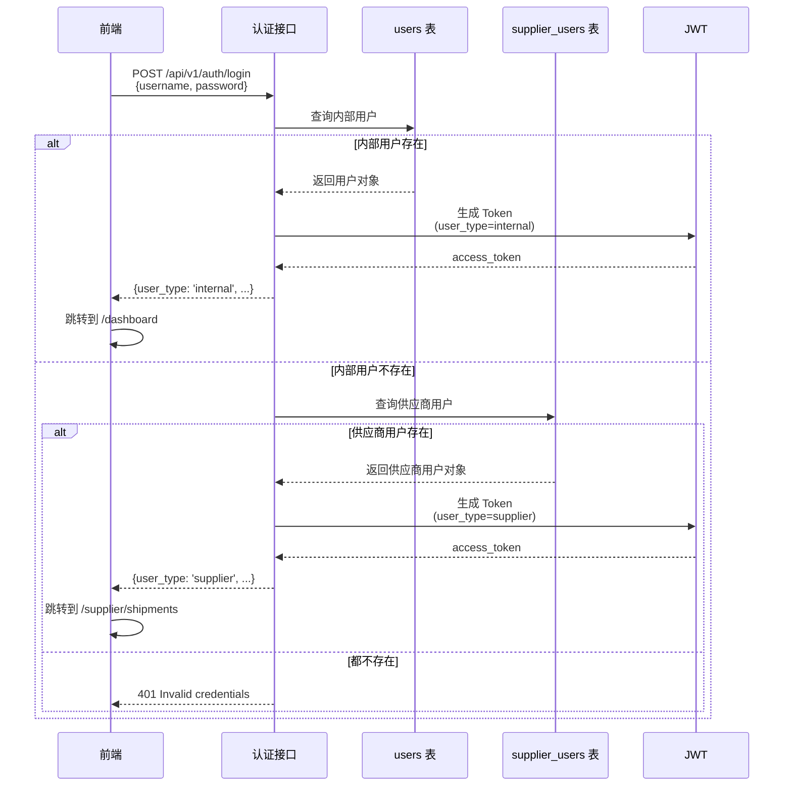
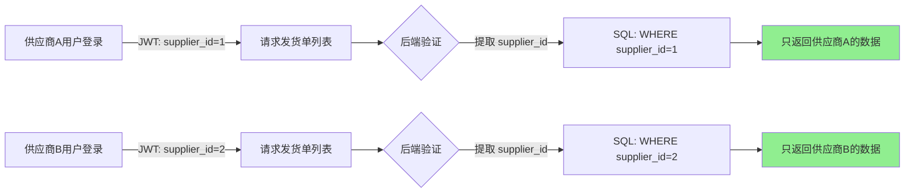

# 供应商门户系统技术设计文档

## 文档版本
- **版本**: 1.0
- **日期**: 2025年12月18日
- **作者**: 技术架构团队
- **状态**: 待评审
- **修订记录**: 
  - v1.0: 初始设计方案（多用户类型认证体系、供应商门户架构）

---

## 1. 项目概述

### 1.1 业务背景

在跨境电商供应链管理中，供应商是关键的业务合作伙伴。当前系统存在以下痛点：

#### 痛点分析

| 场景 | 当前做法 | 问题 |
|------|---------|------|
| **发货数量核对** | 供应商电话/微信确认 | 效率低、易遗漏、无记录 |
| **开票信息确认** | 邮件来回沟通 | 周期长、信息易错、无法追溯 |
| **对账结算** | Excel 表格手工核对 | 耗时、易出错、无法并行处理 |
| **发票上传** | 快递寄送纸质件 | 物流成本高、归档慢 |
| **发货状态查询** | 采购员手动通知 | 供应商无法主动获取信息 |

#### 业务价值

通过建设供应商门户系统，实现：

1. ✅ **业务自助化**：供应商自主查看发货单、上传发票、确认开票信息
2. ✅ **流程数字化**：所有操作留痕，支持审计和追溯
3. ✅ **效率提升**：财务对账效率提升 80%+，开票周期缩短 50%
4. ✅ **数据准确性**：系统自动校验，避免人工核对错误
5. ✅ **合规性增强**：满足税务、审计对供应商交易的可追溯要求

### 1.2 核心需求

#### 功能性需求

1. **供应商用户管理**
   - 独立的供应商用户体系（区别于内部员工）
   - 支持一个供应商多个账号（采购员、财务等）
   - 账号激活、密码重置、权限控制

2. **发货单管理**
   - 查看与本供应商相关的发货单列表
   - 查看发货单详情（明细、物流信息）
   - 确认发货数量、上传物流单号
   - 导出发货单 PDF/Excel

3. **开票管理**
   - 查看待开票的开票合同（Supply Contract）
   - 下载开票合同 PDF
   - 上传发票扫描件（支持批量上传）
   - 查看开票历史和付款状态

4. **对账管理**
   - 月度对账单查看和确认
   - 在线签字确认
   - 对账差异标记和备注

#### 非功能性需求

| 指标 | 目标值 | 说明 |
|------|--------|------|
| **可用性** | 99.5% | 工作日 7x12h 保障 |
| **响应时间** | < 2s | 90分位列表查询 |
| **并发用户** | 200+ | 支持 200 个供应商同时在线 |
| **数据隔离** | 100% | 供应商只能看到自己的数据 |
| **操作审计** | 100% | 所有操作必须可追溯 |
| **移动适配** | 响应式 | 支持手机浏览器访问 |

---

## 2. 系统架构设计

### 2.1 整体架构

```mermaid
graph TB
    subgraph 前端层
        InternalUI[内部员工前端<br/>Vue3 + Vben Admin]
        SupplierUI[供应商前端<br/>共享前端框架]
    end
    
    subgraph 认证层
        Login[统一登录接口<br/>/api/v1/auth/login]
        JWT[JWT Token<br/>user_type 字段区分]
    end
    
    subgraph API网关层
        RouteGuard[路由守卫<br/>基于 user_type]
        PermissionCheck[权限验证<br/>@permission_required]
    end
    
    subgraph 业务逻辑层
        InternalAPI[内部 API<br/>/api/v1/*]
        SupplierAPI[供应商 API<br/>/api/v1/supplier/*]
    end
    
    subgraph 数据层
        UserTable[(users 表<br/>内部员工)]
        SupplierUserTable[(supplier_users 表<br/>供应商用户)]
        SupplierTable[(sys_suppliers 表<br/>供应商主数据)]
        ShipmentTable[(shipment_orders 表<br/>发货单)]
        ContractTable[(scm_supply_contracts 表<br/>开票合同)]
    end
    
    InternalUI --> Login
    SupplierUI --> Login
    Login --> JWT
    
    JWT --> RouteGuard
    RouteGuard --> PermissionCheck
    
    PermissionCheck --> InternalAPI
    PermissionCheck --> SupplierAPI
    
    InternalAPI --> UserTable
    InternalAPI --> ShipmentTable
    InternalAPI --> ContractTable
    
    SupplierAPI --> SupplierUserTable
    SupplierAPI --> SupplierTable
    SupplierAPI --> ShipmentTable
    SupplierAPI --> ContractTable
```

### 2.2 架构分层说明

#### 2.2.1 认证层设计

**核心设计原则**：
- ✅ 统一登录入口，后端自动识别用户类型
- ✅ JWT Token 包含 `user_type` 字段（`internal` / `supplier`）
- ✅ 用户名全局唯一（跨两张用户表）

**为什么不采用独立登录页面？**

| 维度 | 统一登录 | 独立登录 |
|------|---------|---------|
| **用户体验** | ⭐⭐⭐⭐⭐ 供应商只需记住一个URL | ⭐⭐⭐ 需要记住专属URL |
| **维护成本** | ⭐⭐⭐⭐⭐ 只有一个登录页面 | ⭐⭐ 两套登录逻辑 |
| **扩展性** | ⭐⭐⭐⭐⭐ 未来增加"客户用户"无需改动 | ⭐⭐ 每增加一种用户就多一个页面 |
| **安全性** | ⭐⭐⭐⭐⭐ 集中管控，统一策略 | ⭐⭐⭐⭐ 需要分别维护安全策略 |

#### 2.2.2 前端架构设计

**核心设计原则**：
- ✅ 复用现有 Vben Admin 框架（表格、表单、上传等组件）
- ✅ 供应商使用简化版 Layout（无侧边栏系统菜单）
- ✅ 路由守卫根据 `user_type` 自动跳转

**为什么不单独构建供应商前端？**

| 维度 | 共享框架 | 独立构建 |
|------|---------|---------|
| **开发成本** | ⭐⭐⭐⭐⭐ 复用 95% 代码 | ⭐⭐ 需要重新搭建基础设施 |
| **维护成本** | ⭐⭐⭐⭐⭐ API 变更自动同步 | ⭐⭐ 需要同时维护两套前端 |
| **功能一致性** | ⭐⭐⭐⭐⭐ 自动保持一致 | ⭐⭐ 容易出现功能差异 |
| **主题支持** | ⭐⭐⭐⭐⭐ 深色模式/国际化自动生效 | ⭐⭐ 需要重新实现 |

---

## 3. 数据模型设计

### 3.1 核心数据模型

#### 3.1.1 供应商用户表（supplier_users）

```python
class SupplierUser(db.Model):
    """供应商用户表"""
    __tablename__ = "supplier_users"
    
    # ========== 主键与关联 ==========
    id: Mapped[int] = mapped_column(primary_key=True)
    supplier_id: Mapped[int] = mapped_column(
        ForeignKey("sys_suppliers.id"), 
        nullable=False, 
        comment='关联供应商'
    )
    
    # ========== 账号信息 ==========
    username: Mapped[str] = mapped_column(
        String(50), 
        unique=True, 
        index=True, 
        comment='用户名（全局唯一）'
    )
    password_hash: Mapped[str] = mapped_column(String(256), comment='密码哈希')
    
    # ========== 联系信息 ==========
    real_name: Mapped[str] = mapped_column(String(50), comment='真实姓名')
    mobile: Mapped[Optional[str]] = mapped_column(String(20), comment='手机号（用于验证码登录）')
    email: Mapped[Optional[str]] = mapped_column(String(100), comment='邮箱')
    department: Mapped[Optional[str]] = mapped_column(String(50), comment='部门（如采购部、财务部）')
    
    # ========== 权限控制 ==========
    permissions: Mapped[List[str]] = mapped_column(
        JSONB, 
        default=['view_shipment', 'upload_invoice'],
        comment='权限列表'
    )
    
    # ========== 状态管理 ==========
    is_active: Mapped[bool] = mapped_column(Boolean, default=True, comment='账号是否启用')
    last_login_at: Mapped[Optional[DateTime]] = mapped_column(DateTime, comment='最后登录时间')
    last_login_ip: Mapped[Optional[str]] = mapped_column(String(50), comment='最后登录IP')
    
    # ========== 审计字段 ==========
    created_at: Mapped[DateTime] = mapped_column(DateTime, server_default=func.now())
    updated_at: Mapped[Optional[DateTime]] = mapped_column(DateTime, onupdate=func.now())
    created_by: Mapped[Optional[int]] = mapped_column(Integer, comment='创建人（内部员工ID）')
    
    # ========== 关系 ==========
    supplier: Mapped["SysSupplier"] = relationship("SysSupplier", back_populates="users")
```

**设计要点**：

1. **用户名全局唯一性**
   ```python
   # 方式1：应用层校验（推荐）
   def create_supplier_user(username):
       if User.query.filter_by(username=username).first():
           raise BusinessError('用户名已被占用（内部员工）')
       if SupplierUser.query.filter_by(username=username).first():
           raise BusinessError('用户名已被占用（供应商用户）')
   
   # 方式2：使用前缀规范（可选）
   # 供应商用户名强制格式：{supplier_code}_{name}
   # 例如：huawei_zhangsan, xiaomi_lisi
   ```

2. **权限设计**
   ```python
   # 供应商用户权限列表（JSON 数组）
   permissions = [
       'view_shipment',           # 查看发货单
       'confirm_shipment',        # 确认发货
       'upload_tracking',         # 上传物流单号
       'view_supply_contract',    # 查看开票合同
       'upload_invoice',          # 上传发票
       'view_payment',            # 查看付款状态
       'view_statement',          # 查看对账单
       'confirm_statement',       # 确认对账单
   ]
   ```

#### 3.1.2 供应商主表扩展

```python
class SysSupplier(db.Model):
    """供应商主表（已存在，需要扩展）"""
    __tablename__ = "sys_suppliers"
    
    # ... 原有字段 ...
    
    # ========== 新增字段 ==========
    portal_enabled: Mapped[bool] = mapped_column(
        Boolean, 
        default=False, 
        comment='是否启用供应商门户'
    )
    portal_activated_at: Mapped[Optional[DateTime]] = mapped_column(
        DateTime, 
        comment='门户激活时间'
    )
    
    # ========== 新增关系 ==========
    users: Mapped[List["SupplierUser"]] = relationship(
        "SupplierUser", 
        back_populates="supplier",
        cascade="all, delete-orphan"
    )
```

#### 3.1.3 操作日志表（supplier_operation_logs）

```python
class SupplierOperationLog(db.Model):
    """供应商操作日志表（用于审计）"""
    __tablename__ = "supplier_operation_logs"
    
    id: Mapped[int] = mapped_column(primary_key=True)
    
    # 操作主体
    supplier_user_id: Mapped[int] = mapped_column(ForeignKey("supplier_users.id"))
    supplier_id: Mapped[int] = mapped_column(ForeignKey("sys_suppliers.id"))
    
    # 操作内容
    operation_type: Mapped[str] = mapped_column(String(50), comment='操作类型')
    resource_type: Mapped[str] = mapped_column(String(50), comment='资源类型（如shipment）')
    resource_id: Mapped[Optional[int]] = mapped_column(Integer, comment='资源ID')
    
    # 操作详情
    action: Mapped[str] = mapped_column(String(20), comment='动作（view/create/update）')
    details: Mapped[Optional[dict]] = mapped_column(JSONB, comment='详细数据')
    
    # 请求信息
    ip_address: Mapped[str] = mapped_column(String(50))
    user_agent: Mapped[Optional[str]] = mapped_column(String(500))
    
    # 时间戳
    created_at: Mapped[DateTime] = mapped_column(DateTime, server_default=func.now())
```

### 3.2 数据库迁移脚本

```python
"""
添加供应商用户表和相关字段

Revision ID: 20251218_supplier_portal
Create Date: 2025-12-18
"""
from alembic import op
import sqlalchemy as sa
from sqlalchemy.dialects import postgresql

def upgrade():
    # 1. 创建供应商用户表
    op.create_table(
        'supplier_users',
        sa.Column('id', sa.Integer(), nullable=False),
        sa.Column('supplier_id', sa.Integer(), nullable=False),
        sa.Column('username', sa.String(50), nullable=False),
        sa.Column('password_hash', sa.String(256), nullable=False),
        sa.Column('real_name', sa.String(50), nullable=False),
        sa.Column('mobile', sa.String(20), nullable=True),
        sa.Column('email', sa.String(100), nullable=True),
        sa.Column('department', sa.String(50), nullable=True),
        sa.Column('permissions', postgresql.JSONB(), nullable=True),
        sa.Column('is_active', sa.Boolean(), default=True),
        sa.Column('last_login_at', sa.DateTime(), nullable=True),
        sa.Column('last_login_ip', sa.String(50), nullable=True),
        sa.Column('created_at', sa.DateTime(), server_default=sa.func.now()),
        sa.Column('updated_at', sa.DateTime(), onupdate=sa.func.now()),
        sa.Column('created_by', sa.Integer(), nullable=True),
        sa.PrimaryKeyConstraint('id'),
        sa.ForeignKeyConstraint(['supplier_id'], ['sys_suppliers.id']),
        sa.UniqueConstraint('username')
    )
    
    # 2. 创建索引
    op.create_index('ix_supplier_users_username', 'supplier_users', ['username'])
    op.create_index('ix_supplier_users_supplier_id', 'supplier_users', ['supplier_id'])
    
    # 3. 扩展供应商主表
    op.add_column('sys_suppliers', 
        sa.Column('portal_enabled', sa.Boolean(), default=False)
    )
    op.add_column('sys_suppliers', 
        sa.Column('portal_activated_at', sa.DateTime(), nullable=True)
    )
    
    # 4. 创建操作日志表
    op.create_table(
        'supplier_operation_logs',
        sa.Column('id', sa.Integer(), nullable=False),
        sa.Column('supplier_user_id', sa.Integer(), nullable=False),
        sa.Column('supplier_id', sa.Integer(), nullable=False),
        sa.Column('operation_type', sa.String(50), nullable=False),
        sa.Column('resource_type', sa.String(50), nullable=False),
        sa.Column('resource_id', sa.Integer(), nullable=True),
        sa.Column('action', sa.String(20), nullable=False),
        sa.Column('details', postgresql.JSONB(), nullable=True),
        sa.Column('ip_address', sa.String(50), nullable=False),
        sa.Column('user_agent', sa.String(500), nullable=True),
        sa.Column('created_at', sa.DateTime(), server_default=sa.func.now()),
        sa.PrimaryKeyConstraint('id'),
        sa.ForeignKeyConstraint(['supplier_user_id'], ['supplier_users.id']),
        sa.ForeignKeyConstraint(['supplier_id'], ['sys_suppliers.id'])
    )
    
    # 5. 创建索引（优化查询性能）
    op.create_index('ix_supplier_logs_supplier_id', 'supplier_operation_logs', ['supplier_id'])
    op.create_index('ix_supplier_logs_created_at', 'supplier_operation_logs', ['created_at'])

def downgrade():
    op.drop_table('supplier_operation_logs')
    op.drop_column('sys_suppliers', 'portal_activated_at')
    op.drop_column('sys_suppliers', 'portal_enabled')
    op.drop_table('supplier_users')
```

---

## 4. API 设计

### 4.1 认证接口

#### 4.1.1 统一登录接口（核心设计）

**接口路径**: `POST /api/v1/auth/login`

**请求参数**:
```json
{
  "username": "huawei_zhangsan",
  "password": "password123"
}
```

**后端逻辑**:
```python
@auth_bp.post('/login')
@auth_bp.input(LoginInput, arg_name='data')
@auth_bp.output(TokenOutput)
def login(data):
    username = data['username']
    password = data['password']
    
    # 🔑 步骤1：尝试从内部用户表查找
    user = User.query.filter_by(username=username).first()
    if user and user.check_password(password):
        if not user.is_active:
            abort(403, 'Account is disabled')
        
        # 生成内部用户 Token
        additional_claims = {
            "user_type": "internal",
            "roles": list(user.role_names),
            "permissions": list(user.permissions)
        }
        
        access_token = create_access_token(
            identity=str(user.id), 
            additional_claims=additional_claims
        )
        refresh_token = create_refresh_token(identity=str(user.id))
        
        return {
            'data': {
                'access_token': access_token,
                'refresh_token': refresh_token,
                'user_type': 'internal',
                'username': user.username,
                'nickname': user.nickname,
                'roles': list(user.role_names),
                'permissions': list(user.permissions)
            }
        }
    
    # 🔑 步骤2：尝试从供应商用户表查找
    supplier_user = SupplierUser.query.filter_by(username=username).first()
    if supplier_user and supplier_user.check_password(password):
        if not supplier_user.is_active:
            abort(403, 'Account is disabled')
        
        # 检查供应商是否启用门户
        if not supplier_user.supplier.portal_enabled:
            abort(403, 'Supplier portal is not enabled')
        
        # 生成供应商用户 Token
        additional_claims = {
            "user_type": "supplier",
            "supplier_id": supplier_user.supplier_id,
            "supplier_code": supplier_user.supplier.code,
            "supplier_name": supplier_user.supplier.name,
            "permissions": supplier_user.permissions or []
        }
        
        access_token = create_access_token(
            identity=f"supplier_{supplier_user.id}",  # 🔑 加前缀避免ID冲突
            additional_claims=additional_claims
        )
        refresh_token = create_refresh_token(identity=f"supplier_{supplier_user.id}")
        
        # 🔑 更新最后登录信息
        supplier_user.last_login_at = datetime.utcnow()
        supplier_user.last_login_ip = request.remote_addr
        db.session.commit()
        
        # 🔑 记录登录日志
        log_supplier_operation(
            supplier_user_id=supplier_user.id,
            operation_type='login',
            action='login',
            details={'username': username}
        )
        
        return {
            'data': {
                'access_token': access_token,
                'refresh_token': refresh_token,
                'user_type': 'supplier',
                'username': supplier_user.username,
                'real_name': supplier_user.real_name,
                'supplier_id': supplier_user.supplier_id,
                'supplier_name': supplier_user.supplier.name,
                'permissions': supplier_user.permissions
            }
        }
    
    # 🔑 步骤3：都不匹配，返回错误
    abort(401, 'Invalid username or password')
```

**响应示例（供应商用户）**:
```json
{
  "code": 0,
  "message": "success",
  "data": {
    "access_token": "eyJhbGciOiJIUzI1NiIsInR5cCI6IkpXVCJ9...",
    "refresh_token": "eyJhbGciOiJIUzI1NiIsInR5cCI6IkpXVCJ9...",
    "user_type": "supplier",
    "username": "huawei_zhangsan",
    "real_name": "张三",
    "supplier_id": 5,
    "supplier_name": "深圳华为科技",
    "permissions": ["view_shipment", "upload_invoice"]
  }
}
```

**JWT Token Payload（供应商用户）**:
```json
{
  "identity": "supplier_123",
  "user_type": "supplier",
  "supplier_id": 5,
  "supplier_code": "HUAWEI",
  "supplier_name": "深圳华为科技",
  "permissions": ["view_shipment", "upload_invoice"],
  "exp": 1703001600
}
```

#### 4.1.2 Token 验证改造

```python
# backend/app/security.py

def verify_token():
    """验证 Token 并加载用户对象"""
    try:
        verify_jwt_in_request()
        
        identity = get_jwt_identity()
        claims = get_jwt()
        user_type = claims.get('user_type')
        
        # 🔑 根据用户类型加载不同的用户对象
        if user_type == 'supplier':
            # 提取供应商用户ID（去掉 supplier_ 前缀）
            supplier_user_id = int(identity.replace('supplier_', ''))
            user = SupplierUser.query.get(supplier_user_id)
            
            if not user or not user.is_active:
                return None
            
            # 🔑 检查供应商门户是否启用
            if not user.supplier.portal_enabled:
                return None
            
            return user
        else:
            # 内部用户
            user_id = int(identity)
            user = User.query.get(user_id)
            
            if not user or not user.is_active:
                return None
            
            return user
    
    except Exception as e:
        logger.error(f"Token verification failed: {str(e)}")
        return None

# 注册验证函数
auth.verify_token(verify_token)
```

### 4.2 供应商专属 API

#### 4.2.1 我的发货单列表

**接口路径**: `GET /api/v1/supplier/shipments`

**权限要求**: `view_shipment`

**请求参数**:
```json
{
  "page": 1,
  "per_page": 20,
  "status": "shipped",
  "start_date": "2025-01-01",
  "end_date": "2025-12-31"
}
```

**后端实现**:
```python
@supplier_bp.route('/shipments')
@supplier_bp.auth_required(auth)
@supplier_bp.input(PaginationQuerySchema, location='query', arg_name='pagination')
@supplier_bp.output(make_pagination_schema(ShipmentOrderItemSchema))
def get_my_shipments(pagination):
    """获取我的发货单明细列表"""
    claims = get_jwt()
    
    # 🔑 验证用户类型
    if claims.get('user_type') != 'supplier':
        abort(403, 'Access denied')
    
    supplier_id = claims.get('supplier_id')
    
    # 🔑 权限检查
    current_user = auth.current_user
    if 'view_shipment' not in current_user.permissions:
        abort(403, 'Permission denied')
    
    # 🔑 构建查询（只查询该供应商的数据）
    query = ShipmentOrderItem.query.filter_by(supplier_id=supplier_id)
    
    # 状态过滤
    if pagination.get('status'):
        query = query.join(ShipmentOrder).filter(
            ShipmentOrder.status == pagination['status']
        )
    
    # 日期过滤
    if pagination.get('start_date'):
        query = query.join(ShipmentOrder).filter(
            ShipmentOrder.actual_ship_date >= pagination['start_date']
        )
    
    # 分页
    page = pagination['page']
    per_page = pagination['per_page']
    paginated = query.paginate(page=page, per_page=per_page)
    
    # 🔑 记录访问日志
    log_supplier_operation(
        supplier_user_id=current_user.id,
        operation_type='view',
        resource_type='shipment',
        action='list'
    )
    
    return {
        'data': {
            'items': paginated.items,
            'total': paginated.total,
            'page': page,
            'per_page': per_page
        }
    }
```

#### 4.2.2 发货单详情

**接口路径**: `GET /api/v1/supplier/shipments/{item_id}`

**权限要求**: `view_shipment`

**后端实现**:
```python
@supplier_bp.route('/shipments/<int:item_id>')
@supplier_bp.auth_required(auth)
@supplier_bp.output(ShipmentOrderItemSchema)
def get_shipment_detail(item_id: int):
    """获取发货单明细详情"""
    claims = get_jwt()
    supplier_id = claims.get('supplier_id')
    
    # 🔑 查询并验证权限
    item = ShipmentOrderItem.query.filter_by(
        id=item_id,
        supplier_id=supplier_id  # 🔑 确保只能访问自己的数据
    ).first_or_404()
    
    # 记录访问日志
    log_supplier_operation(
        supplier_user_id=auth.current_user.id,
        operation_type='view',
        resource_type='shipment',
        resource_id=item_id,
        action='detail'
    )
    
    return {'data': item}
```

#### 4.2.3 确认发货（上传物流单号）

**接口路径**: `POST /api/v1/supplier/shipments/{item_id}/confirm`

**权限要求**: `confirm_shipment`

**请求参数**:
```json
{
  "tracking_no": "SF1234567890",
  "confirmed_quantity": 1000,
  "notes": "已通过顺丰发出"
}
```

**后端实现**:
```python
@supplier_bp.route('/shipments/<int:item_id>/confirm')
@supplier_bp.auth_required(auth)
@supplier_bp.input(ShipmentConfirmSchema, arg_name='data')
@supplier_bp.output(ShipmentOrderItemSchema)
def confirm_shipment(item_id: int, data):
    """供应商确认发货"""
    claims = get_jwt()
    supplier_id = claims.get('supplier_id')
    current_user = auth.current_user
    
    # 权限检查
    if 'confirm_shipment' not in current_user.permissions:
        abort(403, 'Permission denied')
    
    # 查询明细
    item = ShipmentOrderItem.query.filter_by(
        id=item_id,
        supplier_id=supplier_id
    ).first_or_404()
    
    # 🔑 业务校验：数量不能超过订单数量
    if data['confirmed_quantity'] > item.quantity:
        raise BusinessError('确认数量不能超过订单数量')
    
    # 🔑 更新数据
    item.confirmed_quantity = data['confirmed_quantity']
    item.supplier_tracking_no = data.get('tracking_no')
    item.supplier_confirm_notes = data.get('notes')
    item.supplier_confirmed_at = datetime.utcnow()
    item.supplier_confirmed_by = current_user.id
    
    db.session.commit()
    
    # 记录操作日志
    log_supplier_operation(
        supplier_user_id=current_user.id,
        operation_type='update',
        resource_type='shipment',
        resource_id=item_id,
        action='confirm',
        details=data
    )
    
    return {'data': item}
```

#### 4.2.4 我的开票合同列表

**接口路径**: `GET /api/v1/supplier/supply-contracts`

**后端实现**:
```python
@supplier_bp.route('/supply-contracts')
@supplier_bp.auth_required(auth)
@supplier_bp.input(PaginationQuerySchema, location='query', arg_name='pagination')
@supplier_bp.output(make_pagination_schema(SupplyContractSchema))
def get_my_supply_contracts(pagination):
    """获取我的开票合同列表"""
    claims = get_jwt()
    supplier_id = claims.get('supplier_id')
    
    # 🔑 只查询该供应商的开票合同
    query = SupplyContract.query.filter_by(supplier_id=supplier_id)
    
    # 状态过滤
    if pagination.get('invoice_status'):
        query = query.filter_by(invoice_status=pagination['invoice_status'])
    
    # 分页
    paginated = query.paginate(
        page=pagination['page'],
        per_page=pagination['per_page']
    )
    
    return {
        'data': {
            'items': paginated.items,
            'total': paginated.total
        }
    }
```

#### 4.2.5 上传发票

**接口路径**: `POST /api/v1/supplier/supply-contracts/{contract_id}/upload-invoice`

**权限要求**: `upload_invoice`

**请求参数**: `multipart/form-data`
- `file`: 发票扫描件（PDF/JPG/PNG）
- `invoice_no`: 发票号码
- `invoice_code`: 发票代码
- `invoice_date`: 开票日期

**后端实现**:
```python
@supplier_bp.route('/supply-contracts/<int:contract_id>/upload-invoice')
@supplier_bp.auth_required(auth)
@supplier_bp.input(InvoiceUploadSchema, location='form_and_files', arg_name='data')
@supplier_bp.output(SupplyContractSchema)
def upload_invoice(contract_id: int, data):
    """上传发票"""
    claims = get_jwt()
    supplier_id = claims.get('supplier_id')
    current_user = auth.current_user
    
    # 权限检查
    if 'upload_invoice' not in current_user.permissions:
        abort(403, 'Permission denied')
    
    # 查询合同
    contract = SupplyContract.query.filter_by(
        id=contract_id,
        supplier_id=supplier_id
    ).first_or_404()
    
    # 🔑 业务校验：合同状态必须为"待开票"
    if contract.invoice_status != 'pending':
        raise BusinessError('该合同不在待开票状态')
    
    # 🔑 上传文件到 NAS
    file_obj = data['file']
    file_path = upload_invoice_file(
        file_obj=file_obj,
        supplier_id=supplier_id,
        contract_id=contract_id
    )
    
    # 🔑 创建发票记录
    invoice = SupplierTaxInvoice(
        invoice_no=data['invoice_no'],
        invoice_code=data['invoice_code'],
        invoice_date=data['invoice_date'],
        supply_contract_id=contract_id,
        supplier_id=supplier_id,
        amount=contract.amount,
        tax_amount=contract.tax_amount,
        total_amount=contract.total_amount,
        file_path=file_path,
        uploaded_by=current_user.id,
        uploaded_at=datetime.utcnow()
    )
    
    db.session.add(invoice)
    
    # 🔑 更新合同状态
    contract.invoice_status = 'uploaded'
    contract.invoice_uploaded_at = datetime.utcnow()
    
    db.session.commit()
    
    # 记录操作日志
    log_supplier_operation(
        supplier_user_id=current_user.id,
        operation_type='create',
        resource_type='invoice',
        resource_id=invoice.id,
        action='upload',
        details={
            'contract_id': contract_id,
            'invoice_no': data['invoice_no']
        }
    )
    
    return {'data': contract}
```

---

## 5. 前端实现

### 5.1 路由配置

```typescript
// frontend/apps/web-antd/src/router/routes/modules/supplier.ts

import type { RouteRecordRaw } from 'vue-router';
import { SupplierLayout } from '#/layouts';
import { $t } from '#/locales';

const routes: RouteRecordRaw[] = [
  {
    component: SupplierLayout,  // 🔑 供应商专属布局
    meta: {
      requiresAuth: true,
      requiresUserType: 'supplier',  // 🔑 只有供应商可访问
    },
    name: 'SupplierPortal',
    path: '/supplier',
    redirect: '/supplier/shipments',
    children: [
      {
        name: 'SupplierShipments',
        path: 'shipments',
        component: () => import('#/views/supplier/shipments/index.vue'),
        meta: {
          icon: 'lucide:package',
          title: $t('我的发货单'),
        },
      },
      {
        name: 'SupplierShipmentDetail',
        path: 'shipments/:id',
        component: () => import('#/views/supplier/shipments/detail.vue'),
        meta: {
          hideInMenu: true,
          title: $t('发货单详情'),
          activePath: '/supplier/shipments',
        },
      },
      {
        name: 'SupplierContracts',
        path: 'contracts',
        component: () => import('#/views/supplier/contracts/index.vue'),
        meta: {
          icon: 'lucide:file-text',
          title: $t('开票管理'),
        },
      },
      {
        name: 'SupplierStatements',
        path: 'statements',
        component: () => import('#/views/supplier/statements/index.vue'),
        meta: {
          icon: 'lucide:calculator',
          title: $t('对账单'),
        },
      },
    ],
  },
];

export default routes;
```

### 5.2 路由守卫（关键实现）

```typescript
// frontend/apps/web-antd/src/router/guard.ts

import { useAuthStore } from '#/store';

router.beforeEach(async (to, from, next) => {
  const authStore = useAuthStore();
  
  // 如果需要登录且未登录，跳转到登录页
  if (to.meta.requiresAuth && !authStore.isAuthenticated) {
    return next({
      path: '/auth/login',
      query: { redirect: to.fullPath },
    });
  }
  
  // 🔑 如果已登录，根据用户类型进行路由控制
  if (authStore.isAuthenticated) {
    const userType = authStore.userInfo?.user_type;
    
    // 🔑 供应商用户：只能访问供应商路由
    if (userType === 'supplier') {
      if (!to.path.startsWith('/supplier')) {
        return next('/supplier/shipments');
      }
    }
    
    // 🔑 内部用户：不能访问供应商路由
    if (userType === 'internal') {
      if (to.path.startsWith('/supplier')) {
        return next('/');
      }
    }
  }
  
  next();
});
```

### 5.3 供应商专属布局

```vue
<!-- frontend/apps/web-antd/src/layouts/SupplierLayout.vue -->

<template>
  <div class="supplier-layout min-h-screen bg-gray-50 dark:bg-gray-900">
    <!-- 顶部导航栏 -->
    <header class="sticky top-0 z-50 bg-white dark:bg-gray-800 border-b border-gray-200 dark:border-gray-700">
      <div class="container mx-auto px-4 h-16 flex items-center justify-between">
        <!-- Logo -->
        <div class="flex items-center gap-4">
          
          <span class="text-lg font-semibold">{{ supplierName }}</span>
        </div>
        
        <!-- 导航菜单 -->
        <nav class="hidden md:flex items-center gap-6">
          <router-link
            v-for="item in menuItems"
            :key="item.path"
            :to="item.path"
            class="text-gray-600 hover:text-primary dark:text-gray-300"
            active-class="text-primary font-semibold"
          >
            <Icon :icon="item.icon" class="inline-block mr-1" />
            {{ item.title }}
          </router-link>
        </nav>
        
        <!-- 用户信息 -->
        <div class="flex items-center gap-4">
          <a-dropdown>
            <div class="flex items-center gap-2 cursor-pointer">
              <a-avatar :size="32">
                {{ userInitial }}
              </a-avatar>
              <span class="text-sm">{{ realName }}</span>
            </div>
            <template #overlay>
              <a-menu>
                <a-menu-item @click="handlePasswordChange">
                  <Icon icon="lucide:key" class="mr-2" />
                  修改密码
                </a-menu-item>
                <a-menu-divider />
                <a-menu-item @click="handleLogout">
                  <Icon icon="lucide:log-out" class="mr-2" />
                  退出登录
                </a-menu-item>
              </a-menu>
            </template>
          </a-dropdown>
        </div>
      </div>
    </header>
    
    <!-- 主内容区 -->
    <main class="container mx-auto px-4 py-6">
      <RouterView />
    </main>
    
    <!-- 页脚 -->
    <footer class="mt-auto py-6 text-center text-gray-500 text-sm">
      © 2025 Your Company. All rights reserved.
    </footer>
  </div>
</template>

<script setup lang="ts">
import { computed } from 'vue';
import { useAuthStore } from '#/store';
import { useRouter } from 'vue-router';

const authStore = useAuthStore();
const router = useRouter();

const supplierName = computed(() => authStore.userInfo?.supplier_name);
const realName = computed(() => authStore.userInfo?.real_name);
const userInitial = computed(() => realName.value?.charAt(0) || 'U');

const menuItems = [
  { path: '/supplier/shipments', title: '我的发货单', icon: 'lucide:package' },
  { path: '/supplier/contracts', title: '开票管理', icon: 'lucide:file-text' },
  { path: '/supplier/statements', title: '对账单', icon: 'lucide:calculator' },
];

async function handleLogout() {
  await authStore.logout();
  router.push('/auth/login');
}

function handlePasswordChange() {
  // TODO: 实现密码修改
}
</script>
```

### 5.4 发货单列表页面

```vue
<!-- frontend/apps/web-antd/src/views/supplier/shipments/index.vue -->

<script setup lang="ts">
import { useVbenVxeGrid, type VxeGridProps } from '#/adapter/vxe-table';
import { getMyShipments } from '#/api/supplier';
import { onMounted, ref } from 'vue';

// Grid 配置
const gridOptions: VxeGridProps = {
  columns: [
    { field: 'shipment_no', title: '发货单号', width: 150 },
    { field: 'sku', title: 'SKU', width: 120 },
    { field: 'product_name', title: '商品名称', minWidth: 200 },
    { field: 'quantity', title: '订单数量', width: 100 },
    { 
      field: 'confirmed_quantity', 
      title: '已确认数量', 
      width: 120,
      cellRender: {
        name: '$default',
        setup: ({ row }) => {
          return row.confirmed_quantity || '-';
        }
      }
    },
    { field: 'unit', title: '单位', width: 80 },
    { 
      field: 'status', 
      title: '状态', 
      width: 100,
      cellRender: {
        name: 'ATag',
        props: (params) => {
          const statusMap = {
            'draft': { color: 'default', text: '草稿' },
            'confirmed': { color: 'processing', text: '已确认' },
            'shipped': { color: 'success', text: '已发货' },
          };
          const status = statusMap[params.row.status] || {};
          return { color: status.color, children: status.text };
        }
      }
    },
    {
      title: '操作',
      width: 150,
      slots: { default: 'action' },
    },
  ],
  data: [],
  pagerConfig: { enabled: true },
  toolbarConfig: {
    refresh: { code: 'query' },
  },
};

// 初始化 Grid
const [Grid, gridApi] = useVbenVxeGrid({
  gridOptions,
  gridEvents: {
    toolbarToolClick: (params) => {
      if (params.code === 'query') loadData();
    }
  }
});

// 数据加载
async function loadData() {
  try {
    gridApi.setLoading(true);
    const res = await getMyShipments({
      page: 1,
      per_page: 20
    });
    gridApi.setGridOptions({ data: res.data.items });
  } catch (e) {
    console.error(e);
  } finally {
    gridApi.setLoading(false);
  }
}

// 确认发货
function handleConfirm(row: any) {
  // TODO: 打开确认对话框
}

onMounted(() => {
  loadData();
});
</script>

<template>
  <div class="supplier-shipments">
    <a-card title="我的发货单" :bordered="false">
      <Grid>
        <template #action="{ row }">
          <a-space>
            <a-button type="link" size="small">详情</a-button>
            <a-button 
              v-if="row.status === 'confirmed'" 
              type="link" 
              size="small"
              @click="handleConfirm(row)"
            >
              确认发货
            </a-button>
          </a-space>
        </template>
      </Grid>
    </a-card>
  </div>
</template>
```

---

## 6. 安全性设计

### 6.1 安全威胁分析

| 威胁类型 | 风险等级 | 缓解措施 |
|---------|---------|---------|
| **越权访问** | 🔴 高 | 后端强制数据隔离（supplier_id 过滤） |
| **Token 泄露** | 🔴 高 | 短过期时间（2h） + Refresh Token 机制 |
| **暴力破解** | 🟡 中 | 登录失败限制（5次/15分钟） |
| **SQL 注入** | 🟢 低 | ORM 自动参数化查询 |
| **文件上传漏洞** | 🟡 中 | 文件类型白名单 + 大小限制 + 病毒扫描 |
| **XSS 攻击** | 🟢 低 | 前端自动转义 + CSP 策略 |

### 6.2 数据隔离机制（核心安全）

**原则**：供应商只能访问与自己相关的数据

```python
# 🔑 装饰器：自动注入供应商 ID 过滤
def supplier_data_filter(model_class, foreign_key='supplier_id'):
    """装饰器：自动过滤供应商数据"""
    def decorator(func):
        @wraps(func)
        def wrapper(*args, **kwargs):
            claims = get_jwt()
            
            # 只对供应商用户生效
            if claims.get('user_type') != 'supplier':
                return func(*args, **kwargs)
            
            supplier_id = claims.get('supplier_id')
            
            # 注入过滤条件
            kwargs['supplier_id_filter'] = supplier_id
            
            return func(*args, **kwargs)
        return wrapper
    return decorator

# 使用示例
@supplier_bp.route('/shipments')
@supplier_bp.auth_required(auth)
@supplier_data_filter(ShipmentOrderItem, 'supplier_id')
def get_my_shipments(supplier_id_filter=None):
    query = ShipmentOrderItem.query
    
    # 🔑 自动注入过滤条件
    if supplier_id_filter:
        query = query.filter_by(supplier_id=supplier_id_filter)
    
    return {'data': query.all()}
```

### 6.3 操作审计

**所有供应商操作必须记录审计日志**：

```python
def log_supplier_operation(
    supplier_user_id: int,
    operation_type: str,
    resource_type: str = None,
    resource_id: int = None,
    action: str = None,
    details: dict = None
):
    """记录供应商操作日志"""
    from flask import request
    
    log = SupplierOperationLog(
        supplier_user_id=supplier_user_id,
        supplier_id=auth.current_user.supplier_id,
        operation_type=operation_type,
        resource_type=resource_type,
        resource_id=resource_id,
        action=action,
        details=details,
        ip_address=request.remote_addr,
        user_agent=request.headers.get('User-Agent')
    )
    
    db.session.add(log)
    db.session.commit()
```

### 6.4 文件上传安全

```python
ALLOWED_EXTENSIONS = {'pdf', 'jpg', 'jpeg', 'png'}
MAX_FILE_SIZE = 10 * 1024 * 1024  # 10MB

def validate_upload_file(file_obj: FileStorage):
    """验证上传文件"""
    # 1. 检查文件扩展名
    filename = secure_filename(file_obj.filename)
    ext = filename.rsplit('.', 1)[1].lower()
    
    if ext not in ALLOWED_EXTENSIONS:
        raise BusinessError(f'不支持的文件类型：{ext}')
    
    # 2. 检查文件大小
    file_obj.seek(0, 2)  # 移动到文件末尾
    size = file_obj.tell()
    file_obj.seek(0)  # 重置到文件开头
    
    if size > MAX_FILE_SIZE:
        raise BusinessError('文件大小超过限制（10MB）')
    
    # 3. 检查 MIME 类型（防止伪造扩展名）
    mime_type = magic.from_buffer(file_obj.read(1024), mime=True)
    file_obj.seek(0)
    
    allowed_mimes = {
        'application/pdf',
        'image/jpeg',
        'image/png'
    }
    
    if mime_type not in allowed_mimes:
        raise BusinessError(f'文件内容类型不匹配：{mime_type}')
    
    return filename, ext
```

---

## 7. 实施计划

### 7.1 开发阶段

#### Phase 1: 基础架构（1周）

**任务清单**：
- [ ] 创建数据库迁移脚本（`supplier_users`, `supplier_operation_logs`）
- [ ] 修改登录接口（支持多用户类型）
- [ ] 修改 JWT 验证逻辑（`verify_token`）
- [ ] 开发供应商用户管理 API（CRUD）

**验收标准**：
- ✅ 供应商用户可以成功登录
- ✅ Token 包含正确的 `user_type` 和 `supplier_id`
- ✅ 内部用户和供应商用户互不干扰

#### Phase 2: 供应商 API（2周）

**任务清单**：
- [ ] 发货单列表/详情 API
- [ ] 发货确认 API
- [ ] 开票合同列表 API
- [ ] 发票上传 API
- [ ] 对账单查看/确认 API
- [ ] 操作日志记录

**验收标准**：
- ✅ 所有 API 实现数据隔离
- ✅ 所有操作记录审计日志
- ✅ API 文档完整（Swagger UI）

#### Phase 3: 前端开发（2周）

**任务清单**：
- [ ] 路由配置（供应商专属路由）
- [ ] 路由守卫（用户类型控制）
- [ ] 供应商布局组件（`SupplierLayout`）
- [ ] 发货单列表/详情页面
- [ ] 开票管理页面
- [ ] 对账单页面

**验收标准**：
- ✅ 供应商登录后自动跳转到供应商门户
- ✅ 内部用户无法访问供应商路由
- ✅ UI 响应式，支持移动端

#### Phase 4: 测试与优化（1周）

**任务清单**：
- [ ] 安全性测试（越权、注入、XSS）
- [ ] 性能测试（200 并发）
- [ ] 兼容性测试（Chrome/Safari/微信浏览器）
- [ ] 用户体验优化

**验收标准**：
- ✅ 通过安全测试（无高危漏洞）
- ✅ 响应时间 < 2s（90分位）
- ✅ 主流浏览器兼容

### 7.2 上线计划

#### 灰度发布策略

| 阶段 | 范围 | 用户数 | 周期 |
|------|------|--------|------|
| **Alpha** | 内部测试 | 5-10 个测试供应商 | 1周 |
| **Beta** | 小范围试点 | 20-30 个活跃供应商 | 2周 |
| **GA** | 全量发布 | 所有供应商 | - |

#### 回滚方案

```bash
# 1. 数据库回滚
docker compose exec backend flask db downgrade

# 2. 代码回滚
git revert <commit-hash>
docker compose restart backend

# 3. 前端回滚（Nginx 配置切换）
ln -sf /var/www/frontend-v1 /var/www/frontend
nginx -s reload
```

---

## 8. 监控与运维

### 8.1 关键指标

| 指标 | 目标值 | 告警阈值 |
|------|--------|---------|
| **API 响应时间** | < 2s | > 5s |
| **错误率** | < 1% | > 5% |
| **登录成功率** | > 98% | < 95% |
| **文件上传成功率** | > 95% | < 90% |
| **并发用户数** | - | > 200 |

### 8.2 日志监控

```python
# 关键操作日志示例
{
  "timestamp": "2025-12-18T10:30:00Z",
  "level": "INFO",
  "operation": "supplier_login",
  "supplier_id": 5,
  "supplier_user_id": 123,
  "username": "huawei_zhangsan",
  "ip_address": "183.14.132.45",
  "user_agent": "Mozilla/5.0...",
  "result": "success"
}

{
  "timestamp": "2025-12-18T10:35:00Z",
  "level": "INFO",
  "operation": "invoice_upload",
  "supplier_id": 5,
  "supplier_user_id": 123,
  "resource_type": "supply_contract",
  "resource_id": 456,
  "invoice_no": "12345678",
  "file_size": 2048576,
  "result": "success"
}
```

---

## 9. 风险评估与应对

### 9.1 技术风险

| 风险 | 概率 | 影响 | 应对措施 |
|------|------|------|---------|
| **数据隔离失效** | 🟡 中 | 🔴 高 | 多层防护：JWT 校验 + SQL 过滤 + 代码审查 |
| **并发性能瓶颈** | 🟢 低 | 🟡 中 | 数据库索引优化 + Redis 缓存 |
| **文件存储故障** | 🟢 低 | 🟡 中 | NAS 冗余备份 + 异常处理 |

### 9.2 业务风险

| 风险 | 概率 | 影响 | 应对措施 |
|------|------|------|---------|
| **供应商不接受新系统** | 🟡 中 | 🟡 中 | 提供培训视频 + 客服支持 |
| **操作流程变更阻力** | 🟡 中 | 🟢 低 | 保留旧流程过渡期（1个月） |
| **数据迁移问题** | 🟢 低 | 🟡 中 | 历史数据导入脚本 + 人工核对 |

---

## 10. 未来演进

### 10.1 短期优化（3个月内）

1. **手机号验证码登录**：降低密码记忆负担
2. **微信公众号集成**：消息通知推送
3. **批量操作优化**：批量确认发货、批量上传发票
4. **移动端 App**：原生体验

### 10.2 中期规划（6-12个月）

1. **供应商 API 开放**：供应商系统直接对接
2. **自动对账**：系统自动比对发货数量和发票金额
3. **电子签章**：在线签署合同和对账单
4. **供应链金融**：基于订单的供应链融资

### 10.3 长期愿景

构建**供应商协同平台**：
- 需求预测共享
- 协同库存管理（VMI）
- 质量追溯系统
- 供应商评级体系

---

## 11. 参考文档

- [技术框架.md](./技术框架.md)
- [发货单驱动的双轨制合同系统设计.md](./发货单驱动的双轨制合同系统设计.md)
- [报关单权限系统完整实施方案.md](./报关单权限系统完整实施方案.md)
- [Flask-JWT-Extended 官方文档](https://flask-jwt-extended.readthedocs.io/)
- [Vben Admin 5.0 文档](https://doc.vben.pro/)

---

## 附录 A：核心代码示例

### A.1 完整的登录流程



### A.2 数据隔离示意图



---

**文档结束**

