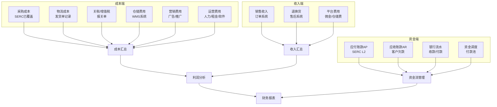
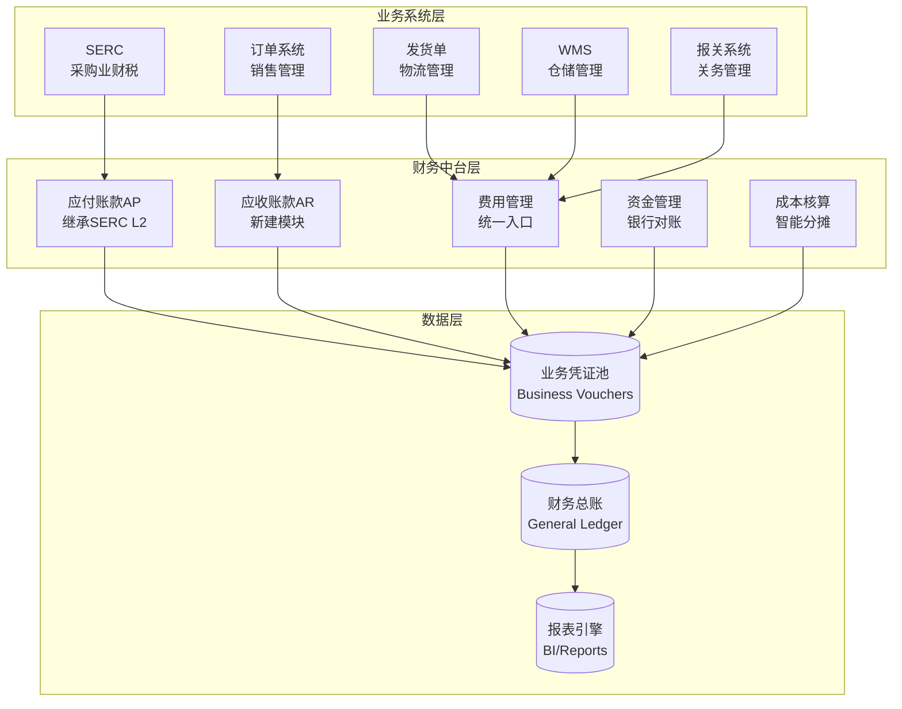

# SERC业财税模块与统一财务系统协调架构评估

**文档版本**: v1.0  
**创建时间**: 2025-12-19  
**评估背景**: 现有SERC系统侧重采购开票对账，需评估如何与未来统一财务系统协调

---

## 一、现状分析

### 1.1 现有SERC系统的定位（✅ 已实现）

**核心架构**：L1（交付合同）→ L2（结算单）→ L3（付款申请）

| 层级 | 名称 | 职责 | 覆盖场景 |
|------|------|------|----------|
| **L1** | 交付合同 | 实物确权、采购对账锚点 | ✅ 采购收货、虚拟入库 |
| **L2** | 采购结算单(SOA) | 应付账款确权、双状态管理 | ✅ 采购对账、开票管理 |
| **L3** | 付款申请单 | 资金执行、银行流水 | ✅ 供应商付款 |
| **Pool** | 付款池 | 资金缓冲、调度优化 | ✅ 定金/尾款/预付 |

**侧重点**：
- ✅ **采购端业务流**：供应商→收货→对账→开票→付款→退税
- ✅ **票据流管理**：发票认领、部分开票、见款开票
- ✅ **退税风控**：换汇成本、三层匹配、报关单溯源

**核心价值**：
1. **三层解耦架构**：解决"多供应商集货"、"分批付款"、"见款开票"等复杂场景
2. **双状态管理**：资金状态（未付/部分付/已结清）+ 票据状态（未开票/部分开票/已开票）
3. **付款池机制**：实现资金计划与单据执行的分离，支持灵活的资金调度
4. **退税风控**：换汇成本控制、报关单项号级匹配、三层数据核验

### 1.2 发货单模块的定位（✅ 刚完成优化）

**职责边界**：仅记录**物流成本**，不参与完整财务核算

| 成本类型 | 记录位置 | 状态 |
|---------|---------|------|
| 运费 | `shipment_orders.freight_cost` | ✅ 保留 |
| 保险费 | `shipment_orders.insurance_cost` | ✅ 保留 |
| 操作费 | `shipment_orders.handling_fee` | ✅ 保留 |
| 其他物流费用 | `shipment_orders.other_costs` | ✅ 保留 |
| 采购成本 | ❌ 标记废弃 | 从采购明细获取 |
| 利润分析 | ❌ 标记废弃 | 从财务系统计算 |

---

## 二、业务全景：财务系统应覆盖的场景

### 2.1 完整的费用类型矩阵

跨境电商/外贸企业的财务核算**远不止采购成本**，以下是完整的费用分类：



### 2.2 现有系统的覆盖缺口

| 场景 | SERC是否覆盖 | 缺口说明 | 影响 |
|------|-------------|----------|------|
| **采购商品对账** | ✅ 完整覆盖 | L2结算单 | - |
| **物流成本对账** | ⚠️ 部分覆盖 | 发货单有记录，但未整合到L2结算单 | 无法完整计算发货成本 |
| **关税/增值税** | ⚠️ 部分覆盖 | 报关单有记录，但未整合财务核算 | 利润分析不准确 |
| **仓储费用** | ❌ 未覆盖 | WMS系统独立，无财务接口 | 成本核算缺失 |
| **营销费用** | ❌ 未覆盖 | 广告平台数据未导入 | ROI分析不准 |
| **销售收入** | ❌ 未覆盖 | 订单系统独立 | 无法计算利润 |
| **应收账款AR** | ❌ 未覆盖 | 仅处理AP，不处理AR | 资金流不闭环 |
| **多公司合并报表** | ⚠️ 部分覆盖 | 有多公司架构，但无合并逻辑 | 集团财务分析受限 |

---

## 三、架构协调方案：SERC + 统一财务系统

### 3.1 总体架构（推荐方案）

采用**"领域分治 + 数据汇聚"**模式：



### 3.2 核心设计原则

#### 原则1：SERC作为**采购域的AP子系统**

**定位调整**：
- ✅ **保留**：SERC的L1-L2-L3架构（采购交付→结算→付款）
- ✅ **增强**：SERC的L2结算单作为统一财务系统中**"应付账款(AP)"**的数据源
- ✅ **扩展**：在SERC基础上，新增**"费用类结算单"**，处理非采购商品的费用

**实施要点**：
```python
# 现有SERC的L2结算单
class FinPurchaseSOA(db.Model):
    """采购结算单 - 专注于采购商品"""
    soa_type = 'purchase_goods'  # 明确类型
    # ... 现有字段保持不变

# 新增：费用类结算单（复用L2架构）
class FinExpenseSOA(db.Model):
    """费用结算单 - 处理非商品费用"""
    soa_type = 'expense'  # 费用类型
    expense_category: str  # 费用类别（物流/仓储/营销/运营）
    reference_type: str    # 关联业务类型（shipment/warehouse/ad）
    reference_id: int      # 关联业务ID
    # ... 复用L2的双状态管理（资金+票据）
```

#### 原则2：建立**"业务凭证池"**作为财务中台

**设计思路**：
- 各业务系统（SERC、发货单、WMS、订单）产生的费用，统一以**"业务凭证"**的形式进入中台
- 财务中台负责**分类、审核、入账、核算**

**数据模型**：
```python
class FinBusinessVoucher(db.Model):
    """业务凭证 - 统一财务入口"""
    __tablename__ = "fin_business_vouchers"
    
    id: int
    voucher_no: str  # 凭证号
    voucher_date: date  # 凭证日期
    
    # 业务溯源
    source_system: str  # 来源系统（serc/shipment/wms/order）
    source_type: str    # 业务类型（purchase/logistics/storage/sales）
    source_id: int      # 业务单据ID
    
    # 财务属性
    direction: str      # 资金方向（debit/credit）
    amount: Decimal     # 金额
    currency: str       # 币种
    
    # 会计科目
    account_code: str   # 科目代码（如：6001运费、6002仓储费）
    cost_center: str    # 成本中心（可选）
    
    # 状态
    status: str         # 待审核/已审核/已入账
    gl_entry_id: int    # 关联总账分录ID（入账后）
```

**业务系统对接示例**：

```python
# 示例1：发货单完成后，自动推送物流成本到财务中台
def on_shipment_completed(shipment_id):
    shipment = ShipmentOrder.query.get(shipment_id)
    
    # 推送运费凭证
    if shipment.freight_cost:
        FinBusinessVoucher.create(
            source_system='shipment',
            source_type='logistics_freight',
            source_id=shipment.id,
            direction='debit',  # 借：运费
            amount=shipment.freight_cost,
            account_code='6001',  # 运费科目
        )
    
    # 推送保险费凭证
    if shipment.insurance_cost:
        FinBusinessVoucher.create(
            source_system='shipment',
            source_type='logistics_insurance',
            source_id=shipment.id,
            direction='debit',
            amount=shipment.insurance_cost,
            account_code='6002',  # 保险费科目
        )
```

```python
# 示例2：SERC的L2结算单确认后，自动推送采购成本
def on_soa_confirmed(soa_id):
    soa = FinPurchaseSOA.query.get(soa_id)
    
    # 推送采购成本凭证（通过明细表追溯到L1）
    for detail in soa.details:
        FinBusinessVoucher.create(
            source_system='serc',
            source_type='purchase_goods',
            source_id=detail.l1_contract_id,
            direction='debit',  # 借：存货
            amount=detail.amount,
            account_code='1403',  # 库存商品科目
        )
```

#### 原则3：应收账款(AR)作为新模块，与SERC对称设计

**设计理念**：
- SERC处理**AP（应付账款）** → 对供应商的债务
- 新建**AR模块（应收账款）** → 对客户的债权

**对称架构**：

| 模块 | 业务对象 | 核心表 | 状态管理 |
|------|---------|-------|---------|
| **SERC (AP)** | 供应商 | `FinPurchaseSOA` | 资金状态 + 票据状态 |
| **AR模块** | 客户 | `FinSalesInvoice` | 资金状态 + 发货状态 |

**数据模型**（新建）：
```python
class FinSalesInvoice(db.Model):
    """销售发票 - AR核心表"""
    __tablename__ = "fin_sales_invoices"
    
    id: int
    invoice_no: str  # 发票号
    customer_id: int  # 客户ID
    
    # 金额
    total_amount: Decimal  # 发票总额
    received_amount: Decimal  # 已收款金额
    
    # 双状态管理（对称SERC）
    payment_status: str  # 未收/部分收/已收清
    shipment_status: str  # 未发货/部分发货/已发货
    
    # 关联订单
    order_ids: List[int]  # 关联多个订单（对应SERC的L1）
```

---

## 四、具体对账场景的协调方案

### 4.1 采购商品对账（✅ SERC已覆盖）

**保持不变**，继续使用SERC的L2结算单。

**核心流程**：
1. 供应商交货 → 生成L1交付合同
2. 按供应商/账期合并 → 生成L2结算单
3. 供应商对账确认 → L2状态：待付款
4. 供应商开票 → L2票据状态：已开票
5. 财务付款 → L3付款单 → L2资金状态：已结清

### 4.2 物流成本对账（🔧 需要整合）

**现状问题**：
- 发货单记录了物流成本（运费、保险费等）
- 但这些成本**未纳入财务对账流程**

**整合方案**：

**方案A：扩展SERC L2结算单（推荐）**

```python
# 在L2结算单中新增"费用行"
class FinPurchaseSOAExpenseLine(db.Model):
    """L2结算单-费用行（非商品）"""
    __tablename__ = "fin_purchase_soa_expense_lines"
    
    soa_id: int  # 关联L2结算单
    expense_type: str  # 费用类型（logistics/storage/other）
    reference_type: str  # 关联业务类型（shipment/warehouse）
    reference_id: int  # 关联业务ID（如shipment_id）
    amount: Decimal
    description: str
    currency: str
```

**使用场景**：
1. 供应商A的货物发出（发货单SH001）
2. 财务生成L2结算单时，**自动关联该发货单的物流成本**
3. 结算单明细：
   - 商品明细：来自L1交付合同
   - 费用明细：来自关联发货单
4. 供应商收到统一的对账单，包含商品和物流费用

**方案B：独立物流费用结算单（备选）**

如果物流成本由**独立的物流服务商**收取（不是供应商），则创建独立的结算单：

```python
class FinLogisticsSOA(db.Model):
    """物流结算单"""
    __tablename__ = "fin_logistics_soas"
    
    logistics_provider_id: int  # 物流商ID（不是供应商）
    shipment_ids: List[int]  # 关联多个发货单
    total_freight: Decimal
    total_insurance: Decimal
    total_handling: Decimal
    # ... 复用L2的双状态管理
```

**适用场景**：
- 使用第三方物流（如DHL、FedEx）
- 物流费用单独与物流商对账结算

### 4.3 关税/增值税对账（🔧 需要新增）

**场景**：
- 海关代扣关税和增值税
- 需要与报关单核对，确保税费准确入账

**整合方案**：

```python
class FinCustomsTaxVoucher(db.Model):
    """关税凭证"""
    __tablename__ = "fin_customs_tax_vouchers"
    
    voucher_no: str  # 凭证号
    customs_declaration_id: int  # 关联报关单
    
    # 税种明细
    import_duty: Decimal  # 关税
    import_vat: Decimal  # 进口增值税
    consumption_tax: Decimal  # 消费税
    
    # 状态管理
    payment_status: str  # 未付/已付
    payment_date: date
    payment_method: str  # 电子支付/保证金抵扣
    
    # 核销信息
    reconciled: bool  # 是否已与海关数据核对
    reconcile_date: date
```

**对账流程**：
1. 报关单审核通过后，自动生成关税凭证
2. 海关扣款后，财务录入付款信息
3. 月底与海关电子口岸数据对账
4. 核对无误后，凭证状态：已核销

### 4.4 仓储费用对账（🔧 需要新增）

**场景**：
- 第三方海外仓收取仓储费、操作费
- 需要与WMS系统的出入库记录核对

**整合方案**：

```python
class FinWarehouseSOA(db.Model):
    """仓储结算单"""
    __tablename__ = "fin_warehouse_soas"
    
    soa_no: str
    warehouse_provider_id: int  # 仓储服务商ID
    billing_period: str  # 账期（2024-12）
    
    # 费用明细
    storage_fee: Decimal  # 仓储费
    inbound_fee: Decimal  # 入库费
    outbound_fee: Decimal  # 出库费
    value_added_fee: Decimal  # 增值服务费（贴标/包装等）
    
    # 关联业务
    inbound_ids: List[int]  # 关联入库单
    outbound_ids: List[int]  # 关联出库单
    
    # 双状态管理
    payment_status: str
    invoice_status: str
```

### 4.5 销售收入对账（❌ 需要新建AR模块）

**场景**：
- 客户下单 → 发货 → 收款
- 需要追踪应收账款和回款进度

**整合方案**：

参考前文的 `FinSalesInvoice` 模型，建立AR管理模块。

**核心流程**：
1. 订单确认 → 生成销售发票
2. 发货完成 → 更新发货状态
3. 客户付款 → 更新资金状态
4. 月底对账 → 核对应收账款余额

---

## 五、实施路径建议

### 阶段1：最小化改造（v1.5，3个月）

**目标**：在不破坏SERC的基础上，补充缺失功能

#### 任务1：新增"业务凭证池"表 ✅

**数据模型**：
```python
class FinBusinessVoucher(db.Model):
    """业务凭证 - 统一财务入口"""
    # 见前文详细定义
```

**价值**：
- 作为各业务系统向财务推送数据的统一入口
- 发货单、WMS等系统完成后，推送凭证到池中
- 为后续总账系统奠定基础

#### 任务2：扩展SERC L2结算单 ✅

**新增费用行表**：
```python
class FinPurchaseSOAExpenseLine(db.Model):
    """L2结算单-费用行"""
    # 见前文详细定义
```

**改造点**：
- L2结算单生成时，自动关联相关发货单的物流成本
- 对账单显示：商品明细 + 费用明细
- 保持现有采购商品对账逻辑不变

#### 任务3：建立AR模块（应收账款）✅

**核心表**：
- `FinSalesInvoice`（销售发票）
- `FinSalesInvoiceDetail`（发票明细）
- `FinReceiptVoucher`（收款凭证）

**对称设计**：
- 复用SERC的双状态管理逻辑
- 支持分批发货、分批收款
- 与订单系统集成

### 阶段2：深度整合（v2.0，6个月）

**目标**：建立完整的财务中台

#### 任务1：总账系统 ✅

**核心功能**：
- 自动根据业务凭证生成会计分录
- 支持多公司、多币种、多账簿
- 提供科目余额表、总分类账、明细账

**数据模型**：
```python
class FinGeneralLedger(db.Model):
    """总账分录"""
    entry_no: str  # 凭证号
    entry_date: date  # 记账日期
    account_code: str  # 科目代码
    debit_amount: Decimal  # 借方金额
    credit_amount: Decimal  # 贷方金额
    business_voucher_id: int  # 关联业务凭证
    # ...
```

#### 任务2：成本核算引擎 ✅

**核心功能**：
- 智能分摊物流、仓储、营销费用到SKU
- 支持加权平均、FIFO、LIFO等成本计算方法
- 提供多维度成本分析（SKU/类目/市场/渠道）

**算法示例**：
```python
# 按销售额比例分摊物流成本
def allocate_logistics_cost(shipment_id):
    shipment = ShipmentOrder.query.get(shipment_id)
    total_logistics_cost = shipment.total_logistics_cost
    
    # 获取该发货单的所有SKU及其销售额
    items = shipment.items  # 商品明细
    total_sales = sum(item.quantity * item.unit_price for item in items)
    
    # 按销售额比例分摊
    for item in items:
        item_sales = item.quantity * item.unit_price
        allocated_cost = total_logistics_cost * (item_sales / total_sales)
        
        # 记录分摊结果
        CostAllocation.create(
            sku=item.sku,
            cost_type='logistics',
            allocated_amount=allocated_cost,
            source_id=shipment_id,
        )
```

#### 任务3：资金管理 ✅

**核心功能**：
- 银行流水自动对账
- 资金预测和调度优化
- 多银行账户统一管理

**数据模型**：
```python
class FinBankTransaction(db.Model):
    """银行流水"""
    transaction_no: str  # 银行流水号
    bank_account_id: int  # 银行账户
    transaction_date: date
    amount: Decimal
    direction: str  # in/out
    counterparty: str  # 对方账户名
    # 对账状态
    reconciled: bool
    reconcile_voucher_id: int  # 关联业务凭证
```

### 阶段3：智能化（v3.0，长期）

#### 功能1：智能对账

**技术方案**：
- AI/NLP识别银行流水的交易对手和用途
- 自动匹配业务单据（L2结算单、L3付款单等）
- 异常提醒（金额不符、重复付款等）

#### 功能2：风险预警

**预警场景**：
- 现金流预警：预测未来30天资金缺口
- 汇率风险：监控外币应付/应收，提示套期保值
- 账期风险：客户超期未付款预警

#### 功能3：税务优化

**优化方向**：
- 跨境税筹：利用不同国家税率差异优化利润
- 退税最大化：智能匹配报关单和发票，提升退税效率
- 合规检查：自动检查财务数据是否符合税法要求

---

## 六、关键决策建议

### ✅ 建议保留的设计

1. **SERC的L1-L2-L3架构**
   - 经过验证的成熟设计，保持不变
   - 三层解耦有效解决复杂业务场景
   - 业界罕见的创新设计，具有竞争力

2. **付款池机制**
   - 资金调度的核心创新，扩展到AR侧
   - 实现"业务与资金分离"，财务灵活性大幅提升
   - 支持预付、定金、尾款等多种付款模式

3. **双状态管理**
   - 资金状态+票据状态，扩展到其他业务
   - 解决"见款开票"等现实痛点
   - 为部分退税、分批开票提供支撑

### ⚠️ 建议调整的设计

1. **SERC定位**
   - 从"业财税一体化"收窄为"采购域AP管理 + 退税风控"
   - 理由：单一系统难以覆盖企业所有财务场景
   - 建议：定位为财务中台的"采购子模块"

2. **发货单财务字段**
   - 继续废弃非物流成本字段（已完成）
   - 物流成本通过业务凭证池推送到财务系统
   - 发货单专注物流业务，不承担财务核算职责

3. **独立建设AR模块**
   - 不要强行在SERC中处理销售侧业务
   - AR与AP是对称的两个域，应独立设计
   - 可以复用SERC的架构思想（双状态管理等）

### 🔧 建议新增的设计

1. **业务凭证池**
   - 统一财务入口，解耦业务系统
   - 所有费用类业务（物流、仓储、营销等）通过凭证池进入财务
   - 为自动记账、总账系统奠定基础

2. **费用类结算单**
   - 处理物流、仓储、营销等非商品费用
   - 复用SERC L2的双状态管理逻辑
   - 统一对账流程，提升财务效率

3. **总账系统**
   - 作为财务核心，汇聚所有业务数据
   - 自动生成会计分录，符合会计准则
   - 提供多维度财务报表和分析

---

## 七、总结

### 核心观点

1. **SERC不是完整的财务系统**
   - 而是**采购域的AP管理工具** + **出口退税风控引擎**
   - 优势在于解决复杂采购场景和退税合规问题
   - 不应承担企业全部财务核算职责

2. **未来财务系统应该是"中台架构"**
   - SERC作为其中的一个子模块（采购AP）
   - 新增AR模块、费用管理、总账系统等
   - 各模块数据汇聚到财务中台，统一核算和报表

3. **对账不止采购**
   - 还包括：物流、仓储、关税、销售、营销、运营等多个维度
   - 每个维度都需要独立的对账流程
   - 最终在财务中台汇总，生成完整的财务报表

### 架构协调的关键

| 维度 | SERC角色 | 财务系统角色 | 协调方式 |
|------|---------|-------------|---------|
| **AP管理** | ✅ 核心职责 | 继承SERC的L2数据 | SERC独立运行，财务读取 |
| **AR管理** | ❌ 不涉及 | ✅ 新建模块 | 对称设计，复用双状态逻辑 |
| **费用对账** | ⚠️ 扩展支持 | ✅ 统一管理 | SERC L2增加费用行 |
| **总账核算** | ❌ 不涉及 | ✅ 核心职责 | 业务凭证池推送 |
| **报表分析** | ⚠️ 仅退税 | ✅ 全场景 | 数据中台汇聚 |

### 实施优先级

#### P0（必须做，3个月）
1. **业务凭证池**：统一财务入口，为后续扩展奠定基础
2. **AR模块**：补齐应收账款管理，实现资金流闭环
3. **扩展SERC L2**：支持费用行，整合物流成本对账

#### P1（应该做，6个月）
1. **总账系统**：自动记账，生成财务报表
2. **成本核算引擎**：智能分摊费用，计算SKU成本
3. **资金管理**：银行流水对账，资金预测

#### P2（可以做，长期）
1. **智能对账**：AI识别银行流水，自动匹配单据
2. **风险预警**：现金流/汇率/账期风险提醒
3. **税务优化**：跨境税筹，退税最大化

---

## 八、附录：术语对照表

| 术语 | 英文 | 说明 |
|------|------|------|
| **SERC** | Supply Export Refund Compliance | 供应链出口退税风控系统 |
| **L1** | Delivery Contract | 交付合同（实物确权） |
| **L2** | Settlement Statement / SOA | 结算单（债务确权） |
| **L3** | Payment Request | 付款申请单（资金执行） |
| **AP** | Accounts Payable | 应付账款 |
| **AR** | Accounts Receivable | 应收账款 |
| **SOA** | Statement of Account | 对账单 |
| **GL** | General Ledger | 总账 |
| **双状态管理** | Dual-Status Management | 资金状态 + 票据状态 |
| **业务凭证池** | Business Voucher Pool | 统一财务入口 |
| **三层解耦** | Three-Layer Decoupling | L1-L2-L3架构 |

---

**文档状态**: ✅ 已完成  
**下一步行动**: 根据评估结果，制定详细的技术实施方案  
**负责人**: 待分配  
**预计完成时间**: 2026-06-30（阶段2完成）

