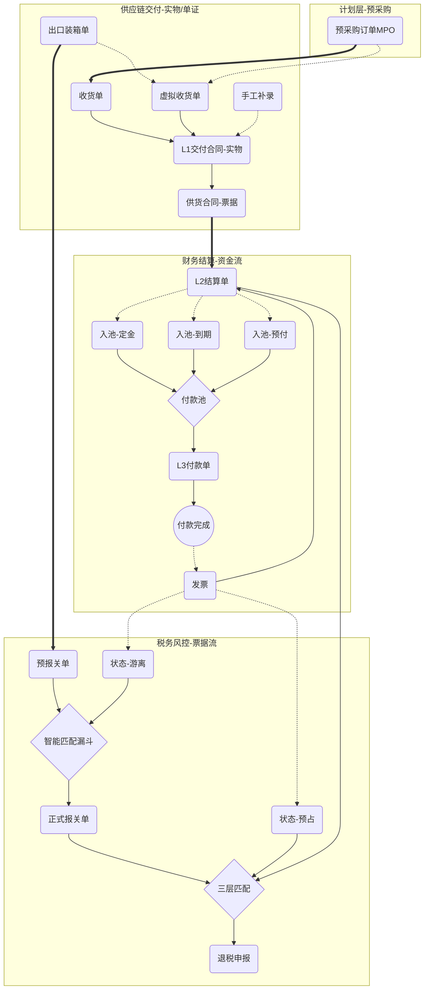

# 出口退税智能风控系统 (SERC) 详细设计说明书

## 1. 文档概述

### 1.1 背景与目的
本文档基于“业财税一体化”理念，旨在构建一套解决跨境电商及外贸企业在供应链、财务、税务协作中痛点的智能系统。系统以解决“多供应商集货”、“见款开票”等复杂现实场景为核心，通过“三层解耦”架构实现资金流与票据流的灵活匹配，确保税务合规并最大化退税效率。

### 1.2 适用范围
本系统适用于具有自营出口业务的跨境电商企业、外贸公司及工贸一体化企业。

---

## 2. 核心业务架构

系统采用**“双线并行 + 关键点交汇”**的总体架构，并引入**“三层解耦”**模型解决资金与票据的异步问题。

### 2.1 总体流程图 (Mermaid)

---

## 3. 详细功能模块设计

### 3.1 源头管理模块：实物流与合同流的映射

本系统遵循**“虚实结合，以单证为准”**的核心原则。无论货物是否经过我司实体仓库，系统层面必须建立完整的“采购-入库-出库”链条，以确保财务成本结转的合规性。

#### 3.1.1 核心单据定义与权责转移
*   **采购订单 (MPO - Pre-Order)**：
    *   **定义**：仅作为供应链的**预采购协议**或框架合同。
    *   **权责**：此时商品权责仍在供应商，**不产生财务应付账款**。
*   **交付合同 (L1 - Delivery Contract) —— 核心凭证**：
    *   **定义**：基于实物交付（收货单）或虚拟交付（出口装箱单）生成的正式法律凭证。
    *   **权责转移**：**标志着商品权责由供应商转移至我司**。
    *   **财务属性**：是确认资产入库和应付账款（AP）的唯一依据。
*   **收货单 (GRN) / 出口装箱单 (PL)**：
    *   作为交付合同生成的**事实依据**（Evidence of Fact）。
    *   "入库即确权"：无论实物入库还是虚拟入库，均以此节点触发 L1 生成。

#### 3.1.2 交付合同生成体系 (四种核心场景)

交付合同是结算与退税的基石，必须严守**“一单一合同”**（基于收货单/虚拟收货单）的颗粒度原则，严禁在合同生成阶段进行不明合并。

| 场景编号 | 场景名称 | 触发源头 | 逻辑描述 | 适用情况 |
| :--- | :--- | :--- | :--- | :--- |
| **01** | **手工补录** | 手工录入 | 全手工填写合同日期、商品明细、单价等。建议关联采购单号以校验。 | 历史数据清洗、特殊应急通道。 |
| **02** | **标准库存交付** | **收货单** (实体) | 引用已审核的收货单，1:1 生成交付合同。 | **备货模式**。供应商批量交货至仓库，后续分批出口。 |
| **03** | **出口直装交付** | **出口装箱单** | 系统自动根据装箱单明细 $\rightarrow$ 匹配采购单 $\rightarrow$ 反推生成虚拟收货单 $\rightarrow$ 生成交付合同。 | **背对背/工厂直发模式**。最常见的业务形态。 |
| **04** | **月结付款** | **付款申请** (资金级) | **合同端保持独立**，在付款端进行合并。详见 3.2.3 章节。 | 长期合作供应商，每月集中结算一次。 |

#### 3.1.3 交付合同的法律合规性
*   **证据链闭环**：系统生成的 L1 交付合同明细及最终打印的合同文件，必须包含**关联条款**。
*   **系统动作**：在生成或打印交付合同时，系统自动强制添加备注：*"本合同系采购框架协议 [MPO编号] 之具体执行单据"*。防止税务函调时被认定为虚假贸易或事后补造合同。

#### 3.1.4 复杂场景适配 (业务场景补充)

*   **场景 04 (拼柜/集货)**：一个出口装箱单包含多个供应商商品 $\rightarrow$ 系统自动按供应商拆分为多个虚拟收货单 $\rightarrow$ 生成多份交付合同。
*   **场景 05 (溢短装与损耗)**：
    *   **痛点**：采购1000个，实际收货/装箱995个（短装）或1005个（溢装）。
    *   **处理**：交付合同严格按**“实收/实际装箱数量”**生成。系统应支持自动截断原采购单的剩余数量（Close Short），避免长期挂账。
*   **场景 06 (红字/退换货)**：
    *   **痛点**：货物质量问题退回或退运。
    *   **处理**：生成“红字收货单” $\rightarrow$ 生成“负数交付合同”或“补充协议” $\rightarrow$ 冲抵 L2 应付账款。
*   **场景 07 (多币种/调价)**：
    *   **痛点**：采购单为美元，国内结算需转人民币；或交付时临时调价。
    *   **处理**：引用收货单生成交付合同时，允许**“特批修改单价”**（需上传调价函附件），系统重新计算合同总额。

### 3.2 财务资金线：三层解耦架构 (核心创新)

为解决“多供应商集货”、“分批付款”、“见款开票”等业务冲突，采用 **L1-L2-L3** 三层架构。

#### 3.2.1 L1 交付合同与供货合同双轨制 (Dual-Track Structure)
*   **核心设计**：为解决“名/量/单不一致”的业务痛点，将交易单据拆分为**“业务实物”**与**“财务商务”**双实体。
*   **A. L1 交付合同 (Delivery Contract)**
    *   **定义**：记录真实的物理交付/虚拟入库，与收货单强一致。
    *   **作用**：采购对账、库存扣减、报关单溯源锚点。
    *   **字段**：商品名称(A)、数量(100)、单位(KG)、源头收货单ID。
*   **B. 供货合同 (Supply Contract)**
    *   **定义**：记录为了满足财务/税务要求而调整的商务/票据信息（原 L1-Inv）。
    *   **作用**：生成 L2 结算单、财务凭证、税务申报。
    *   **字段**：商品名称(B)、数量(200)、单位(瓶)、关联L1_ID。
    *   **风控**：供货合同的总金额必须与 L1 交付合同保持严格一致（允许尾差），确保“业财金额对齐”。
*   **状态**：`待结算` / `结算中` / `已结算`。

#### 3.2.2 L2 采购结算单 (Purchase SOA) —— **核心枢纽**
*   **定义**：应付账款（AP）的确权单据，连接供应链（货）与财务（票/款）的锚点。
*   **生成策略**：
    *   **合并模式**：勾选多个 L1（如月结） $\rightarrow$ 生成一个 L2。
    *   **直通模式**：一个 L1 $\rightarrow$ 生成一个 L2。
*   **双状态管理**：
    *   **资金状态**：`未付` / `部分付款` / `已结清`（由 L3 驱动）。
    *   **票据状态**：`未开票` / `部分开票` / `已开票`（由发票挂载驱动）。

#### 3.2.3 L3 付款申请单 (Payment Request)与付款池
*   **引入付款池 (Payment Pool)**：在 L2 与 L3 之间增加“资金缓冲层”。
*   **逻辑**：
    1.  **入池**：L2 确权后，依据账期规则（如 Net 30）或手工申请（定金/预付），生成“付款计划项”进入池中。
    2.  **蓄水**：池中汇聚了所有待付款项（含定金、尾款、预付税款等）。
    3.  **出池**：财务总监根据资金状况，**挑选/批量**批准池中款项 $\rightarrow$ 生成 L3 付款单。
*   **价值**：实现“资金计划”与“单据执行”的分离，支持灵活的资金调度（如拆东墙补西墙、优先付急单）。

#### 3.2.4 现实业务兼容：见款开票与部分退税（详细操作流程）

为解决供应商“见款开票”或“分批开票”的实际场景，系统需支持“预付/分批开票兼容方案”。这不需要推翻架构，而是在 L2（结算单）和 L3（付款单）之间增加**“发票认领（Claim）”**机制。

**策略 A：理想情况（大厂/强势供应商）**
*   **模式**：先票后款。
*   **操作**：生成 L2 结算单后，直接要求供应商开具全额发票，发票直接挂载在 L2 结算单上。付款进度（L3）按计划执行，不影响退税。

**策略 B：现实情况（中小供应商/见款开票）**
*   **模式**：先款后票，或分批付款分批开票。
*   **操作逻辑**：

    1.  **第一步：业务确权（L2）**
        *   生成 **L2 采购结算单**（例如总额 100万）。
        *   初始状态：`资金状态：待付款`，`票据状态：待开票`。

    2.  **第二步：分批付款（L3）**
        *   财务创建 **L3 付款申请单-01**（例如付30万）。
        *   供应商收到30万款项后，开具一张30万的发票（或暂不开票）。

    3.  **第三步：发票录入与认领（关键机制）**
        *   **入口**：在【发票管理】模块录入收到的发票（如30万）。
        *   **关联动作**：系统询问归属，用户选择关联至 **L2 采购结算单**。
        *   **状态更新**：
            *   L2 总额：100万
            *   已关联发票金额：30万
            *   L2 票据状态更新为：**`部分开票`**。

    4.  **第四步：退税申报（支持部分退税）**
        *   **核心痛点解决**：无需等待100万发票全齐即可启动退税。
        *   **系统支持（专家修正版）**：【退税匹配引擎】执行**“报关单项号级凑数”**算法。
        *   **动作**：系统扫描报关单明细，寻找**“该项号对应发票已全额到位”**的记录。例如，报关单有两行（项号01、02），项号01的发票齐了，项号02没齐。系统将锁定**项号01**进行申报，项号02暂时搁置。
        *   **硬约束**：**同一个项号下的数据必须一次性申报，不可拆分**。
        *   **闭环**：剩余额度保留在池中，待后续发票补充完整后，触发剩余项号的匹配和申报。

### 3.2.5 逆向流程与异常处理（专家补充）
*   **L2 红冲流程 (Credit Note)**：
    *   场景：发生退货或质量扣款。
    *   操作：生成负数 L1 明细，汇入 L2 结算单，冲减应付余额。
*   **发票作废/红冲**：
    *   场景：供应商发票开错或退货。
    *   操作：系统联动解除该发票与报关单的锁定关系，释放报关单额度回到“待匹配池”，允许重新匹配。
*   **非贸费用处理**：
    *   支持在 L2 中添加“非货款项目”（如模具费），此类费用打标为 `不参与退税`。

### 3.3 关务与风控线

#### 3.3.1 换汇成本风控体系
*   **事前（定价辅助）**：
    *   输入采购成本，设定目标换汇成本（如6.5），系统**逆向计算**建议的最低FOB申报单价。
*   **事中（申报阻断与归一化）**：
    *   **成交方式归一化 (Incoterms Normalization)**：系统必须支持将 EXW、CIF、DDP 等多种成交方式的价格，自动换算为 **FOB 净价**（扣除海外运保费、关税等）。这是计算换汇成本分母的**前置必要条件**。
    *   **实时阻断**：预报关单导出前，基于归一化后的 FOB 价格实时计算换汇成本。若超出安全区间 `[汇率-1.5, 汇率+1.0]`，强制锁定。
*   **事后（退税终审）**：
    *   申报前复核：$$ \text{最终换汇成本} = \frac{\text{发票价税合计}}{\text{报关单FOB净价}} $$

#### 3.3.2 智能匹配引擎与三层漏斗
*   **核心痛点**：解决报关单与发票之间“弱关联”及“名/量不一致”的匹配难题。
*   **匹配策略 (三层漏斗)**：
    1.  **基因匹配 (Gene Match)**：基于 `Origin_Source_ID` (收货单) 的硬链接。
        *   路径：报关单 $\rightarrow$ 收货单 $\rightarrow$ L1 交付合同 $\rightarrow$ 供货合同 $\rightarrow$ 发票。
        *   *优势：即使发票品名已改为B，依然能通过ID链路找到报关单A。*
    2.  **特征匹配 (Feature Match)**：基于 `供应商 + 金额 + 数量` 的智能推荐。
        *   适用：历史数据或断链数据。
    3.  **强制指派 (Force Match)**：人工手动“拉郎配”，处理极端脏数据。

#### 3.3.3 预报关单定价与发票策略
*   **FOB定价模式**：
    *   **模式A (成本加成)**：基于采购成本 * 利润率，自动计算 FOB。
    *   **模式B (发票倒推)**：从“游离发票池”中选取发票，逆算 FOB。
    *   **模式C (手工录入)**：全手工填写。
*   **发票状态机 (三态模型)**：
    *   **预占态 (Reserved)**：默认状态。发票已开，但货物未出口，系统保护其不被挪用。
    *   **游离态 (Free)**：无主发票或人工释放的发票。**仅此状态**可被模式B调用。
    *   **锁定态 (Locked)**：已匹配报关单，冻结。
*   **人工干预**：生成 L2 时，可手动取消“预占”，将发票直接投入“游离池”以消化历史积压。

---

## 4. 关键数据实体设计

### 4.1 采购结算单 (`purchase_soa`)
| 字段名 | 类型 | 说明 |
| :--- | :--- | :--- |
| `soa_no` | string | 结算单号 |
| `supplier_id` | long | 供应商ID |
| `total_amount` | decimal | 结算总额 |
| `paid_amount` | decimal | 已付金额 (来自L3) |
| `invoiced_amount` | decimal | 已开票金额 (来自发票挂载) |
| `payment_status` | enum | 未付/部分/已结清 |
| `invoice_status` | enum | 未开/部分/已开 |

### 4.2 换汇成本配置 (`risk_config_exchange_rate`)
| 字段名 | 类型 | 说明 |
| :--- | :--- | :--- |
| `currency` | string | 币种 (USD) |
| `safe_min` | decimal | 安全下限 (如 5.5) |
| `safe_max` | decimal | 安全上限 (如 8.0) |
| `block_strategy` | enum | 阻断策略 (警告/禁止) |

### 4.3 退税率版本库 (`tax_refund_rate_history`)（专家补充）
| 字段名 | 类型 | 说明 |
| :--- | :--- | :--- |
| `hs_code` | string | 海关编码 |
| `rate` | decimal | 退税率 (如 0.13) |
| `effective_date` | date | 生效日期 |
| `expiry_date` | date | 失效日期 |
*   **逻辑**：系统在计算换汇成本时，严格依据**“报关出口日期”**匹配该时间段内有效的退税率，而非当前系统日期。

---

## 5. 实操案例集 (Case Study)

### 5.1 场景一：标准流程 - "单单匹配"
**适用对象**：采购员、财务、关务
**背景**：向大供应商 A 采购 1000件 商品 X，一次性发货，一次性报关。

#### 1. 供应链端
*   **采购员**：下单 MPO-001，单价 100元。
*   **库管**：收货 1000件，系统自动生成 **收货单 GRN-001**。
*   **系统动作**：
    *   财务端：基于收货单生成 L1 交付合同明细（1000件 × 100元 = 10万）。
    *   关务端：生成预报关单草稿。

#### 2. 财务端 (先票后款)
*   **财务**：勾选 L1，生成 **L2 结算单 SOA-001** (10万)。
*   **动作**：直接通知供应商 A 开票。
*   **供应商**：开来一张 10万 的专票。
*   **财务**：录入发票，挂载到 SOA-001 上。此时 L2 状态变更为 `已开票`。
*   **付款**：哪怕钱还没付，退税流程已经可以启动了。

#### 3. 关务与税务端
*   **关务**：完善预报关单，系统提示“换汇成本 6.8 (安全)”，放行申报。
*   **退税**：退税引擎发现 L2 已全额开票，报关单也已放行，自动匹配成功，进入申报列表。

### 5.2 场景二：复杂流程 - "拼柜出口 + 见款开票 + 付款池调度"
**适用对象**：财务、采购
**背景**：
*   **出口**：一个集装箱（出口装箱单 PL-002），里面拼了：
    *   供应商 B 的货：300件 (总价3万)
    *   供应商 C 的货：700件 (总价7万)
*   **付款**：供应商 C 比较强势，要求“先付30%定金，见尾款发货”。

#### 1. 供应链自动拆解
*   **系统动作**：出口装箱单 PL-002 触发系统**虚拟入库**，并自动按供应商拆分生成两张虚拟收货单，进而生成两个 L1：
    *   L1-B: 供应商B, 3万
    *   L1-C: 供应商C, 7万

#### 2. 财务与付款池调度
*   **对供应商 B (正常结算)**：生成 L2-B，直接收票结算。
*   **对供应商 C (定金+尾款)**：
    1.  **确权**：生成 **L2-C** (总额 7万)。
    2.  **定金入池**：业务员申请 30% 定金 $\rightarrow$ 付款池新增 `[C-定金: 2.1万]`。
    3.  **优先支付**：财务总监批准定金 $\rightarrow$ 生成 L3-Pay-01 (付2.1万) $\rightarrow$ 供应商C收到定金。
    4.  **尾款入池**：发货前，L2-C 剩余尾款自动触发入池 $\rightarrow$ 付款池新增 `[C-尾款: 4.9万]`。
    5.  **尾款支付**：财务总监批准尾款 $\rightarrow$ 生成 L3-Pay-02 (付4.9万)。

#### 3. 发票与退税
*   **发票认领**：供应商 C 收到全款后，开具 7万 全额发票。财务挂载至 L2-C。
*   **退税引擎动作**：
    *   检测到 L2-C 资金已清 (Paid) 且 票据已齐 (Full)。
    *   系统自动匹配报关单明细，放行退税申报。

### 5.3 场景三：历史包袱消化 - "双轨制调整 + 发票倒推"
**适用对象**：财务经理、采购
**背景**：
*   **历史遗留**：有一批库存“商品A”（无源头数据），积压了大量发票（游离态）。
*   **现实操作**：新采购了一批“商品A”，但为了配合供应商和消化旧票，交付合同需写“商品A”，但开票要按“商品B”开。

#### 1. 双轨制录入 (L1 vs 供货合同)
*   **生成 L1**：采购员录入标准交付合同 `L1: 商品A, 100个`。
*   **调整 供货合同**：财务在生成开票计划时，手动调整供货合同明细为 `供货合同: 商品B, 200个`。
    *   **系统校验**：L1 总额 = 供货合同总额，允许通过。

#### 2. 存量消化 (发票策略)
*   **预报关定价 (模式B)**：业务员在做“商品A”的预报关时，选择 **“发票倒推模式”**。
*   **匹配动作**：
    *   系统展示 **“游离发票池”**。
    *   业务员勾选了那批历史积压的“商品A”发票。
    *   **逆算**：系统根据所选发票总额，自动计算出符合退税逻辑的报关 FOB 单价。
*   **结果**：
    *   新出口的货（商品A）成功使用了历史积压的发票进行退税。
    *   供货合同（商品B）的新发票进入游离池，等待未来匹配。

### 5.4 场景四：风控拦截 - "换汇成本异常阻断"
**适用对象**：关务、业务员、财务
**背景**：业务员在预报关阶段，由于输入错误或成本核算偏差，导致换汇成本超出安全区间。

#### 1. 触发预警
*   **业务员**：录入预报关单数据。
    *   采购含税总价：￥100,000 (来自 L1 合同)
    *   预申报 FOB 总价：$12,000
*   **系统实时计算**：
    *   当前汇率：7.2
    *   计算换汇成本 = 100,000 / 12,000 ≈ **8.33**
    *   安全区间配置：[5.7, 8.0]

#### 2. 系统阻断与处理
*   **动作**：点击【提交审核】或【导出报关单】时，系统拦截。
    > ⛔ **风控阻断**
    > 当前换汇成本 8.33 超出安全上限 8.0。
    > 风险提示：存在“高报成本”或“低报出口价”嫌疑，极易触发税务函调。
*   **修正路径**：
    1.  **检查采购价**：是否关联了错误的 L1 合同？（如选了昂贵的样品合同）
    2.  **检查申报价**：是否漏算了运保费？（如误将 CIF 价当成 FOB 价填入，导致分母变大，指标异常）
    3.  **合规调整**：业务员核实后，将申报 FOB 总价修正为 $13,000 (换汇成本降至 7.69)，系统放行。

---

## 6. 预期价值
1.  **业务弹性**：完美适配“多供应商拼柜”与“见款开票”等复杂现实场景。
2.  **现金流优化**：通过“部分退税”机制，无需等待全额付款/开票即可回笼部分税款。
3.  **合规零风险**：换汇成本双重风控体系将税务函调风险降至最低。

---
**版本**: v2.1 (含案例版)
**日期**: 2025-11-24
