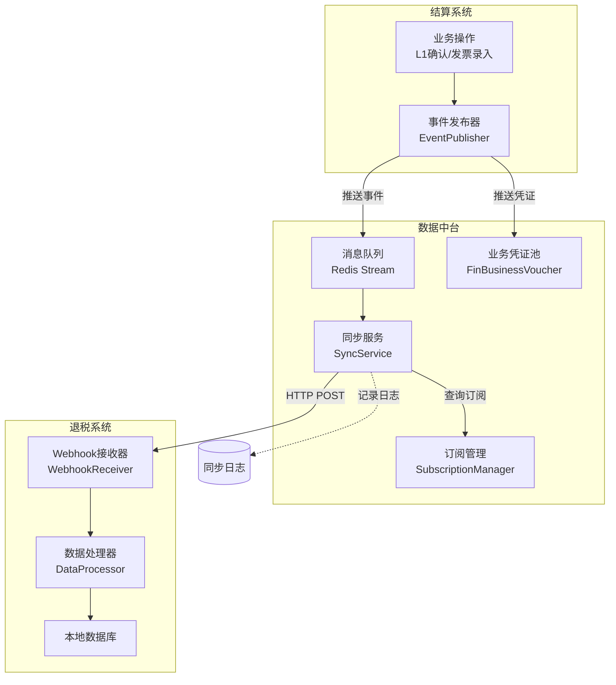
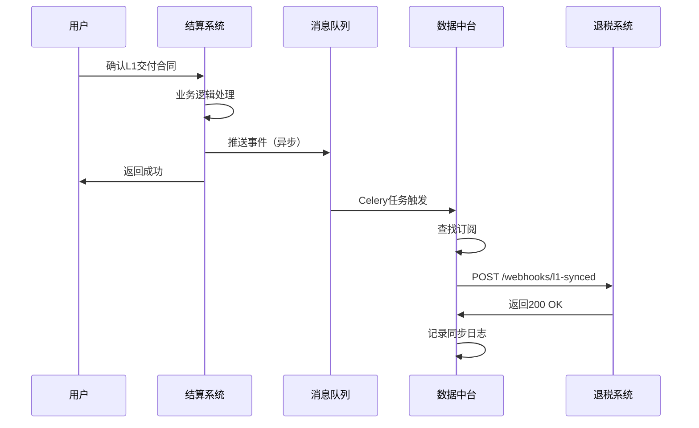

# 数据同步机制设计

**文档版本**: v1.0  
**创建时间**: 2025-12-19  
**状态**: 架构设计阶段

---

## 一、设计目标

### 1.1 核心目标

1. **数据一致性**：确保结算系统和退税系统的数据保持一致
2. **低延迟**：关键数据实时同步，延迟< 1分钟
3. **高可靠性**：同步成功率 > 99.9%
4. **可追溯**：完整的同步日志，便于问题排查
5. **可扩展**：支持未来新增系统的接入

### 1.2 设计原则

- **单向数据流**：退税系统只读取结算系统数据，不反向修改
- **最终一致性**：允许短暂的数据延迟，但最终必须一致
- **故障隔离**：同步失败不影响业务系统正常运行
- **可监控**：提供完善的监控指标和告警机制

---

## 二、同步架构

### 2.1 总体架构



### 2.2 三种同步模式

#### 模式1：实时同步（关键数据）

**适用场景**：
- L1交付合同确认
- 发票录入
- L2结算单生成

**同步流程**：
```python
# 结算系统
@signal.connect('l1_contract_confirmed')
def on_l1_confirmed(sender, contract_id, **kwargs):
    # 1. 推送凭证到数据中台
    voucher = create_voucher(contract_id)
    
    # 2. 推送到消息队列（异步）
    publish_to_queue('l1_confirmed', voucher.to_dict())
    
    # 3. 立即返回，不阻塞业务
    return

# 数据中台
@celery.task
def process_voucher_event(event_type, voucher_data):
    # 1. 查找订阅
    subscriptions = find_subscriptions(event_type)
    
    # 2. 批量推送
    for sub in subscriptions:
        push_to_webhook(sub.webhook_url, voucher_data)
```

**时序图**：


**性能指标**：
- 端到端延迟：< 5秒
- 成功率：> 99.9%

---

#### 模式2：批量同步（非关键数据）

**适用场景**：
- 供应商信息变更
- 商品信息更新
- 历史数据修正

**同步流程**：
```python
# 定时任务（每天凌晨2点）
@celery.task
def daily_batch_sync():
    # 1. 查询昨天变更的数据
    yesterday = date.today() - timedelta(days=1)
    changed_records = query_changed_records(yesterday)
    
    # 2. 批量推送
    for batch in chunk(changed_records, batch_size=100):
        push_batch(batch)
        
        # 3. 限流：每批次间隔1秒
        time.sleep(1)
```

**优点**：
- 降低系统负载
- 避免高峰期影响性能
- 可以批量优化（合并请求）

**缺点**：
- 延迟较高（T+1）
- 不适合关键数据

---

#### 模式3：补偿同步（异常恢复）

**适用场景**：
- 实时同步失败后的重试
- 数据一致性检查发现差异
- 人工触发的数据修复

**同步流程**：
```python
# 重试失败的同步
@celery.task
def retry_failed_sync():
    # 1. 查询失败的同步日志
    failed_logs = FinDataSyncLog.query.filter(
        FinDataSyncLog.status == 'failed',
        FinDataSyncLog.retry_count < 3
    ).all()
    
    # 2. 逐条重试
    for log in failed_logs:
        try:
            # 重新同步
            retry_sync(log)
            log.mark_success()
        except Exception as e:
            log.retry_count += 1
            log.mark_failed(str(e))

# 数据一致性检查（每周日凌晨）
@celery.task
def weekly_consistency_check():
    # 1. 对比源数据和目标数据
    inconsistent = compare_data()
    
    # 2. 生成差异报告
    report = generate_report(inconsistent)
    
    # 3. 发送告警
    send_alert(report)
    
    # 4. 自动修复（可选）
    if auto_fix_enabled:
        for record in inconsistent:
            fix_data(record)
```

**重试策略**：指数退避
```
第1次重试：1秒后
第2次重试：2秒后
第3次重试：4秒后
超过3次：人工介入
```

---

## 三、数据流转详解

### 3.1 L1交付合同同步流程

**场景**：结算系统确认L1交付合同，需要同步到退税系统

**步骤1：结算系统推送**
```python
# 结算系统 services/serc/supply_service.py
class SupplyService:
    @classmethod
    def confirm_contract(cls, contract_id, user_id):
        # 业务逻辑：更新状态
        contract = ScmDeliveryContract.query.get(contract_id)
        contract.status = 'confirmed'
        db.session.commit()
        
        # 推送数据到中台
        from app.services.middleware.voucher_service import VoucherService
        VoucherService.create_from_l1(contract, user_id)
        
        return contract
```

**步骤2：数据中台处理**
```python
# 数据中台 services/middleware/voucher_service.py
class VoucherService:
    @classmethod
    def create_from_l1(cls, contract, user_id):
        # 1. 创建业务凭证
        voucher = FinBusinessVoucher(
            voucher_no=FinBusinessVoucher.generate_voucher_no(),
            voucher_date=date.today(),
            source_system='settlement',
            source_module='l1_contract',
            source_type='purchase_goods',
            source_id=contract.id,
            source_reference_no=contract.contract_no,
            company_id=contract.shipper_company_id,
            counterparty_type='supplier',
            counterparty_id=contract.supplier_id,
            counterparty_name=contract.supplier.name,
            direction='debit',
            amount=contract.total_amount,
            currency=contract.currency,
            summary=f'采购交付合同：{contract.contract_no}',
            business_data={
                'contract_no': contract.contract_no,
                'supplier_id': contract.supplier_id,
                'total_amount': float(contract.total_amount),
                'items': [
                    {
                        'sku': item.sku,
                        'quantity': float(item.confirmed_qty),
                        'unit_price': float(item.unit_price)
                    }
                    for item in contract.items
                ]
            },
            status='approved',  # L1确认后自动审核
            sync_status='pending',
            sync_target_systems=['tax'],
            created_by=user_id
        )
        db.session.add(voucher)
        db.session.flush()
        
        # 2. 异步推送
        from app.tasks.middleware import push_voucher_to_subscribers
        push_voucher_to_subscribers.delay(voucher.id, 'l1_confirmed')
        
        return voucher
```

**步骤3：异步推送任务**
```python
# Celery任务 tasks/middleware/sync_tasks.py
@celery.task(bind=True, max_retries=3)
def push_voucher_to_subscribers(self, voucher_id, event_type):
    from app.models.middleware import FinBusinessVoucher, DataSubscription
    from app.services.middleware.sync_service import SyncService
    
    voucher = FinBusinessVoucher.query.get(voucher_id)
    
    # 查找订阅
    subscriptions = DataSubscription.query.filter(
        DataSubscription.is_active == True,
        DataSubscription.event_types.contains([event_type])
    ).all()
    
    # 推送到各订阅方
    for sub in subscriptions:
        try:
            SyncService.push_to_webhook(
                subscription=sub,
                event_type=event_type,
                voucher=voucher
            )
        except Exception as e:
            # 记录失败，稍后重试
            logger.error(f"推送失败: {e}")
            self.retry(countdown=60)  # 1分钟后重试
```

**步骤4：退税系统接收**
```python
# 退税系统 api/v1/webhooks.py
@bp.route('/webhooks/l1-synced', methods=['POST'])
def receive_l1_sync():
    from app.services.tax.sync_service import TaxSyncService
    
    data = request.json
    
    # 验证签名（防止伪造请求）
    if not verify_signature(data):
        return {'code': 401, 'message': '签名验证失败'}, 401
    
    # 处理数据
    try:
        TaxSyncService.process_l1_sync(data)
        return {'code': 0, 'message': 'success'}
    except Exception as e:
        logger.error(f"处理L1同步失败: {e}")
        return {'code': 500, 'message': str(e)}, 500
```

---

### 3.2 发票同步流程

**特殊性**：发票既用于结算系统（付款），也用于退税系统（三层匹配）

**同步策略**：
1. 发票主数据存储在结算系统
2. 退税系统订阅发票变更事件
3. 退税系统本地缓存发票信息（只读）

**数据流**：
```
结算系统（发票录入）
  ↓ 推送事件
数据中台（凭证池）
  ↓ Webhook
退税系统（本地缓存）
```

**缓存更新策略**：
```python
# 退税系统缓存发票
class TaxInvoiceCache(db.Model):
    """退税系统的发票缓存表"""
    __tablename__ = "tax_invoice_cache"
    
    id = mapped_column(Integer, primary_key=True)
    invoice_id = mapped_column(Integer, unique=True)  # 来自结算系统
    invoice_no = mapped_column(String(50))
    amount = mapped_column(DECIMAL(18, 2))
    # ... 其他字段
    
    synced_at = mapped_column(DateTime)  # 同步时间
    source_version = mapped_column(Integer)  # 源数据版本号
```

**一致性保证**：
- 每次使用发票数据前，检查版本号
- 如果版本不一致，重新拉取
- 定期全量校验（每周一次）

---

## 四、技术实现

### 4.1 消息队列选型

**方案对比**：

| 方案 | 优点 | 缺点 | 推荐度 |
|------|------|------|--------|
| **Redis Stream** | 轻量、易部署、已有Redis | 持久化较弱、不支持复杂路由 | ⭐⭐⭐⭐ |
| Kafka | 高吞吐、强持久化 | 重量级、运维成本高 | ⭐⭐⭐ |
| RabbitMQ | 功能丰富、支持复杂路由 | 性能较Redis低 | ⭐⭐⭐ |
| Celery+Redis | 已有技术栈、开发简单 | 不是专业MQ | ⭐⭐⭐⭐⭐ |

**推荐方案**: **Celery + Redis**

**理由**：
1. ✅ 项目已使用Celery，无需引入新技术
2. ✅ Redis Stream可作为Broker
3. ✅ 开发简单，上手快
4. ✅ 对于本项目的数据量足够

### 4.2 Webhook实现

**签名验证**：
```python
import hmac
import hashlib

def generate_signature(data, secret):
    """生成签名"""
    message = json.dumps(data, sort_keys=True).encode()
    signature = hmac.new(
        secret.encode(),
        message,
        hashlib.sha256
    ).hexdigest()
    return signature

def verify_signature(data, signature, secret):
    """验证签名"""
    expected = generate_signature(data, secret)
    return hmac.compare_digest(expected, signature)
```

**请求示例**：
```http
POST /api/v1/webhooks/l1-synced HTTP/1.1
Host: tax-system.example.com
Content-Type: application/json
X-Signature: sha256:abc123...
X-Timestamp: 1703002800
X-Source-System: settlement

{
  "event": "l1_confirmed",
  "voucher_id": 1001,
  "data": {
    "contract_id": 12345,
    "contract_no": "L1-20251219-001",
    "amount": 100000.00
  }
}
```

### 4.3 重试机制

**指数退避算法**：
```python
def calculate_retry_delay(retry_count):
    """计算重试延迟（秒）"""
    # 1秒, 2秒, 4秒, 8秒, 16秒...
    base_delay = 2 ** retry_count
    # 加上随机抖动，避免雪崩
    jitter = random.uniform(0, 0.1 * base_delay)
    return base_delay + jitter
```

**Celery任务配置**：
```python
@celery.task(
    bind=True,
    max_retries=3,
    default_retry_delay=60,
    autoretry_for=(Exception,),
    retry_backoff=True,
    retry_backoff_max=600,  # 最大10分钟
    retry_jitter=True
)
def push_to_webhook(self, subscription_id, voucher_data):
    # ... 推送逻辑
```

---

## 五、监控与告警

### 5.1 监控指标

| 指标 | 说明 | 告警阈值 |
|------|------|---------|
| **同步成功率** | 成功次数 / 总次数 | < 99.9% |
| **平均延迟** | 从事件发生到同步完成的时间 | > 5分钟 |
| **失败次数** | 1小时内失败次数 | > 10次 |
| **积压数量** | 待同步的凭证数量 | > 100条 |
| **重试次数** | 需要重试的同步任务数量 | > 50个 |

### 5.2 监控大盘

```sql
-- 同步成功率（最近24小时）
SELECT 
    COUNT(CASE WHEN status = 'success' THEN 1 END) * 100.0 / COUNT(*) AS success_rate
FROM fin_data_sync_logs
WHERE sync_started_at >= NOW() - INTERVAL '24 hours';

-- 平均延迟（最近1小时）
SELECT 
    AVG(EXTRACT(EPOCH FROM (sync_completed_at - sync_started_at))) AS avg_delay_seconds
FROM fin_data_sync_logs
WHERE sync_started_at >= NOW() - INTERVAL '1 hour'
  AND status = 'success';

-- 失败分布（按错误类型）
SELECT 
    error_code,
    COUNT(*) AS count
FROM fin_data_sync_logs
WHERE status = 'failed'
  AND sync_started_at >= NOW() - INTERVAL '24 hours'
GROUP BY error_code
ORDER BY count DESC;
```

### 5.3 告警规则

**严重告警**（短信+电话）：
- 同步成功率 < 95%
- 连续失败 > 20次
- 数据一致性检查差异 > 100条

**警告告警**（企业微信/钉钉）：
- 同步成功率 < 99%
- 平均延迟 > 3分钟
- 积压数量 > 50条

**提示告警**（邮件）：
- 同步成功率 < 99.9%
- 有重试任务 > 10个

---

## 六、故障处理

### 6.1 常见故障场景

#### 场景1：目标系统宕机

**现象**：
- Webhook调用失败
- 错误码：`ECONNREFUSED` 或 `ETIMEDOUT`

**处理**：
1. 自动重试（指数退避）
2. 超过3次后暂停推送
3. 发送告警通知
4. 目标系统恢复后，手动触发补偿同步

#### 场景2：网络抖动导致部分失败

**现象**：
- 偶发性失败
- 错误码：`NETWORK_ERROR`

**处理**：
1. 自动重试
2. 记录日志
3. 成功率下降到阈值时告警

#### 场景3：数据格式不兼容

**现象**：
- 目标系统返回 `400 Bad Request`
- 错误信息：`Validation Error`

**处理**：
1. 停止自动重试（避免无意义重试）
2. 发送严重告警
3. 人工介入，修正数据格式或Schema
4. 修复后手动重新同步

#### 场景4：数据一致性差异

**现象**：
- 一致性检查发现差异
- 源数据和目标数据不一致

**处理**：
1. 生成差异报告
2. 分析差异原因（同步失败？业务bug？）
3. 使用数据修复工具恢复
4. 严重差异人工确认后修复

### 6.2 数据修复工具

```python
# 命令行工具
@click.command()
@click.option('--date', help='修复指定日期的数据')
@click.option('--dry-run', is_flag=True, help='试运行，不实际修复')
def fix_inconsistent_data(date, dry_run):
    """修复不一致的数据"""
    # 1. 查找差异
    inconsistent = find_inconsistent_records(date)
    
    click.echo(f"发现 {len(inconsistent)} 条不一致数据")
    
    # 2. 修复
    for record in inconsistent:
        click.echo(f"修复: {record}")
        if not dry_run:
            fix_record(record)
    
    click.echo("修复完成")
```

使用方式：
```bash
# 试运行
flask fix-data --date 2025-12-19 --dry-run

# 实际修复
flask fix-data --date 2025-12-19
```

---

## 七、性能优化

### 7.1 批量推送优化

**问题**：逐条推送效率低

**优化**：批量合并推送
```python
def batch_push(vouchers, batch_size=100):
    """批量推送"""
    for i in range(0, len(vouchers), batch_size):
        batch = vouchers[i:i+batch_size]
        push_batch_to_webhook(batch)
        time.sleep(0.1)  # 避免过载
```

### 7.2 缓存优化

**问题**：频繁查询订阅配置

**优化**：Redis缓存订阅配置
```python
def get_subscriptions_cached(event_type):
    """获取订阅（带缓存）"""
    cache_key = f"subscriptions:{event_type}"
    
    # 尝试从缓存读取
    cached = redis_client.get(cache_key)
    if cached:
        return json.loads(cached)
    
    # 缓存未命中，查询数据库
    subscriptions = DataSubscription.query.filter(
        DataSubscription.is_active == True,
        DataSubscription.event_types.contains([event_type])
    ).all()
    
    # 写入缓存（5分钟过期）
    redis_client.setex(
        cache_key,
        300,
        json.dumps([s.to_dict() for s in subscriptions])
    )
    
    return subscriptions
```

### 7.3 连接池优化

**问题**：频繁创建HTTP连接

**优化**：使用连接池
```python
import requests
from requests.adapters import HTTPAdapter
from urllib3.util.retry import Retry

# 创建会话（复用连接）
session = requests.Session()

# 配置重试
retry = Retry(total=3, backoff_factor=1)
adapter = HTTPAdapter(max_retries=retry, pool_connections=10, pool_maxsize=20)

session.mount('http://', adapter)
session.mount('https://', adapter)

# 使用会话发送请求
def push_to_webhook(url, data):
    return session.post(url, json=data, timeout=30)
```

---

**文档状态**: ✅ 已完成  
**下一步**: 技术风险评估  
**审核**: 待技术总监审核

