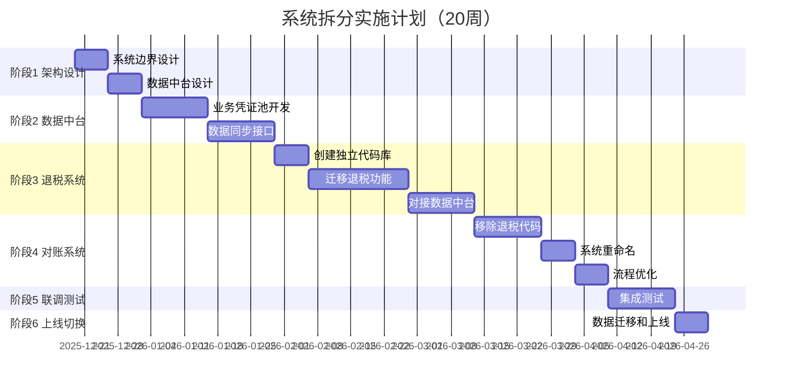

# 系统拆分实施计划

**项目名称**: 采购对账与退税业务系统拆分  
**开始时间**: 2025-12-19  
**预计完成**: 2026-05-19（5个月）  
**项目负责人**: 待定

---

## 一、项目目标

### 1.1 核心目标

将现有的"SERC 业财税系统"拆分为两个独立系统：

1. **供应商结算管理系统**（简称：结算系统）
   - 定位：采购域的专业对账与结算工具
   - 核心：L1-L2-L3架构，付款池管理

2. **出口退税管理系统**（简称：退税系统）
   - 定位：出口退税的智能风控与申报平台
   - 核心：三层匹配、换汇成本风控

### 1.2 关键成果

- ✅ 两个系统可以独立运行和部署
- ✅ 数据通过中台同步，确保一致性
- ✅ 用户体验专注、简洁
- ✅ 支持独立售卖

---

## 二、总体进度安排



---

## 三、详细实施阶段

### 阶段1：架构设计（2周）⏰ 当前阶段

**时间**: 2025-12-19 ~ 2026-01-02  
**目标**: 完成技术架构设计和接口规范

#### 任务清单

##### 任务1.1：系统边界定义 ⏳ 进行中

**负责人**: 架构师  
**工期**: 3天

**交付物**:
- [x] 系统边界图
- [ ] 功能划分清单
- [ ] 数据归属说明
- [ ] 接口清单

**详细内容**:

**1. 供应商结算管理系统的边界**

```
【包含功能】
├── 供应链交付管理
│   ├── 源头单据管理（GRN/PL）
│   ├── L1交付合同管理
│   └── 供货合同管理
├── 采购结算管理
│   ├── L2采购结算单
│   ├── 结算单明细管理
│   └── 供应商对账
├── 付款执行管理
│   ├── L3付款申请
│   ├── 付款池管理
│   └── 银行流水管理
└── 发票管理
    ├── 发票录入
    ├── 发票认领（关联L2）
    └── 发票查询

【数据归属】
- 采购主体（SysCompany）✅
- 供应商（SysSupplier）✅
- L1交付合同（ScmDeliveryContract）✅
- L2结算单（FinPurchaseSOA）✅
- L3付款单（FinPaymentRequest）✅
- 付款池（FinPaymentPool）✅
- 发票（TaxInvoice）✅ 主数据在此
```

**2. 出口退税管理系统的边界**

```
【包含功能】
├── 报关单管理
│   ├── 报关单录入/导入
│   ├── 报关单审核
│   └── 报关单查询
├── 退税匹配引擎
│   ├── 三层匹配（L1+发票+报关单）
│   ├── 智能匹配算法
│   └── 匹配结果确认
├── 退税风控
│   ├── 换汇成本计算
│   ├── 价格异常预警
│   └── 风险报告
└── 退税申报
    ├── 退税申报单生成
    ├── 申报进度追踪
    └── 退税到账核销

【数据归属】
- 报关单（CustomsDeclaration）✅
- 退税申报单（TaxRefundApplication）✅
- 匹配记录（TaxMatchRecord）✅
- 风险预警（TaxRiskWarning）✅

【依赖数据】（从数据中台读取）
- L1交付合同（只读）
- 发票（只读）
- 商品信息（只读）
```

**3. 数据中台的边界**

```
【核心功能】
├── 业务凭证池
│   ├── 采购凭证
│   ├── 发票凭证
│   └── 报关凭证
├── 数据同步服务
│   ├── 消息推送
│   ├── 数据订阅
│   └── 增量同步
└── 数据一致性保障
    ├── 事务消息
    ├── 数据校验
    └── 数据修复
```

---

##### 任务1.2：数据中台设计

**负责人**: 架构师 + 数据工程师  
**工期**: 5天

**交付物**:
- [ ] 数据中台架构图
- [ ] 业务凭证池数据模型
- [ ] 数据同步流程图
- [ ] API接口文档

**核心设计**:

**1. 业务凭证池（FinBusinessVoucher）**

```python
class FinBusinessVoucher(db.Model):
    """业务凭证 - 统一财务入口"""
    __tablename__ = "fin_business_vouchers"
    
    # 基础信息
    id: Mapped[int] = mapped_column(primary_key=True)
    voucher_no: Mapped[str] = mapped_column(String(50), unique=True)
    voucher_date: Mapped[date] = mapped_column(Date)
    
    # 业务溯源
    source_system: Mapped[str] = mapped_column(String(20), comment='来源系统(settlement/tax)')
    source_module: Mapped[str] = mapped_column(String(50), comment='来源模块')
    source_type: Mapped[str] = mapped_column(String(50), comment='业务类型')
    source_id: Mapped[int] = mapped_column(Integer, comment='业务单据ID')
    source_detail_id: Mapped[Optional[int]] = mapped_column(Integer, comment='明细ID')
    
    # 业务主体
    company_id: Mapped[int] = mapped_column(ForeignKey("sys_companies.id"))
    counterparty_type: Mapped[str] = mapped_column(String(20), comment='对方类型(supplier/customer)')
    counterparty_id: Mapped[int] = mapped_column(Integer, comment='对方ID')
    
    # 财务属性
    direction: Mapped[str] = mapped_column(String(10), comment='借贷方向(debit/credit)')
    amount: Mapped[Decimal] = mapped_column(DECIMAL(18, 2))
    currency: Mapped[str] = mapped_column(String(10), default='CNY')
    
    # 会计科目
    account_code: Mapped[Optional[str]] = mapped_column(String(20), comment='科目代码')
    account_name: Mapped[Optional[str]] = mapped_column(String(100), comment='科目名称')
    cost_center: Mapped[Optional[str]] = mapped_column(String(50), comment='成本中心')
    
    # 凭证内容
    summary: Mapped[str] = mapped_column(String(200), comment='摘要')
    description: Mapped[Optional[str]] = mapped_column(Text, comment='详细说明')
    attachment_urls: Mapped[Optional[dict]] = mapped_column(JSONB, comment='附件链接')
    
    # 状态管理
    status: Mapped[str] = mapped_column(String(20), default='pending', comment='状态')
    # pending: 待审核
    # approved: 已审核
    # posted: 已入账
    # voided: 已作废
    
    # 审核信息
    approved_by: Mapped[Optional[int]] = mapped_column(Integer)
    approved_at: Mapped[Optional[DateTime]] = mapped_column(DateTime)
    
    # 总账关联
    gl_entry_id: Mapped[Optional[int]] = mapped_column(Integer, comment='总账分录ID')
    posted_at: Mapped[Optional[DateTime]] = mapped_column(DateTime, comment='入账时间')
    
    # 审计字段
    created_at: Mapped[DateTime] = mapped_column(DateTime, server_default=func.now())
    updated_at: Mapped[Optional[DateTime]] = mapped_column(DateTime, onupdate=func.now())
    created_by: Mapped[int] = mapped_column(Integer)
```

**2. 数据同步记录表（FinDataSyncLog）**

```python
class FinDataSyncLog(db.Model):
    """数据同步日志"""
    __tablename__ = "fin_data_sync_logs"
    
    id: Mapped[int] = mapped_column(primary_key=True)
    
    # 同步信息
    sync_type: Mapped[str] = mapped_column(String(50), comment='同步类型')
    source_system: Mapped[str] = mapped_column(String(20))
    source_table: Mapped[str] = mapped_column(String(50))
    source_id: Mapped[int] = mapped_column(Integer)
    
    # 目标信息
    target_system: Mapped[str] = mapped_column(String(20))
    target_table: Mapped[Optional[str]] = mapped_column(String(50))
    target_id: Mapped[Optional[int]] = mapped_column(Integer)
    
    # 同步内容
    sync_data: Mapped[dict] = mapped_column(JSONB, comment='同步数据快照')
    
    # 状态
    status: Mapped[str] = mapped_column(String(20), comment='success/failed/pending')
    error_message: Mapped[Optional[str]] = mapped_column(Text)
    retry_count: Mapped[int] = mapped_column(Integer, default=0)
    
    # 时间
    sync_at: Mapped[DateTime] = mapped_column(DateTime, server_default=func.now())
    completed_at: Mapped[Optional[DateTime]] = mapped_column(DateTime)
```

---

##### 任务1.3：数据同步机制设计

**负责人**: 架构师  
**工期**: 4天

**交付物**:
- [ ] 数据同步流程图
- [ ] 同步策略文档
- [ ] 异常处理方案
- [ ] 性能优化方案

**同步策略**:

**1. 实时同步（关键数据）**

```python
# 场景：L1交付合同确认后，立即推送到数据中台
@signal.connect('l1_contract_confirmed')
def on_l1_confirmed(sender, contract_id, **kwargs):
    """L1确认后的实时同步"""
    contract = ScmDeliveryContract.query.get(contract_id)
    
    # 推送凭证到数据中台
    voucher = FinBusinessVoucher.create(
        source_system='settlement',
        source_type='l1_contract',
        source_id=contract.id,
        amount=contract.total_amount,
        # ...
    )
    
    # 发送消息通知（使用消息队列）
    publish_message('voucher.created', voucher.to_dict())
```

**2. 批量同步（非关键数据）**

```python
# 场景：每天凌晨同步发票数据
@celery.task
def sync_invoices_daily():
    """批量同步发票"""
    # 获取昨天新增/修改的发票
    invoices = TaxInvoice.query.filter(
        TaxInvoice.updated_at >= yesterday
    ).all()
    
    # 批量推送
    for invoice in invoices:
        voucher = create_invoice_voucher(invoice)
        publish_message('invoice.synced', voucher.to_dict())
```

**3. 补偿同步（异常恢复）**

```python
@celery.task
def retry_failed_sync():
    """重试失败的同步"""
    failed_logs = FinDataSyncLog.query.filter(
        FinDataSyncLog.status == 'failed',
        FinDataSyncLog.retry_count < 3
    ).all()
    
    for log in failed_logs:
        try:
            # 重新同步
            retry_sync(log)
            log.status = 'success'
        except Exception as e:
            log.retry_count += 1
            log.error_message = str(e)
```

---

##### 任务1.4：技术风险评估

**负责人**: 技术总监  
**工期**: 2天

**交付物**:
- [ ] 风险清单
- [ ] 风险应对方案
- [ ] 技术备选方案

**主要风险**:

| 风险项 | 风险等级 | 影响 | 应对方案 |
|--------|---------|------|---------|
| 数据不一致 | ⭐⭐⭐⭐ 高 | 退税系统数据延迟或错误 | 事务消息+定时校验 |
| 系统性能下降 | ⭐⭐⭐ 中 | 数据同步影响性能 | 异步队列+批量处理 |
| 用户体验割裂 | ⭐⭐⭐ 中 | 需要在系统间切换 | 统一门户+SSO |
| 开发进度延期 | ⭐⭐ 低 | 影响上线时间 | 分阶段交付+灰度发布 |

---

### 阶段2：数据中台建设（4周）

**时间**: 2026-01-03 ~ 2026-01-31

#### 任务2.1：创建业务凭证池

**交付物**:
- [ ] 数据库迁移文件
- [ ] Model定义
- [ ] Schema定义
- [ ] 基础CRUD API

#### 任务2.2：开发数据推送接口

**交付物**:
- [ ] 推送API接口
- [ ] 消息队列集成（Redis/Kafka）
- [ ] 事务保证机制
- [ ] API文档

#### 任务2.3：开发数据订阅接口

**交付物**:
- [ ] 订阅API接口
- [ ] Webhook通知机制
- [ ] 数据过滤和转换
- [ ] API文档

#### 任务2.4：数据一致性保障

**交付物**:
- [ ] 数据校验脚本
- [ ] 一致性检测报告
- [ ] 数据修复工具
- [ ] 监控大盘

---

### 阶段3：退税系统独立（6周）

**时间**: 2026-02-01 ~ 2026-03-15

#### 任务3.1：创建独立代码库

**交付物**:
- [ ] 新建项目目录结构
- [ ] 配置独立的git仓库
- [ ] 配置CI/CD流水线
- [ ] 基础框架搭建

**目录结构**:
```
tax-refund-system/
├── backend/
│   ├── app/
│   │   ├── models/
│   │   │   └── tax/
│   │   ├── services/
│   │   │   └── tax/
│   │   ├── api/
│   │   │   └── v1/
│   │   │       └── tax/
│   │   └── schemas/
│   │       └── tax/
│   └── tests/
└── frontend/
    └── apps/
        └── tax-refund/
            └── src/
```

#### 任务3.2：迁移报关单管理功能

**交付物**:
- [ ] 报关单Model迁移
- [ ] 报关单API迁移
- [ ] 报关单前端页面迁移
- [ ] 单元测试

#### 任务3.3：迁移退税申报功能

**交付物**:
- [ ] 退税匹配引擎迁移
- [ ] 退税申报流程迁移
- [ ] 风控算法迁移
- [ ] 集成测试

#### 任务3.4：对接数据中台

**交付物**:
- [ ] 数据订阅客户端
- [ ] 数据缓存层
- [ ] 数据同步监控
- [ ] 联调测试

---

### 阶段4：对账系统瘦身（4周）

**时间**: 2026-03-16 ~ 2026-04-13

#### 任务4.1：移除退税相关代码

**交付物**:
- [ ] 删除退税相关Model
- [ ] 删除退税相关API
- [ ] 删除退税相关前端页面
- [ ] 代码审查

#### 任务4.2：系统重命名

**交付物**:
- [ ] 前端标题更新
- [ ] 后端日志更新
- [ ] 文档更新
- [ ] 数据库注释更新

**新名称**: 供应商结算管理系统

#### 任务4.3：流程优化

**交付物**:
- [ ] L1-L2-L3流程优化
- [ ] 发票管理增强
- [ ] 性能优化
- [ ] 用户体验优化

---

### 阶段5：联调测试（2周）

**时间**: 2026-04-14 ~ 2026-04-27

#### 测试内容

1. **功能测试**
   - [ ] 结算系统独立功能测试
   - [ ] 退税系统独立功能测试
   - [ ] 跨系统业务流程测试

2. **集成测试**
   - [ ] 数据同步测试
   - [ ] 接口联调测试
   - [ ] 异常场景测试

3. **性能测试**
   - [ ] 并发压力测试
   - [ ] 数据同步性能测试
   - [ ] 响应时间测试

4. **安全测试**
   - [ ] 权限隔离测试
   - [ ] 数据安全测试
   - [ ] API安全测试

---

### 阶段6：上线切换（1周）

**时间**: 2026-04-28 ~ 2026-05-05

#### 上线计划

**1. 数据迁移（T-3天）**
- [ ] 备份现有数据
- [ ] 迁移历史数据到新架构
- [ ] 数据完整性校验

**2. 灰度发布（T-2天）**
- [ ] 20%用户灰度
- [ ] 监控系统运行
- [ ] 收集用户反馈

**3. 全量上线（T天）**
- [ ] 100%用户切换
- [ ] 7x24监控
- [ ] 应急响应

**4. 稳定性观察（T+1周）**
- [ ] 性能监控
- [ ] 错误日志分析
- [ ] 用户满意度调查

---

## 四、资源需求

### 4.1 人力资源

| 角色 | 人数 | 工期 | 工作内容 |
|------|------|------|---------|
| **架构师** | 1人 | 2周 | 架构设计、技术选型 |
| **后端开发** | 2人 | 16周 | 数据中台、系统拆分 |
| **前端开发** | 2人 | 12周 | 页面迁移、UI优化 |
| **测试工程师** | 1人 | 4周 | 功能测试、性能测试 |
| **DBA** | 1人 | 4周 | 数据迁移、性能优化 |
| **DevOps** | 1人 | 4周 | CI/CD、部署上线 |

### 4.2 技术资源

| 资源 | 用途 | 成本 |
|------|------|------|
| **开发环境** | 开发测试 | 已有 |
| **测试环境** | 联调测试 | 新增1套（5万） |
| **生产环境** | 正式运行 | 扩容（10万） |
| **消息队列** | 数据同步 | Redis已有 |
| **监控平台** | 系统监控 | 已有 |

---

## 五、风险与应对

### 5.1 技术风险

| 风险 | 等级 | 应对措施 |
|------|------|---------|
| 数据同步延迟 | 高 | 增加缓存层、优化同步算法 |
| 系统性能下降 | 中 | 性能测试、分布式部署 |
| 数据不一致 | 高 | 事务消息、定时校验 |

### 5.2 业务风险

| 风险 | 等级 | 应对措施 |
|------|------|---------|
| 用户不适应 | 中 | 提前培训、操作手册 |
| 业务中断 | 高 | 灰度发布、快速回滚 |
| 功能遗漏 | 中 | 功能清单检查、用户验收 |

---

## 六、成功标准

### 6.1 功能标准

- ✅ 结算系统可以独立运行，完成采购对账和付款
- ✅ 退税系统可以独立运行，完成退税申报
- ✅ 数据中台稳定运行，同步成功率 > 99.9%

### 6.2 性能标准

- ✅ 系统响应时间 < 2秒
- ✅ 数据同步延迟 < 1分钟
- ✅ 系统可用性 > 99.5%

### 6.3 用户标准

- ✅ 用户培训完成率 100%
- ✅ 用户满意度 > 90%
- ✅ 系统Bug数量 < 10个

---

## 七、项目沟通

### 7.1 周报制度

- **频率**: 每周五下午
- **内容**: 本周进度、下周计划、风险问题
- **参与**: 项目组全员

### 7.2 月度汇报

- **频率**: 每月最后一个工作日
- **内容**: 月度总结、预算执行、里程碑达成
- **参与**: 管理层

### 7.3 日常协作

- **工具**: 钉钉/企业微信
- **会议**: 每日站会（15分钟）
- **文档**: Confluence/石墨文档

---

**文档状态**: ✅ 初稿完成  
**当前阶段**: 阶段1 - 架构设计  
**当前任务**: 任务1.1 - 系统边界定义  
**下一步**: 完成数据中台数据模型设计

