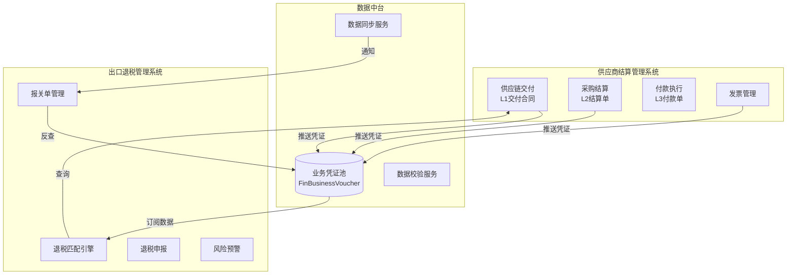
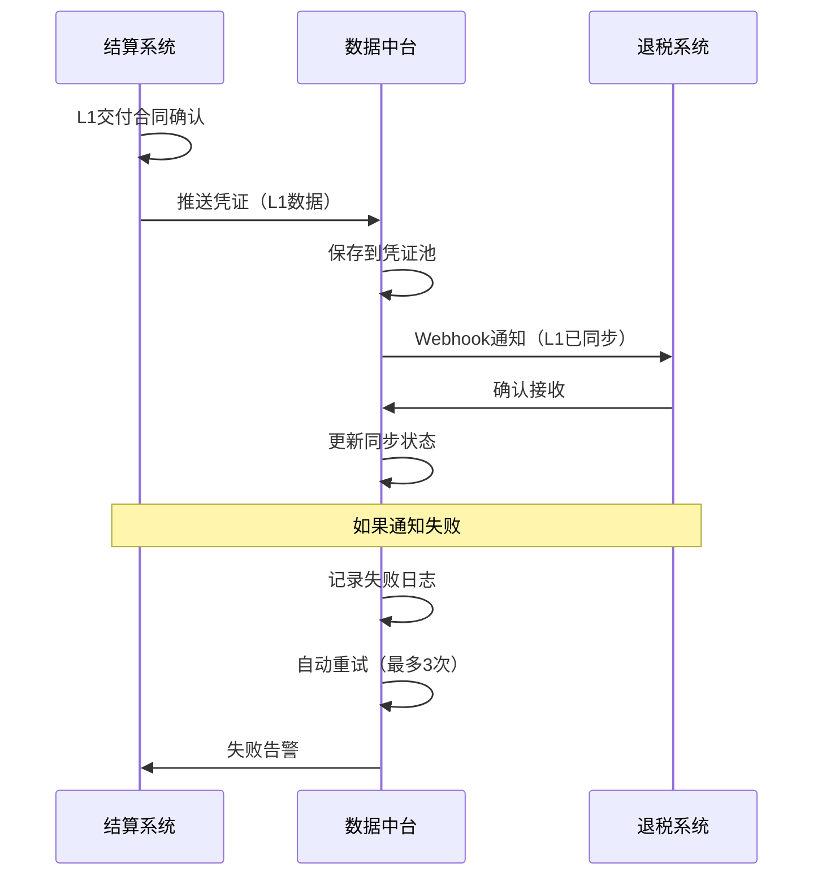

# 系统边界和接口规范

**文档版本**: v1.0  
**创建时间**: 2025-12-19  
**状态**: 架构设计阶段

---

## 一、系统架构总览



---

## 二、供应商结算管理系统

### 2.1 系统定位

**名称**: 供应商结算管理系统  
**英文**: Supplier Settlement Management System  
**简称**: 结算系统

**核心定位**: 采购域的专业对账与结算工具

### 2.2 功能边界

#### 包含功能 ✅

**模块1：供应链交付管理**
- ✅ 源头单据管理（GRN/PL）
- ✅ L1交付合同生成与管理
- ✅ 供货合同（L1-Inv）管理
- ✅ 交付确权与锁定

**模块2：采购结算管理**
- ✅ L2采购结算单（SOA）生成
- ✅ 结算单明细管理
- ✅ 供应商对账
- ✅ 双状态管理（资金+票据）

**模块3：付款执行管理**
- ✅ L3付款申请单生成
- ✅ 付款池管理（定金/尾款/预付）
- ✅ 银行流水管理
- ✅ 付款核销

**模块4：发票管理**
- ✅ 发票录入/导入
- ✅ 发票认领（关联L2）
- ✅ 发票状态管理
- ✅ 发票查询统计

#### 不包含功能 ❌

- ❌ 报关单管理（属于退税系统）
- ❌ 退税申报（属于退税系统）
- ❌ 退税匹配引擎（属于退税系统）
- ❌ 换汇成本计算（属于退税系统）
- ❌ 应收账款管理（属于大财务系统）
- ❌ 总账核算（属于大财务系统）

### 2.3 数据归属

#### 主数据表（拥有写权限）

| 表名 | 说明 | 备注 |
|------|------|------|
| `sys_companies` | 采购主体 | 基础数据 |
| `sys_suppliers` | 供应商 | 基础数据 |
| `scm_source_docs` | 源头单据 | GRN/PL |
| `scm_delivery_contracts` | L1交付合同 | 核心业务表 |
| `scm_delivery_items` | L1明细 | 核心业务表 |
| `fin_supply_contracts` | 供货合同 | L1-Inv |
| `fin_purchase_soas` | L2结算单 | 核心业务表 |
| `fin_purchase_soa_details` | L2明细 | 核心业务表 |
| `fin_payment_pool` | 付款池 | 核心业务表 |
| `fin_payment_requests` | L3付款单 | 核心业务表 |
| `fin_bank_transactions` | 银行流水 | 辅助表 |
| `tax_invoices` | 发票 | 核心业务表 |

#### 数据推送规则

**触发条件** → **推送数据** → **目标系统**

1. **L1交付合同确认** 
   ```
   触发: L1状态变更为"已确认"
   推送: L1基本信息 + 明细
   目标: 数据中台 → 退税系统
   ```

2. **L2结算单生成**
   ```
   触发: L2结算单确认
   推送: L2基本信息 + 关联L1清单
   目标: 数据中台 → 财务系统
   ```

3. **发票录入**
   ```
   触发: 发票保存
   推送: 发票完整信息
   目标: 数据中台 → 退税系统
   ```

4. **L3付款完成**
   ```
   触发: 付款状态变更为"已付"
   推送: 付款信息 + 关联L2
   目标: 数据中台 → 财务系统
   ```

### 2.4 对外接口

#### API 1：查询L1交付合同

**接口路径**: `GET /api/v1/settlement/contracts/{contract_id}`

**用途**: 供退税系统查询L1详细信息

**请求参数**:
```json
{
  "contract_id": 12345,
  "include_items": true,
  "include_supplier": true
}
```

**响应示例**:
```json
{
  "code": 0,
  "data": {
    "id": 12345,
    "contract_no": "L1-20251219-001",
    "supplier_id": 100,
    "supplier_name": "供应商A",
    "total_amount": 100000.00,
    "currency": "CNY",
    "items": [
      {
        "product_id": 1001,
        "sku": "SKU001",
        "quantity": 1000,
        "unit_price": 100.00
      }
    ]
  }
}
```

#### API 2：查询发票信息

**接口路径**: `GET /api/v1/settlement/invoices/{invoice_id}`

**用途**: 供退税系统查询发票详细信息

**响应示例**:
```json
{
  "code": 0,
  "data": {
    "id": 5001,
    "invoice_no": "INV-20251219-001",
    "invoice_date": "2025-12-19",
    "amount": 100000.00,
    "tax_amount": 13000.00,
    "supplier_id": 100,
    "status": "locked"
  }
}
```

#### API 3：接收数据同步通知

**接口路径**: `POST /api/v1/settlement/webhooks/data-sync`

**用途**: 接收来自退税系统的反向通知（如报关单完成）

**请求体**:
```json
{
  "event": "customs_declared",
  "data": {
    "customs_declaration_id": 8001,
    "l1_contract_ids": [12345, 12346],
    "declared_at": "2025-12-19T10:00:00Z"
  }
}
```

---

## 三、出口退税管理系统

### 3.1 系统定位

**名称**: 出口退税管理系统  
**英文**: Export Tax Refund Management System  
**简称**: 退税系统

**核心定位**: 出口退税的智能风控与申报平台

### 3.2 功能边界

#### 包含功能 ✅

**模块1：报关单管理**
- ✅ 报关单录入/导入
- ✅ 报关单审核
- ✅ 报关单明细管理
- ✅ 报关单查询统计

**模块2：退税匹配引擎**
- ✅ 三层匹配（L1+发票+报关单）
- ✅ 智能匹配算法
- ✅ 匹配结果确认
- ✅ 匹配记录追踪

**模块3：退税风控**
- ✅ 换汇成本计算
- ✅ 价格异常预警
- ✅ 数据完整性检查
- ✅ 风险报告生成

**模块4：退税申报**
- ✅ 退税申报单生成
- ✅ 申报数据导出
- ✅ 申报进度追踪
- ✅ 退税到账核销

#### 不包含功能 ❌

- ❌ L1交付合同管理（属于结算系统）
- ❌ 发票录入（属于结算系统，只读取）
- ❌ 供应商管理（属于结算系统）
- ❌ 付款执行（属于结算系统）

### 3.3 数据归属

#### 主数据表（拥有写权限）

| 表名 | 说明 | 备注 |
|------|------|------|
| `customs_declarations` | 报关单 | 核心业务表 |
| `customs_declaration_items` | 报关单明细 | 核心业务表 |
| `tax_match_records` | 匹配记录 | 核心业务表 |
| `tax_refund_applications` | 退税申报单 | 核心业务表 |
| `tax_risk_warnings` | 风险预警 | 辅助表 |
| `tax_exchange_rate_logs` | 换汇成本记录 | 辅助表 |

#### 依赖数据表（只读）

| 表名 | 来源 | 访问方式 |
|------|------|---------|
| `scm_delivery_contracts` | 结算系统 | API查询 |
| `tax_invoices` | 结算系统 | 数据中台订阅 |
| `sys_suppliers` | 结算系统 | API查询 |
| `products` | 商品系统 | API查询 |

### 3.4 对外接口

#### API 1：接收L1数据同步

**接口路径**: `POST /api/v1/tax/webhooks/l1-synced`

**用途**: 接收来自数据中台的L1同步通知

**请求体**:
```json
{
  "event": "l1_confirmed",
  "data": {
    "voucher_id": 1001,
    "l1_contract_id": 12345,
    "contract_no": "L1-20251219-001",
    "amount": 100000.00,
    "synced_at": "2025-12-19T10:00:00Z"
  }
}
```

#### API 2：接收发票数据同步

**接口路径**: `POST /api/v1/tax/webhooks/invoice-synced`

**用途**: 接收来自数据中台的发票同步通知

**请求体**:
```json
{
  "event": "invoice_created",
  "data": {
    "voucher_id": 2001,
    "invoice_id": 5001,
    "invoice_no": "INV-20251219-001",
    "amount": 100000.00,
    "tax_amount": 13000.00
  }
}
```

#### API 3：通知报关完成

**接口路径**: `POST /api/v1/tax/customs/declare-completed`

**用途**: 报关单完成后，通知结算系统更新状态

**请求体**:
```json
{
  "customs_declaration_id": 8001,
  "l1_contract_ids": [12345, 12346],
  "declared_at": "2025-12-19T10:00:00Z"
}
```

---

## 四、数据中台

### 4.1 系统定位

**名称**: 数据中台服务  
**英文**: Data Middle Platform Service  
**简称**: 数据中台

**核心定位**: 业务系统间的数据桥梁

### 4.2 功能边界

#### 核心功能 ✅

**功能1：业务凭证池**
- ✅ 接收来自各业务系统的数据凭证
- ✅ 凭证存储和版本管理
- ✅ 凭证查询和追溯

**功能2：数据同步服务**
- ✅ 消息推送（Pub/Sub模式）
- ✅ Webhook通知
- ✅ 数据订阅管理
- ✅ 增量同步

**功能3：数据一致性保障**
- ✅ 事务消息（确保必达）
- ✅ 数据校验（定时对账）
- ✅ 数据修复工具
- ✅ 监控告警

### 4.3 数据流转



### 4.4 API接口

#### API 1：推送业务凭证

**接口路径**: `POST /api/v1/middle/vouchers`

**用途**: 业务系统推送数据到中台

**请求体**:
```json
{
  "source_system": "settlement",
  "source_type": "l1_contract",
  "source_id": 12345,
  "event": "confirmed",
  "data": {
    "contract_no": "L1-20251219-001",
    "amount": 100000.00,
    // ... 其他字段
  }
}
```

**响应示例**:
```json
{
  "code": 0,
  "data": {
    "voucher_id": 1001,
    "voucher_no": "VCH-20251219-001",
    "sync_status": "pending"
  }
}
```

#### API 2：订阅数据变更

**接口路径**: `POST /api/v1/middle/subscriptions`

**用途**: 业务系统订阅感兴趣的数据变更

**请求体**:
```json
{
  "subscriber_system": "tax",
  "event_types": ["l1_confirmed", "invoice_created"],
  "webhook_url": "https://tax-system.com/webhooks/data-sync",
  "filters": {
    "company_id": [1, 2, 3]
  }
}
```

#### API 3：查询凭证

**接口路径**: `GET /api/v1/middle/vouchers/{voucher_id}`

**用途**: 查询凭证详细信息

**响应示例**:
```json
{
  "code": 0,
  "data": {
    "voucher_id": 1001,
    "source_system": "settlement",
    "source_type": "l1_contract",
    "data": { /* 完整数据 */ },
    "sync_logs": [
      {
        "target_system": "tax",
        "status": "success",
        "synced_at": "2025-12-19T10:01:00Z"
      }
    ]
  }
}
```

#### API 4：数据一致性检查

**接口路径**: `POST /api/v1/middle/consistency-check`

**用途**: 检查源系统和目标系统的数据一致性

**请求体**:
```json
{
  "source_system": "settlement",
  "target_system": "tax",
  "check_type": "l1_contracts",
  "date_range": {
    "start": "2025-12-01",
    "end": "2025-12-19"
  }
}
```

**响应示例**:
```json
{
  "code": 0,
  "data": {
    "total_records": 1000,
    "synced_records": 995,
    "failed_records": 5,
    "inconsistent_records": [
      {
        "source_id": 12345,
        "issue": "target_not_found",
        "details": "L1合同在退税系统中未找到"
      }
    ]
  }
}
```

---

## 五、数据同步协议

### 5.1 事件定义

#### 结算系统事件

| 事件名称 | 触发时机 | 携带数据 |
|---------|---------|---------|
| `l1_confirmed` | L1交付合同确认 | L1完整信息 |
| `l1_updated` | L1交付合同修改 | 变更字段 |
| `l2_created` | L2结算单生成 | L2完整信息 |
| `invoice_created` | 发票录入 | 发票完整信息 |
| `invoice_locked` | 发票锁定（用于退税） | 发票ID |
| `payment_completed` | L3付款完成 | 付款信息 |

#### 退税系统事件

| 事件名称 | 触发时机 | 携带数据 |
|---------|---------|---------|
| `customs_declared` | 报关单完成 | 报关单信息 + 关联L1 |
| `tax_matched` | 三层匹配完成 | 匹配记录 |
| `tax_applied` | 退税申报提交 | 申报单信息 |
| `tax_received` | 退税到账 | 到账金额 + 关联申报单 |

### 5.2 消息格式

**标准消息格式**:

```json
{
  "message_id": "MSG-20251219-100000-001",
  "event_type": "l1_confirmed",
  "source_system": "settlement",
  "timestamp": "2025-12-19T10:00:00Z",
  "data": {
    // 业务数据
  },
  "metadata": {
    "version": "1.0",
    "trace_id": "TRACE-001",
    "user_id": 1001
  }
}
```

### 5.3 同步策略

#### 实时同步（关键数据）

```python
触发条件: L1交付合同确认
同步方式: 事务消息 + Webhook
重试策略: 指数退避（1s, 2s, 4s, 最多3次）
失败处理: 记录日志 + 人工告警
```

#### 批量同步（非关键数据）

```python
触发条件: 定时任务（每天凌晨2点）
同步方式: 批量API调用
重试策略: 失败记录下次重试
失败处理: 生成一致性检查报告
```

#### 补偿同步（异常恢复）

```python
触发条件: 一致性检查发现差异
同步方式: 按差异清单逐条修复
重试策略: 人工确认后重试
失败处理: 记录无法修复的数据
```

---

## 六、安全与权限

### 6.1 系统间认证

**认证方式**: API Key + 数字签名

```http
POST /api/v1/middle/vouchers HTTP/1.1
Host: data-middle.example.com
X-API-Key: SETTLEMENT_API_KEY_xxxxx
X-Signature: sha256(request_body + timestamp + secret)
X-Timestamp: 1703002800
Content-Type: application/json
```

### 6.2 权限隔离

| 系统 | 可访问数据 | 权限级别 |
|------|-----------|---------|
| 结算系统 | 自有数据 + 推送到中台 | 读写 |
| 退税系统 | 自有数据 + 从中台订阅 | 读写自有 + 只读订阅 |
| 数据中台 | 所有凭证数据 | 全部只读 |

### 6.3 数据脱敏

敏感字段在跨系统传输时脱敏：

| 字段类型 | 脱敏规则 | 示例 |
|---------|---------|------|
| 银行账号 | 保留前4后4 | `6222 **** **** 1234` |
| 供应商价格 | 仅传输总金额 | 不传单价 |
| 个人手机 | 保留前3后4 | `138****5678` |

---

## 七、监控与告警

### 7.1 监控指标

| 指标 | 阈值 | 告警级别 |
|------|------|---------|
| 数据同步成功率 | < 99.9% | 严重 |
| 数据同步延迟 | > 5分钟 | 警告 |
| 系统响应时间 | > 2秒 | 警告 |
| 一致性检查差异 | > 10条 | 严重 |

### 7.2 告警渠道

- **邮件**: 所有告警
- **短信**: 严重告警
- **企业微信/钉钉**: 警告级别告警

---

**文档状态**: ✅ 已完成  
**审核状态**: 待技术评审  
**下一步**: 开发数据中台原型

