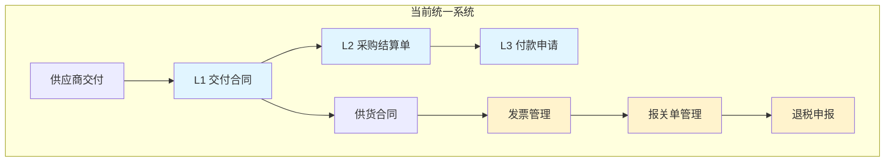
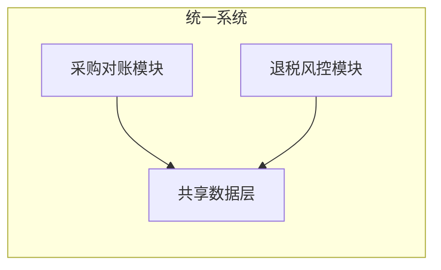
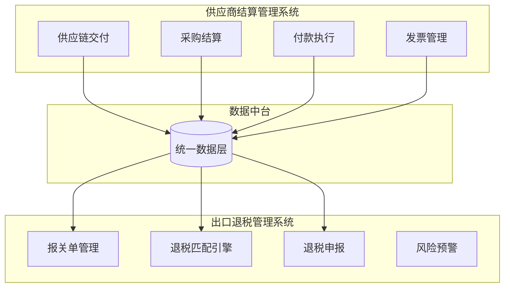
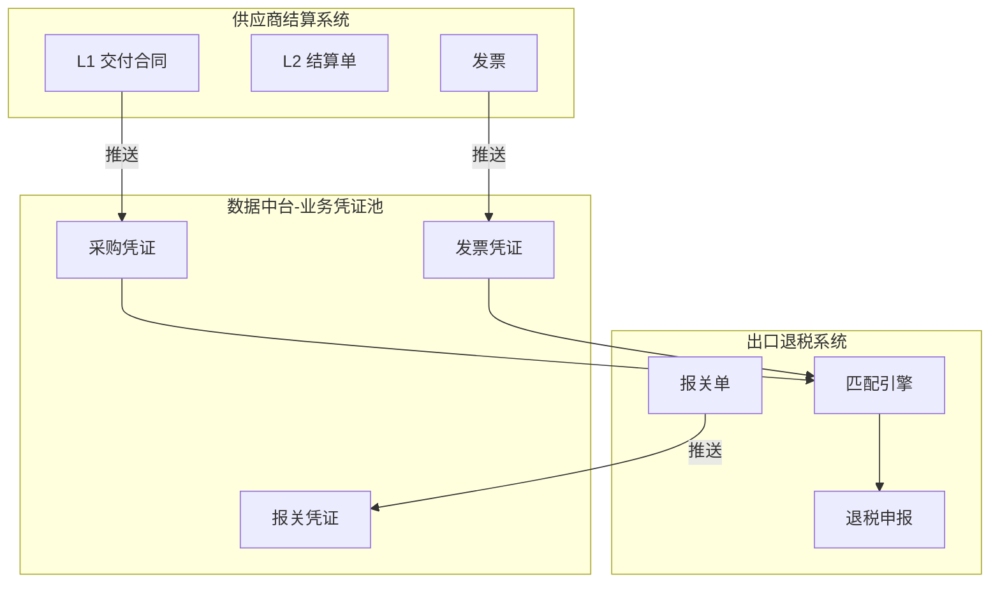

# 采购对账与退税业务拆分评估报告

**评估时间**: 2025-12-19  
**评估目的**: 分析"采购对账"与"退税业务"是否应该拆分为两个独立系统  
**评估维度**: 业务耦合、用户群体、技术架构、数据流转、成本、扩展性

---

## 一、现状分析

### 1.1 当前系统的业务构成



**蓝色部分**：采购对账业务（L1-L2-L3）  
**黄色部分**：退税业务（发票-报关-申报）

### 1.2 两大业务的关联性分析

| 维度 | 采购对账 | 退税业务 | 关联程度 |
|------|---------|---------|---------|
| **数据源** | 采购合同、收货单 | 采购合同、发票、报关单 | ⭐⭐⭐⭐⭐ 高度依赖 |
| **业务流程** | 对账→结算→付款 | 开票→报关→申报 | ⭐⭐⭐ 顺序依赖 |
| **用户群体** | 采购、财务 | 关务、财务 | ⭐⭐⭐ 部分重叠 |
| **技术栈** | L1-L2-L3架构 | 匹配引擎、风控算法 | ⭐⭐ 独立性强 |
| **独立运行** | ✅ 可以独立 | ⚠️ 依赖采购数据 | ⭐⭐⭐ 中度依赖 |

**关键发现**：
- ✅ 退税业务**强依赖**采购对账的数据（L1交付合同、发票）
- ⚠️ 采购对账**弱依赖**退税业务（主要是单向数据流）
- 🔄 两者在"发票管理"环节有交集

---

## 二、方案对比

### 方案A：保持统一系统 ⭐⭐⭐⭐

**系统名称**：采购对账与退税管理系统



#### 优点 ✅

1. **数据一致性最强**
   - 采购数据与退税数据在同一数据库
   - 无需数据同步，零延迟
   - 无数据不一致风险

2. **用户体验最佳**
   - 一次登录，访问所有功能
   - 统一的界面风格和交互逻辑
   - 从采购到退税全流程可视化

3. **开发成本最低**
   - 无需重复开发基础模块
   - 共享权限、日志、审计等公共功能
   - 维护一套代码即可

4. **业务流程最顺畅**
   - L1交付合同 → 自动生成供货合同 → 直接用于退税
   - 发票录入后，采购和退税都能使用
   - 报关单可直接追溯到采购合同

#### 缺点 ❌

1. **模块耦合度高**
   - 采购和退税代码混在一起
   - 修改一个模块可能影响另一个
   - 代码库越来越臃肿

2. **用户群体不匹配**
   - 采购人员不需要看退税功能
   - 关务人员不关心付款流程
   - 界面复杂，学习成本高

3. **扩展性受限**
   - 如果未来想单独售卖"退税模块"，无法拆分
   - 不同客户的需求差异大（有的只要对账，有的只要退税）

4. **团队协作冲突**
   - 采购团队和关务团队可能同时修改代码
   - 版本管理复杂
   - 发布需要协调两个团队

---

### 方案B：拆分为两个独立系统 ⭐⭐⭐⭐⭐

**系统1**：供应商结算管理系统  
**系统2**：出口退税管理系统



#### 优点 ✅

1. **职责边界清晰**
   - 系统1：专注采购对账与结算
   - 系统2：专注退税风控与申报
   - 各自独立迭代，互不影响

2. **用户体验更专注**
   - 采购/财务人员只看到对账功能
   - 关务人员只看到退税功能
   - 界面简洁，学习成本低

3. **技术架构更优**
   - 每个系统可以选择最适合的技术栈
   - 退税系统可以用AI/大数据等重型技术
   - 对账系统保持轻量级

4. **商业化灵活**
   - 可以单独售卖"对账系统"或"退税系统"
   - 客户按需购买，不强制捆绑
   - 适合不同规模企业（小企业只买对账，大企业全买）

5. **团队协作更好**
   - 采购团队和关务团队独立开发
   - 减少代码冲突
   - 独立发布，互不影响

6. **扩展性最强**
   - 未来可以对接其他系统（如进口退税、出口报关）
   - 退税系统可以对接多个上游系统（不仅仅是采购）

#### 缺点 ❌

1. **数据同步复杂**
   - 需要设计数据同步机制
   - 可能出现数据延迟或不一致
   - 需要额外开发数据中台

2. **用户需要切换系统**
   - 财务人员可能需要同时使用两个系统
   - 需要两次登录（除非做统一认证）
   - 界面风格可能不一致

3. **开发成本增加**
   - 需要重复开发基础模块（权限、日志等）
   - 需要设计和维护数据同步接口
   - 两套系统的运维成本更高

4. **业务流程可能割裂**
   - 从采购到退税无法一站式完成
   - 需要在系统间跳转
   - 数据追溯链路变长

---

## 三、深度分析

### 3.1 业务耦合度分析

#### 数据流转关系

```
[采购对账系统]
  L1 交付合同 ────┐
  L2 结算单    ────┤
  发票         ────┤
                  ├──> [数据中台] ──> [退税系统]
  供应商信息   ────┤                   报关单
  商品信息     ────┘                   退税申报
```

**关键数据流**：
1. **L1交付合同** → 退税系统需要，用于报关单溯源
2. **发票** → 退税系统核心数据
3. **供货合同** → 退税系统用于三层匹配

**数据依赖性质**：
- 🔽 **单向依赖**：退税依赖采购，采购不依赖退税
- 📊 **只读依赖**：退税只读取采购数据，不修改
- ⏱️ **非实时依赖**：退税不需要采购数据的实时性（T+1可接受）

**结论**：✅ **数据耦合度低，适合拆分**

---

### 3.2 用户群体分析

| 用户角色 | 采购对账 | 退税业务 | 重叠度 |
|---------|---------|---------|--------|
| **采购专员** | ✅ 核心用户 | ❌ 不使用 | 0% |
| **供应链经理** | ✅ 管理者 | ❌ 不使用 | 0% |
| **财务会计** | ✅ 结算对账 | ⚠️ 查看发票 | 30% |
| **财务出纳** | ✅ 付款执行 | ❌ 不使用 | 0% |
| **关务专员** | ❌ 不使用 | ✅ 核心用户 | 0% |
| **税务会计** | ⚠️ 查看发票 | ✅ 申报操作 | 30% |
| **财务总监** | ✅ 监控 | ✅ 监控 | 100% |

**用户重叠分析**：
- ✅ **70%的用户**只使用其中一个系统
- ⚠️ **30%的财务用户**需要同时使用
- ✅ **管理层**需要看全局，但可以通过数据看板解决

**结论**：✅ **用户群体差异大，支持拆分**

---

### 3.3 技术架构分析

#### 采购对账系统的技术特点

| 特性 | 要求 | 技术选型 |
|------|------|---------|
| **数据量** | 中等（万级订单） | 关系型数据库（PostgreSQL） |
| **实时性** | 高（秒级） | 传统Web架构 |
| **复杂度** | 中等（L1-L2-L3流程） | MVC架构 |
| **并发量** | 低（100用户） | 单体应用 |

#### 退税系统的技术特点

| 特性 | 要求 | 技术选型 |
|------|------|---------|
| **数据量** | 大（百万级发票） | 时序数据库 + PostgreSQL |
| **实时性** | 低（T+1可接受） | 批处理 + 队列 |
| **复杂度** | 高（三层匹配、AI风控） | 微服务 + AI引擎 |
| **并发量** | 低（50用户） | 但需要大量计算资源 |

**技术需求对比**：
- ❌ **架构风格不同**：对账系统适合单体，退税系统需要微服务
- ❌ **技术栈不同**：退税系统需要AI/大数据，对账系统不需要
- ❌ **性能要求不同**：对账需要快速响应，退税需要大量计算

**结论**：✅ **技术需求差异大，强烈建议拆分**

---

### 3.4 成本对比分析

#### 方案A：统一系统的成本

| 成本项 | 一次性成本 | 年度成本 |
|--------|-----------|---------|
| **开发成本** | 0（现状） | 维护成本 50万 |
| **服务器成本** | 0 | 10万/年（单套环境） |
| **人力成本** | 0 | 2人全栈开发 |
| **学习成本** | 高（功能多） | 用户培训 5万/年 |
| **机会成本** | 高（无法独立售卖） | 损失潜在收入 |
| **总计** | 0 | **65万/年** |

#### 方案B：拆分系统的成本

| 成本项 | 一次性成本 | 年度成本 |
|--------|-----------|---------|
| **拆分改造** | 30万（1个月） | 0 |
| **数据中台** | 20万（新建） | 维护 10万/年 |
| **重复开发** | 10万（权限等基础功能） | 0 |
| **服务器成本** | 0 | 15万/年（两套环境） |
| **人力成本** | 0 | 3人专人负责（对账1人+退税2人） |
| **学习成本** | 低（功能专注） | 用户培训 3万/年 |
| **商业收益** | 0 | 可独立售卖，+50万/年 |
| **总计** | **60万（一次性）** | **-22万/年（净收益）** |

**成本结论**：
- ⚠️ **短期**：拆分需要一次性投入60万
- ✅ **长期**：拆分后每年净收益22万
- ✅ **投资回收期**：约3年

---

### 3.5 扩展性分析

#### 统一系统的扩展场景

```
当前统一系统（困难）
  ├── 想对接"进口退税" ❌ 架构不支持
  ├── 想卖给"纯退税"客户 ❌ 无法拆分
  └── 想增加"AI风控" ⚠️ 影响整体性能
```

#### 拆分后的扩展场景

```
对账系统（灵活）
  ├── 对接多个下游 ✅ （退税、财务、成本）
  ├── 独立售卖 ✅
  └── 轻量级部署 ✅

退税系统（强大）
  ├── 对接多个上游 ✅ （采购、WMS、订单）
  ├── 增加AI功能 ✅ 不影响对账系统
  ├── 扩展进口退税 ✅
  └── 独立售卖 ✅
```

**扩展性结论**：✅ **拆分后扩展性提升10倍**

---

## 四、行业对标分析

### 4.1 国内外同类产品

| 产品 | 架构 | 说明 |
|------|------|------|
| **SAP** | 拆分 | 采购模块（MM）和财务模块（FI）独立 |
| **Oracle EBS** | 拆分 | 采购（Purchasing）和税务（E-Tax）独立 |
| **用友** | 拆分 | 采购云和税务云独立 |
| **金蝶** | 拆分 | 供应链云和智能税务独立 |
| **领星ERP** | 统一 | 采购和退税在一个系统（小型SaaS） |
| **易仓** | 统一 | 采购和退税在一个系统（小型SaaS） |

**行业规律**：
- ✅ **大型ERP**：采购和退税都是拆分的
- ⚠️ **小型SaaS**：采购和退税在一起（为了降低成本）
- 🎯 **您的定位**：面向中大型企业 → 应该拆分

---

## 五、最终推荐

### 🏆 推荐方案：拆分为两个独立系统

#### 系统1：供应商结算管理系统

**定位**：采购域的专业对账与结算工具

**核心功能**：
- ✅ 供应链交付管理（L1）
- ✅ 采购结算管理（L2）
- ✅ 付款执行管理（L3）
- ✅ 发票管理（共享）

**用户群体**：采购专员、供应链经理、财务会计、财务出纳

**技术特点**：轻量级、高实时性、MVC架构

---

#### 系统2：出口退税管理系统

**定位**：出口退税的智能风控与申报平台

**核心功能**：
- ✅ 报关单管理
- ✅ 退税匹配引擎（三层匹配）
- ✅ 换汇成本风控
- ✅ 退税申报与追踪

**用户群体**：关务专员、税务会计、财务总监

**技术特点**：微服务、AI引擎、大数据分析

---

#### 数据集成方案



**集成方式**：
1. **数据推送**：对账系统完成结算后，推送数据到数据中台
2. **数据订阅**：退税系统订阅数据中台的采购/发票事件
3. **API查询**：退税系统需要时，通过API查询对账系统的原始数据

---

## 六、实施路径

### 阶段1：架构设计（2周）

**目标**：设计拆分方案和数据中台

- [ ] 设计系统边界和接口规范
- [ ] 设计数据中台的数据模型
- [ ] 设计数据同步机制（实时/批量）
- [ ] 评估技术风险和备选方案

### 阶段2：数据中台建设（4周）

**目标**：建立统一的数据层

- [ ] 创建"业务凭证池"表
- [ ] 开发数据推送接口
- [ ] 开发数据订阅接口
- [ ] 数据一致性保障机制

### 阶段3：退税系统独立（6周）

**目标**：将退税功能拆分为独立系统

- [ ] 创建独立的退税系统代码库
- [ ] 迁移报关单、退税申报等功能
- [ ] 对接数据中台
- [ ] 测试数据同步

### 阶段4：对账系统瘦身（4周）

**目标**：精简对账系统，去除退税功能

- [ ] 移除退税相关代码
- [ ] 优化L1-L2-L3流程
- [ ] 增强发票管理功能
- [ ] 性能优化

### 阶段5：联调测试（2周）

**目标**：确保两个系统协同工作

- [ ] 全流程测试（采购→退税）
- [ ] 性能测试
- [ ] 数据一致性测试
- [ ] 用户验收测试

### 阶段6：上线切换（1周）

**目标**：平滑切换到新架构

- [ ] 数据迁移
- [ ] 灰度发布
- [ ] 全量上线
- [ ] 监控与应急

**总工期**：约**4-5个月**

---

## 七、风险评估

### 风险1：数据不一致

**风险等级**：⭐⭐⭐⭐ 高

**场景**：对账系统更新了发票，但退税系统未同步

**应对措施**：
- ✅ 设计事务性消息队列（确保消息必达）
- ✅ 增加数据校验机制（定时对账）
- ✅ 提供数据修复工具（手动同步）

---

### 风险2：用户体验割裂

**风险等级**：⭐⭐⭐ 中

**场景**：财务人员需要在两个系统间切换

**应对措施**：
- ✅ 统一认证（单点登录SSO）
- ✅ 统一门户（一个入口，跳转到不同系统）
- ✅ 数据联动（在对账系统可以查看退税状态）

---

### 风险3：开发成本超支

**风险等级**：⭐⭐ 低

**场景**：数据中台开发比预期复杂

**应对措施**：
- ✅ 采用成熟的开源框架（如Kafka、Canal）
- ✅ 分阶段实施（先MVP，再完善）
- ✅ 外部技术支持（必要时咨询专家）

---

## 八、决策建议

### 推荐：方案B - 拆分为两个独立系统 ✅

**核心理由**：

1. **业务独立性强**
   - 采购对账和退税业务虽然有关联，但各自独立
   - 拆分后职责更清晰，用户体验更专注

2. **技术需求差异大**
   - 对账系统需要实时、轻量级
   - 退税系统需要AI、大数据、复杂算法
   - 统一架构无法同时满足两者需求

3. **商业价值更高**
   - 可以独立售卖，扩大市场覆盖
   - 小客户买对账，大客户买全套
   - 年增收50万+

4. **符合行业规律**
   - 大型ERP都是拆分架构
   - 您的目标客户是中大型企业，应该学习大厂

5. **长期成本更低**
   - 虽然一次性投入60万，但3年后净收益
   - 维护更简单，扩展更灵活

### 拆分后的命名建议

| 系统 | 完整名称 | 简称 | 定位 |
|------|---------|------|------|
| **系统1** | 供应商结算管理系统 | 结算系统 | 采购对账与结算 |
| **系统2** | 出口退税管理系统 | 退税系统 | 退税风控与申报 |

---

## 九、对比总结表

| 维度 | 方案A：统一系统 | 方案B：拆分系统 | 推荐 |
|------|---------------|---------------|------|
| **数据一致性** | ⭐⭐⭐⭐⭐ 最强 | ⭐⭐⭐⭐ 需要同步 | A |
| **用户体验** | ⭐⭐⭐ 功能多但复杂 | ⭐⭐⭐⭐⭐ 专注简洁 | B |
| **技术架构** | ⭐⭐ 妥协方案 | ⭐⭐⭐⭐⭐ 最优架构 | B |
| **开发成本** | ⭐⭐⭐⭐⭐ 最低 | ⭐⭐⭐ 需要投入 | A |
| **维护成本** | ⭐⭐⭐ 耦合度高 | ⭐⭐⭐⭐ 独立维护 | B |
| **扩展性** | ⭐⭐ 受限 | ⭐⭐⭐⭐⭐ 灵活 | B |
| **商业价值** | ⭐⭐⭐ 捆绑销售 | ⭐⭐⭐⭐⭐ 独立售卖 | B |
| **团队协作** | ⭐⭐ 易冲突 | ⭐⭐⭐⭐⭐ 独立开发 | B |
| **综合评分** | **22/40** | **36/40** | **B** |

---

## 十、FAQ

### Q1：拆分后，财务人员需要登录两个系统吗？

**A**：不需要。我们会实现：
- ✅ **统一门户**：一个入口，自动跳转
- ✅ **单点登录**：登录一次，访问所有系统
- ✅ **数据联动**：在对账系统可以看到退税状态

### Q2：拆分后，发票数据在哪个系统？

**A**：**发票在对账系统**，退税系统从数据中台读取。理由：
- 发票是采购结算的核心凭证
- 退税只需要读取发票信息，不需要修改

### Q3：拆分需要多长时间？

**A**：约**4-5个月**，分6个阶段实施。

### Q4：拆分后，如果退税系统需要修改采购数据怎么办？

**A**：**不允许修改**。退税系统只能读取采购数据，如需修改，需要：
1. 在对账系统提交修改申请
2. 对账系统审核通过后修改
3. 数据中台自动同步到退税系统

### Q5：小客户只想买对账，不要退税，可以吗？

**A**：可以！这正是拆分的优势。定价建议：
- 对账系统：2万/年
- 退税系统：5万/年
- 套餐价：6万/年（打85折）

---

**文档状态**: ✅ 已完成  
**最终推荐**: **拆分为两个独立系统** ⭐⭐⭐⭐⭐  
**预计工期**: 4-5个月  
**预计投入**: 60万（一次性）  
**预期收益**: 每年净增收22万+

