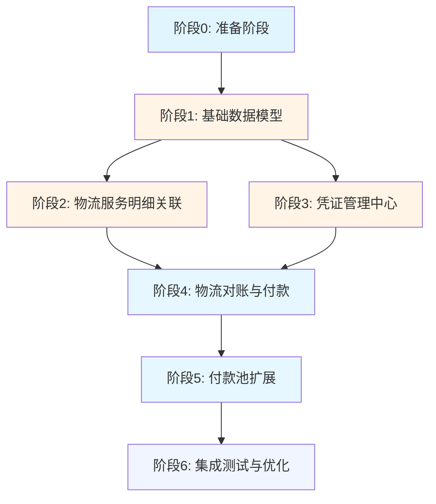

# SERC财务中台系统实施路线图

> **文档版本**: v1.1  
> **创建日期**: 2025-12-19  
> **最后更新**: 2025-12-19  
> **依据文档**: 《SERC财务中台系统设计总则》  
> **实施目标**: 完善物流费用管理 + 凭证管理系统 + 付款池扩展

---

## 一、实施目标与背景

### 1.1 核心目标

基于《SERC财务中台系统设计总则》，本次实施聚焦以下三大核心功能：

1. **物流费用闭环管理**（手工录入模式）
   - 解决一个发货单对应多个物流服务商的复杂场景
   - 实现物流服务商独立管理
   - 建立物流对账单 → 物流付款单的简化流程
   - **注意**：费用采用手工录入，物流服务商无API接口

2. **凭证管理中台化**
   - 建立横向支撑的凭证管理中心
   - 支持物流/采购/报关/付款四大类凭证
   - 实现多维度归档（发货单/报关单/供应商/月度）

3. **付款池统一管理**
   - 扩展付款池支持物流费用
   - 统一商品采购和物流费用的资金调度
   - 实现资金优化和审批流程标准化

### 1.2 业务价值

- **成本闭环**：从发货单 → 物流对账 → 付款 → 银行流水，形成完整的成本追踪链路
- **凭证完整**：业务发生时就上传凭证，避免事后追溯困难
- **资金优化**：统一调度商品采购和物流费用，减少资金占用
- **协作提升**：跟单组、财务组在同一系统协作，信息透明

### 1.3 重要业务约束

> ⚠️ **物流费用管理模式说明**：
> 
> 由于物流服务商（海运、空运、陆运、清关等）**没有API接口**，本系统的物流费用管理采用**手工录入模式**：
> 
> 1. **跟单阶段**：跟单人员根据服务商报价，手工录入**预估费用**
> 2. **对账阶段**：收到服务商账单后，财务人员手工录入**实际费用**
> 3. **无自动对账**：不涉及API自动拉取费用、自动对账等功能
> 4. **未来扩展**：如服务商提供API，可在后续版本扩展自动对账功能
> 
> 这与商品采购的L1-L2-L3流程不同，商品采购可能涉及系统间数据对接，但物流费用完全依赖人工录入。

### 1.4 现有基础

**已实装模块**：
- ✅ 发货单管理（`shipment_order` 表）
- ✅ 采购对账（L1-L2-L3 层级结构）
- ✅ 付款池（`fin_payment_pool` 表）
- ✅ 报关单管理（`customs_declaration` 表）
- ✅ 报关单附件（`customs_attachment` 表）

**待扩展点**：
- ⏳ 物流服务商独立管理（主数据手工维护）
- ⏳ 物流对账单简化流程（基于手工录入费用）
- ⏳ 凭证管理中心（通用化）
- ⏳ 付款池类型扩展

**暂缓功能**：
- ⏸️ 物流服务商API对接（服务商无API）
- ⏸️ 自动获取费用（无数据源）
- ⏸️ 自动对账功能（需API支持）

---

## 二、整体架构变更概览

### 2.1 新增核心模块

```
┌─────────────────────────────────────────────────────────────┐
│                    SERC 财务中台系统                          │
├─────────────────────────────────────────────────────────────┤
│  现有模块                     │  新增/扩展模块                │
├─────────────────────────────────────────────────────────────┤
│  发货单管理                   │  + 物流服务明细表              │
│  (shipment_order)            │  (shipment_logistics_services) │
├─────────────────────────────────────────────────────────────┤
│  供应商管理                   │  + 物流服务商管理              │
│  (商品供应商)                │  (logistics_providers)         │
├─────────────────────────────────────────────────────────────┤
│  采购对账 (L1-L2-L3)         │  + 物流对账管理                │
│                              │  (logistics_statement)          │
│                              │  (logistics_payment)            │
├─────────────────────────────────────────────────────────────┤
│  付款池                      │  + 扩展支持物流费用             │
│  (fin_payment_pool)          │  (payment_type 字段扩展)       │
├─────────────────────────────────────────────────────────────┤
│  报关单附件                  │  + 凭证管理中心（通用化）       │
│  (customs_attachment)        │  (document_center)             │
│                              │  (四大类凭证统一管理)           │
└─────────────────────────────────────────────────────────────┘
```

### 2.2 数据模型变更清单

| 序号 | 变更类型 | 表名 | 说明 | 依赖关系 |
|------|---------|------|------|----------|
| 1 | **新增** | `logistics_providers` | 物流服务商主数据 | 无依赖 |
| 2 | **新增** | `shipment_logistics_services` | 发货单物流服务明细 | 依赖 #1, 现有 `shipment_order` |
| 3 | **新增** | `logistics_statement` | 物流对账单 | 依赖 #1, #2 |
| 4 | **新增** | `logistics_payment` | 物流付款单 | 依赖 #3 |
| 5 | **新增** | `document_center` | 凭证管理中心（通用） | 无依赖 |
| 6 | **扩展** | `fin_payment_pool` | 增加 `payment_type` 字段 | 依赖 #4 |
| 7 | **废弃** | `customs_attachment` | 逐步迁移到 `document_center` | 无（向后兼容） |

### 2.3 业务流程变更

#### 现有流程（商品采购）
```
发货单 → L1交付合同 → L2采购SOA → L3付款申请 → 付款池 → 银行流水
```

#### 新增流程（物流费用）
```
发货单 → 物流服务明细 → 物流对账单 → 物流付款单 → 付款池 → 银行流水
           ↓
       物流凭证上传（服务凭证 + 付款凭证）
```

#### 统一归档流程
```
所有业务凭证 → 凭证管理中心 → 多维度归档
                              ↓
                 按发货单/报关单/供应商/月度 归档
```

---

## 三、实施阶段划分

### 阶段0：准备阶段（1天）

**目标**: 梳理详细设计文档，明确技术细节

**交付物**:
- [ ] 《物流服务商与物流对账管理详细设计》
- [ ] 《凭证管理系统详细设计》
- [ ] 《付款池扩展设计》

**关键决策**:
- 数据模型细节确认
- API接口规范定义
- 前端组件复用策略

---

### 阶段1：基础数据模型（2-3天）

**目标**: 建立物流服务商和凭证管理的数据基础

#### 1.1 数据库迁移（Backend）

**新增表**:

1. **`logistics_providers`** - 物流服务商表
   ```
   核心字段：
   - id (主键)
   - provider_name (服务商名称)
   - service_type (服务类型: 陆运/海运/空运/清关/派送)
   - payment_method (付款方式: 即付/预付/后付)
   - settlement_cycle (结算周期: 即时/周结/月结)
   - contact_info (联系方式)
   - bank_account (银行账户)
   - is_active (启用状态)
   ```

2. **`document_center`** - 凭证管理中心表
   ```
   核心字段：
   - id (主键)
   - business_type (业务类型: logistics/purchase/customs/payment)
   - document_type (凭证类型: 运单/发票/报关单/付款单等)
   - business_id (业务单据ID)
   - file_url (文件URL)
   - uploaded_by (上传人)
   - uploaded_at (上传时间)
   - audit_status (审核状态)
   ```

**迁移命令**:
```bash
docker compose exec backend flask db migrate -m "新增物流服务商和凭证管理中心表"
docker compose exec backend flask db upgrade
```

**验证标准**:
- [ ] 表结构创建成功
- [ ] 索引创建完成（provider_name, business_type + business_id）
- [ ] 外键约束验证通过

---

### 阶段2：物流服务明细关联（2-3天）

**目标**: 建立发货单与物流服务商的多对多关系

#### 2.1 数据库迁移（Backend）

**新增表**:

**`shipment_logistics_services`** - 发货单物流服务明细表
```
核心字段：
- id (主键)
- shipment_id (发货单ID, 外键 → shipment_order)
- logistics_provider_id (物流服务商ID, 外键 → logistics_providers)
- service_type (服务类型: 陆运/海运/空运/清关/派送)
- service_description (服务描述)
- estimated_amount (预估费用)
- actual_amount (实际费用)
- currency (币种)
- payment_method (付款方式: 即付/预付/后付)
- service_voucher_id (服务凭证ID, 外键 → document_center)
- payment_voucher_id (付款凭证ID, 外键 → document_center)
- status (状态: pending/confirmed/reconciled/paid)
- confirmed_at (确认时间)
- reconciled_at (对账时间)
- paid_at (付款时间)
```

**关键关系**:
- 一个发货单 → 多个物流服务明细
- 一个物流服务明细 → 一个物流服务商
- 一个物流服务明细 → 两个凭证（服务凭证 + 付款凭证）

#### 2.2 后端开发（Backend）

**Models** (`backend/app/models/logistics/`):
- [ ] `logistics_provider.py` - 物流服务商模型
- [ ] `shipment_logistics_service.py` - 物流服务明细模型
- [ ] `document.py` - 凭证管理模型

**Schemas** (`backend/app/schemas/logistics/`):
- [ ] `logistics_provider.py` - 序列化/反序列化
- [ ] `shipment_logistics_service.py` - 请求/响应Schema

**Services** (`backend/app/services/logistics/`):
- [ ] `logistics_provider_service.py` - 服务商业务逻辑
- [ ] `shipment_logistics_service.py` - 物流服务明细业务逻辑

**API Routes** (`backend/app/api/logistics/`):
- [ ] `logistics_provider_routes.py` - 服务商CRUD
- [ ] `shipment_logistics_service_routes.py` - 物流服务明细CRUD

**核心API接口**:
```
物流服务商管理：
- GET    /api/v1/logistics-providers          (列表)
- POST   /api/v1/logistics-providers          (创建)
- GET    /api/v1/logistics-providers/{id}     (详情)
- PUT    /api/v1/logistics-providers/{id}     (更新)
- DELETE /api/v1/logistics-providers/{id}     (删除)

物流服务明细管理：
- GET    /api/v1/shipments/{id}/logistics-services        (发货单的物流服务列表)
- POST   /api/v1/shipments/{id}/logistics-services        (添加物流服务)
- PUT    /api/v1/shipments/{id}/logistics-services/{sid}  (更新物流服务)
- DELETE /api/v1/shipments/{id}/logistics-services/{sid}  (删除物流服务)
```

#### 2.3 前端开发（Frontend）

**API层** (`frontend/apps/web-antd/src/api/logistics/`):
- [ ] `logistics-provider.ts` - 服务商API封装
- [ ] `shipment-logistics-service.ts` - 物流服务明细API封装

**页面** (`frontend/apps/web-antd/src/views/logistics/`):
- [ ] `provider/index.vue` - 物流服务商管理页面
- [ ] `provider/components/ProviderFormModal.vue` - 服务商创建/编辑弹窗

**组件** (`frontend/apps/web-antd/src/views/logistics/shipment/components/`):
- [ ] `LogisticsServicesPanel.vue` - 发货单详情页的物流服务Tab
- [ ] `LogisticsServiceFormModal.vue` - 添加物流服务弹窗

**验证标准**:
- [ ] 可以创建物流服务商
- [ ] 可以在发货单详情页添加物流服务
- [ ] 可以查看物流服务列表
- [ ] 物流服务总费用自动汇总

---

### 阶段3：凭证管理中心（3-4天）

**目标**: 建立通用的凭证上传、查询、归档能力

#### 3.1 后端开发（Backend）

**Models** (`backend/app/models/document/`):
- [ ] `document_center.py` - 凭证管理核心模型

**Services** (`backend/app/services/document/`):
- [ ] `document_service.py` - 凭证上传/查询/归档业务逻辑
- [ ] `archive_service.py` - 自动归档服务（报关单审核通过 → 触发归档）

**API Routes** (`backend/app/api/document/`):
- [ ] `document_routes.py` - 凭证管理API

**核心API接口**:
```
凭证管理：
- POST   /api/v1/documents/upload                    (上传凭证)
- GET    /api/v1/documents                           (查询凭证列表)
- GET    /api/v1/documents/by-business/{type}/{id}   (按业务单据查询凭证)
- DELETE /api/v1/documents/{id}                      (删除凭证)
- POST   /api/v1/documents/archive                   (手动触发归档)

归档管理：
- GET    /api/v1/archives/by-shipment/{id}           (按发货单归档)
- GET    /api/v1/archives/by-customs/{id}            (按报关单归档)
- GET    /api/v1/archives/by-supplier/{id}           (按供应商归档)
- GET    /api/v1/archives/by-month/{year}/{month}    (按月度归档)
```

#### 3.2 前端开发（Frontend）

**通用组件** (`frontend/apps/web-antd/src/components/document/`):
- [ ] `DocumentUploader.vue` - 凭证上传组件（支持拖拽、多文件）
- [ ] `DocumentList.vue` - 凭证列表展示组件
- [ ] `DocumentPreview.vue` - 凭证预览组件（支持PDF/图片/Excel）

**集成点**:
- [ ] 发货单详情页 → 物流凭证上传
- [ ] 物流服务明细 → 服务凭证 + 付款凭证上传
- [ ] L1交付合同 → 采购凭证上传
- [ ] 付款申请 → 付款凭证上传

**验证标准**:
- [ ] 可以在业务单据页面上传凭证
- [ ] 凭证自动关联到对应业务单据
- [ ] 可以查看凭证列表和预览
- [ ] 报关单审核通过后，可以一键导出归档包

---

### 阶段4：物流对账与付款（3-4天）

**目标**: 建立物流对账单 → 物流付款单的简化流程

#### 4.1 数据库迁移（Backend）

**新增表**:

1. **`logistics_statement`** - 物流对账单表
   ```
   核心字段：
   - id (主键)
   - statement_no (对账单号)
   - shipment_id (发货单ID, 外键 → shipment_order)
   - logistics_provider_id (物流服务商ID, 外键 → logistics_providers)
   - statement_date (对账日期)
   - total_amount (对账总额)
   - currency (币种)
   - payment_method (付款方式)
   - status (状态: draft/confirmed/paid)
   - confirmed_by (确认人)
   - confirmed_at (确认时间)
   ```

2. **`logistics_payment`** - 物流付款单表
   ```
   核心字段：
   - id (主键)
   - payment_no (付款单号)
   - statement_id (对账单ID, 外键 → logistics_statement)
   - payment_date (付款日期)
   - payment_amount (付款金额)
   - currency (币种)
   - payment_pool_id (付款池ID, 外键 → fin_payment_pool)
   - status (状态: pending/approved/paid)
   ```

**关系链路**:
```
shipment_order (发货单)
    ↓
shipment_logistics_services (物流服务明细)
    ↓
logistics_statement (物流对账单) - 一个发货单 → 多个对账单（每个服务商一个）
    ↓
logistics_payment (物流付款单) - 一个对账单 → 一个付款单
    ↓
fin_payment_pool (付款池) - 统一管理
```

#### 4.2 后端开发（Backend）

**Models**:
- [ ] `logistics_statement.py` - 物流对账单模型
- [ ] `logistics_payment.py` - 物流付款单模型

**Services**:
- [ ] `logistics_statement_service.py` - 对账单业务逻辑
  - 从物流服务明细自动生成对账单
  - 对账单确认 → 自动创建付款单
- [ ] `logistics_payment_service.py` - 付款单业务逻辑
  - 付款单审批
  - 进入付款池
  - 银行流水核销

**API Routes**:
- [ ] `logistics_statement_routes.py` - 对账单CRUD
- [ ] `logistics_payment_routes.py` - 付款单CRUD

**核心API接口**:
```
物流对账单：
- GET    /api/v1/logistics-statements                      (列表)
- POST   /api/v1/logistics-statements                      (创建)
- GET    /api/v1/logistics-statements/{id}                 (详情)
- PUT    /api/v1/logistics-statements/{id}/confirm         (确认对账单)
- GET    /api/v1/shipments/{id}/logistics-statements       (发货单的对账单列表)

物流付款单：
- GET    /api/v1/logistics-payments                        (列表)
- POST   /api/v1/logistics-payments                        (创建)
- GET    /api/v1/logistics-payments/{id}                   (详情)
- PUT    /api/v1/logistics-payments/{id}/approve           (审批)
- PUT    /api/v1/logistics-payments/{id}/add-to-pool       (加入付款池)
```

#### 4.3 前端开发（Frontend）

**页面**:
- [ ] `logistics/statement/index.vue` - 物流对账单列表页
- [ ] `logistics/statement/detail.vue` - 物流对账单详情页
- [ ] `logistics/payment/index.vue` - 物流付款单列表页

**组件**:
- [ ] `StatementFormModal.vue` - 对账单创建/编辑弹窗
- [ ] `PaymentFormModal.vue` - 付款单创建/编辑弹窗

**验证标准**:
- [ ] 可以从发货单的物流服务明细生成对账单
- [ ] 对账单确认后自动创建付款单
- [ ] 付款单可以加入付款池
- [ ] 付款池列表可以区分商品付款和物流付款

---

### 阶段5：付款池扩展（2天）

**目标**: 扩展付款池支持物流费用，统一资金调度

#### 5.1 数据库迁移（Backend）

**扩展表**:

**`fin_payment_pool`** - 增加字段
```
新增字段：
- payment_type (付款类型: 'purchase' | 'logistics' | 'other')
- related_statement_type (关联对账单类型: 'purchase_soa' | 'logistics_statement')
- related_statement_id (关联对账单ID)
```

**迁移命令**:
```bash
docker compose exec backend flask db migrate -m "扩展付款池支持物流费用"
docker compose exec backend flask db upgrade
```

#### 5.2 后端开发（Backend）

**Services** - 扩展现有服务:
- [ ] `payment_pool_service.py` - 扩展支持 `payment_type`
  - 统一调度逻辑
  - 优先级规则（是否物流预付优先？）

**API Routes** - 扩展现有接口:
- [ ] 列表接口支持按 `payment_type` 筛选
- [ ] 统计接口区分商品付款和物流付款

#### 5.3 前端开发（Frontend）

**页面** - 扩展现有页面:
- [ ] `serc/finance/pool.vue` - 增加付款类型筛选
- [ ] 增加标签/颜色区分商品付款和物流付款

**验证标准**:
- [ ] 付款池可以同时管理商品付款和物流付款
- [ ] 可以按类型筛选和统计
- [ ] 资金调度逻辑正确（预付/即付/后付优先级）

---

### 阶段6：集成测试与优化（2-3天）

**目标**: 端到端测试，确保所有流程贯通

#### 6.1 后端测试（Backend）

**单元测试** (`backend/tests/`):
- [ ] `test_logistics_provider.py` - 服务商CRUD测试
- [ ] `test_logistics_statement.py` - 对账单业务逻辑测试
- [ ] `test_document_service.py` - 凭证上传/查询测试
- [ ] `test_payment_pool_extension.py` - 付款池扩展测试

**集成测试** (`backend/tests/integration/`):
- [ ] `test_logistics_flow.py` - 物流费用完整流程测试
  ```
  发货单 → 添加物流服务 → 上传凭证 → 生成对账单 → 
  创建付款单 → 加入付款池 → 审批 → 付款 → 银行流水核销
  ```

#### 6.2 前端测试（Frontend）

**手工测试清单**:
- [ ] 物流服务商管理：创建、编辑、列表、详情
- [ ] 发货单物流服务：添加、编辑、删除、查看
- [ ] 凭证上传：拖拽上传、多文件上传、预览、删除
- [ ] 物流对账单：创建、确认、查看
- [ ] 物流付款单：创建、审批、加入付款池
- [ ] 付款池：类型筛选、统计、付款
- [ ] 归档功能：按发货单/报关单/供应商/月度归档

#### 6.3 性能优化

**后端优化**:
- [ ] 数据库索引优化（慢查询分析）
- [ ] N+1 查询优化（预加载关联数据）
- [ ] API 响应时间优化（<200ms）

**前端优化**:
- [ ] 表格虚拟滚动（大数据量）
- [ ] 图片懒加载（凭证预览）
- [ ] 接口防抖/节流

---

## 四、依赖关系图



**关键路径**:
1. 阶段1（基础数据模型）→ 阶段2（物流服务明细）→ 阶段4（物流对账）→ 阶段5（付款池）
2. 阶段1（基础数据模型）→ 阶段3（凭证管理）→ 阶段4（物流对账）

**并行任务**:
- 阶段2 和 阶段3 可以并行开发（依赖阶段1完成）

---

## 五、风险评估与应对

### 5.1 技术风险

| 风险项 | 风险等级 | 影响 | 应对措施 |
|--------|---------|------|----------|
| 现有数据迁移 | 🟡 中 | 现有发货单需要补充物流服务明细 | 提供数据迁移脚本，支持批量导入 |
| 付款池逻辑冲突 | 🟡 中 | 物流费用和商品费用的调度规则不同 | 明确优先级规则，支持手动调整 |
| 凭证存储成本 | 🟢 低 | 大量文件上传可能导致存储成本增加 | 使用阿里云OSS，设置生命周期策略 |
| 性能瓶颈 | 🟢 低 | 凭证查询可能较慢 | 建立索引，使用缓存 |

### 5.2 业务风险

| 风险项 | 风险等级 | 影响 | 应对措施 |
|--------|---------|------|----------|
| 业务流程变更 | 🟡 中 | 跟单组需要学习新的凭证上传流程 | 提供操作手册，组织培训 |
| 数据完整性 | 🟡 中 | 历史数据可能缺失物流服务明细 | 逐步补全，不影响新业务 |
| 权限管理 | 🟢 低 | 不同角色对凭证的操作权限 | 复用现有RBAC，明确权限规则 |

### 5.3 进度风险

| 风险项 | 风险等级 | 影响 | 应对措施 |
|--------|---------|------|----------|
| 需求变更 | 🟡 中 | 开发过程中可能有细节调整 | 保持敏捷，小步快跑，快速验证 |
| 测试不充分 | 🟡 中 | 上线后可能出现BUG | 编写完整的单元测试和集成测试 |
| 资源不足 | 🟢 低 | 开发人员不足 | 按优先级分阶段实施，先P0再P1 |

---

## 六、时间估算与里程碑

### 6.1 总体时间估算

| 阶段 | 预计时间 | 累计时间 |
|------|---------|---------|
| 阶段0: 准备阶段 | 1天 | 1天 |
| 阶段1: 基础数据模型 | 2-3天 | 3-4天 |
| 阶段2: 物流服务明细关联 | 2-3天 | 5-7天 |
| 阶段3: 凭证管理中心 | 3-4天 | 8-11天 |
| 阶段4: 物流对账与付款 | 3-4天 | 11-15天 |
| 阶段5: 付款池扩展 | 2天 | 13-17天 |
| 阶段6: 集成测试与优化 | 2-3天 | 15-20天 |

**总计**: 15-20个工作日（3-4周）

### 6.2 关键里程碑

| 里程碑 | 目标日期 | 验收标准 |
|--------|---------|----------|
| M1: 数据模型就绪 | Day 4 | 所有新表创建完成，迁移成功 |
| M2: 物流服务管理上线 | Day 7 | 可以管理物流服务商，可以在发货单添加物流服务 |
| M3: 凭证管理上线 | Day 11 | 可以上传凭证，可以查询和预览 |
| M4: 物流对账付款上线 | Day 15 | 可以生成对账单，可以创建付款单，可以加入付款池 |
| M5: 系统集成完成 | Day 20 | 完整流程贯通，集成测试通过 |

### 6.3 优先级调整方案

如果时间紧张，可以按以下优先级调整：

**P0（必须完成）**:
- 阶段1: 基础数据模型
- 阶段2: 物流服务明细关联
- 阶段4: 物流对账与付款（简化版，先不集成付款池）

**P1（重要但可延后）**:
- 阶段5: 付款池扩展
- 阶段3: 凭证管理中心（先手工上传，后续再优化）

**P2（未来规划）**:
- 阶段3: 凭证管理中心的高级功能（OCR、版本控制）
- 阶段6: 性能优化（可以在上线后逐步优化）

---

## 七、成功标准与验收条件

### 7.1 功能完整性

- [ ] **物流服务商管理**：可以创建、编辑、查询物流服务商
- [ ] **物流服务明细**：可以在发货单添加多个物流服务
- [ ] **凭证上传**：可以上传服务凭证和付款凭证
- [ ] **物流对账**：可以生成对账单，确认费用
- [ ] **物流付款**：可以创建付款单，加入付款池
- [ ] **统一调度**：付款池可以统一管理商品和物流费用
- [ ] **多维归档**：可以按发货单/报关单/供应商/月度归档凭证

### 7.2 性能指标

- [ ] **API响应时间**：95%的请求 < 200ms
- [ ] **列表加载时间**：1000条数据 < 2s
- [ ] **凭证上传速度**：10MB文件 < 3s
- [ ] **并发支持**：支持50个用户同时操作

### 7.3 质量标准

- [ ] **单元测试覆盖率**：核心业务逻辑 > 80%
- [ ] **集成测试**：完整流程端到端测试通过
- [ ] **代码规范**：通过 Ruff (Backend) 和 ESLint (Frontend) 检查
- [ ] **API文档**：所有接口有完整的 OpenAPI 文档

### 7.4 用户验收

- [ ] **跟单组**：可以独立完成物流服务和凭证上传
- [ ] **财务组**：可以快速查询和归档凭证
- [ ] **管理层**：可以查看物流费用统计和分析

---

## 八、后续优化方向

### 8.1 短期优化（1-3个月）

- [ ] **凭证OCR**：自动识别运单号、金额等关键信息
- [ ] **智能归档**：AI自动分类和归档凭证
- [ ] **移动端支持**：跟单组在外可以通过手机上传凭证
- [ ] **费用预警**：物流费用超出预算自动预警

### 8.2 中期优化（3-6个月）

- [ ] **物流服务商评价**：按时效、费用、服务质量评价
- [ ] **物流费用分析**：按路线、服务商、时间段分析成本
- [ ] **费用基准库**：建立各路线/服务商的费用基准，用于预警
- [ ] **版本控制**：凭证修改历史追溯

### 8.3 长期规划（6-12个月）

- [ ] **AI成本优化**：基于历史数据，推荐最优物流方案
- [ ] **区块链存证**：凭证上链，防篡改
- [ ] **供应链金融**：基于凭证数据，申请供应链贷款
- [ ] **多语言支持**：凭证管理支持多语言（英文、日文等）

### 8.4 暂缓功能（待条件成熟）

以下功能**暂不实施**，待物流服务商提供API后再扩展：

- ⏸️ **自动对接物流服务商API**：需要服务商提供标准API接口
- ⏸️ **自动获取费用**：需要API提供费用查询功能
- ⏸️ **自动对账**：需要API提供账单数据
- ⏸️ **实时跟踪**：需要API提供物流跟踪数据

**实施条件**：
- 物流服务商提供稳定的API接口
- API支持费用查询、账单下载等功能
- 有足够的技术资源进行API对接和维护

---

## 九、总结

本实施路线图基于《SERC财务中台系统设计总则》，明确了物流费用管理、凭证管理和付款池扩展的实施路径。

**核心价值**:
1. **成本闭环**：从发货单到银行流水，完整追踪物流费用
2. **凭证完整**：业务发生时就上传凭证，避免事后追溯
3. **资金优化**：统一调度商品和物流费用，减少资金占用

**实施策略**:
- 分阶段实施，小步快跑，快速验证
- 核心功能优先（P0），高级功能延后（P1/P2）
- 保持敏捷，根据反馈快速调整

**下一步行动**:
1. 确认本路线图的合理性
2. 开始撰写详细设计文档
3. 启动阶段1的开发工作

---

**文档状态**: ✅ 待确认  
**确认人**: [待填写]  
**确认日期**: [待填写]
