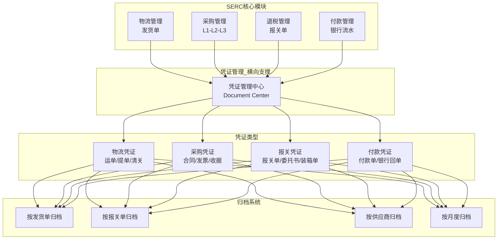

# SERC财务中台系统设计总则

**文档版本**: v2.1  
**创建时间**: 2025-12-19  
**最后更新**: 2025-12-19  
**系统定位**: 跨境电商企业财务成本核算与管理中台  
**文档状态**: ✅ 架构设计完成

---

## 文档说明

本文档是SERC系统的顶层设计总则，定义了系统的核心定位、业务边界、架构原则和数据流转逻辑。所有子模块的设计必须遵循本文档的指导原则。

**阅读对象**: 产品经理、架构师、开发团队、业务负责人

### 重要业务约束

> ⚠️ **物流费用管理说明**（v2.1更新）：
> 
> 由于物流服务商（海运、空运、陆运、清关等）**没有API接口**，物流费用管理采用**手工录入模式**：
> - 头程费用（运费、保险费、操作费等）由跟单人员根据报价手工录入预估费用
> - 实际费用由财务人员收到账单后手工录入
> - 不涉及API自动对接、自动获取费用、自动对账等功能
> - 未来如服务商提供API，可扩展自动对账功能

---

## 目录

- [一、系统定位与价值主张](#一系统定位与价值主张)
- [二、核心设计理念](#二核心设计理念)
- [三、系统边界与职责](#三系统边界与职责)
- [四、整体架构](#四整体架构)
- [五、核心业务流程](#五核心业务流程)
- [六、数据引入与同步](#六数据引入与同步)
- [七、成本归集体系](#七成本归集体系)
- [八、付款管理体系](#八付款管理体系)
- [九、凭证管理与归档](#九凭证管理与归档)
- [十、退税管理体系](#十退税管理体系)
- [十一、技术架构原则](#十一技术架构原则)
- [十二、扩展性与演进](#十二扩展性与演进)

---

## 一、系统定位与价值主张

### 1.1 核心定位

SERC（Supply Export Refund Compliance）是一个**财务成本核算与管理中台系统**，专注于跨境电商企业的财务管理需求。

**系统全称**: 供应链出口退税合规管理系统  
**系统简称**: SERC财务中台  
**适用场景**: 跨境电商（Amazon/eBay等平台）的财务成本管理

### 1.2 与外部业务系统的关系

```
┌─────────────────────────────────────────────┐
│          外部业务系统（领星/其他ERP）          │
│   ┌──────────┐  ┌──────────┐  ┌──────────┐  │
│   │ 订单管理 │  │ 发货管理 │  │ 库存管理 │  │
│   └──────────┘  └──────────┘  └──────────┘  │
└──────────────────┬──────────────────────────┘
                   │ 数据引入
                   ↓
┌─────────────────────────────────────────────┐
│           SERC财务中台（本系统）              │
│   ┌──────────┐  ┌──────────┐  ┌──────────┐  │
│   │ 成本归集 │  │ 付款管理 │  │ 银行对账 │  │
│   └──────────┘  └──────────┘  └──────────┘  │
│   ┌──────────┐  ┌──────────┐  ┌──────────┐  │
│   │ 凭证管理 │  │ 退税管理 │  │ 报表分析 │  │
│   └──────────┘  └──────────┘  └──────────┘  │
└──────────────────┬──────────────────────────┘
                   │ 成本反馈
                   ↓
┌─────────────────────────────────────────────┐
│         外部业务系统（接收成本数据）           │
│              用于利润分析                     │
└─────────────────────────────────────────────┘
```

**关键原则**：
- ✅ **数据引入**：从外部业务系统拉取发货单、订单等业务数据
- ✅ **成本核算**：SERC负责归集各环节的实际成本
- ✅ **成本反馈**：将成本数据提供给业务系统用于利润分析
- ❌ **不做业务**：不管理订单、库存、客户等业务实体

### 1.3 核心价值

| 价值维度 | 传统方式的问题 | SERC的解决方案 |
|---------|--------------|---------------|
| **成本透明** | 成本分散在多个系统，难以汇总 | 统一归集采购、物流、关税等各环节成本 |
| **付款规范** | Excel记录，易出错，难追溯 | L1-L2-L3三层架构，规范对账付款流程 |
| **银行对账** | 手工匹配流水，效率低下 | 自动匹配银行流水与业务单据 |
| **凭证管理** | 纸质凭证丢失，查找困难 | 电子化管理，业务与凭证统一 |
| **退税合规** | 手工匹配发票报关单，易出错 | 三层自动匹配，换汇成本风控 |
| **协同效率** | 业务与财务信息断层 | 跟单组与财务组实时协同 |

### 1.4 目标用户

| 用户角色 | 使用场景 |
|---------|---------|
| **跟单专员** | 创建发货单、上传物流凭证、录入物流费用 |
| **采购专员** | 录入采购合同、对账、上传采购凭证 |
| **财务会计** | 审核凭证、确认结算单、银行对账 |
| **财务出纳** | 执行付款、录入银行流水、核销账目 |
| **关务专员** | 录入报关单、三层匹配、退税申报 |
| **财务经理** | 查看成本汇总报表、监控付款进度 |

---

## 二、核心设计理念

### 2.1 业财一体化

**理念**: 业务数据与财务数据在同一系统中流转，消除信息断层。

**体现**：
- 跟单组录入发货单时，同步上传物流凭证
- 采购组生成L1合同时，系统自动关联后续的结算和付款
- 财务组可以实时看到业务进度，不再"事后补救"

### 2.2 三层解耦架构

**理念**: 实物确权、债务确权、资金执行三层分离，应对复杂业务场景。

```
L1 交付合同 (Delivery Contract)
   ↓ 实物确权：供应商交货，确认数量和价格
L2 结算单 (Statement of Account)
   ↓ 债务确权：按账期合并，确认应付金额
L3 付款单 (Payment Request)
   ↓ 资金执行：按资金计划付款
```

**解决的问题**：
- ✅ 多供应商集货：一个发货单对应多个L1合同
- ✅ 分批付款：一个L2结算单对应多个L3付款
- ✅ 见款开票：L2双状态管理（资金状态+票据状态）
- ✅ 付款灵活：付款池机制，支持定金/尾款/预付

### 2.3 数据驱动决策

**理念**: 所有决策基于真实数据，而非估算或经验。

**体现**：
- 成本归集：每个SKU的实际成本可追溯
- 付款分析：供应商账期、付款及时率统计
- 退税风控：换汇成本实时监控，超标预警
- 银行对账：流水匹配率、未核销金额一目了然

### 2.4 凭证与业务统一

**理念**: 业务单据与原始凭证同步管理，纸质电子统一。

**体现**：
- 跟单组上传物流凭证（运单、提单、清关文件）
- 采购组上传采购凭证（合同、发票、收据）
- 财务组审核凭证（合规性、完整性）
- 归档系统自动打包（按发货单/报关单归档）

### 2.5 渐进式演进

**理念**: 系统不追求一步到位，而是分阶段实施，逐步完善。

**当前阶段**（v2.0）：
- ✅ 采购对账与付款管理（L1-L2-L3）
- ✅ 物流成本归集（发货单管理）
- ✅ 银行流水核销
- ✅ 凭证管理与归档
- ✅ 出口退税管理

**未来演进**：
- ⏳ 多币种管理与汇率风控
- ⏳ 成本智能分摊算法
- ⏳ 资金预测与调度优化
- ⏳ AI辅助的银行流水识别

---

## 三、系统边界与职责

### 3.1 SERC负责的职责 ✅

| 职责领域 | 具体功能 | 说明 |
|---------|---------|------|
| **成本归集** | 采购成本、物流成本、关税成本、其他费用 | 统一管理各环节的实际成本 |
| **采购对账** | L1交付合同、L2结算单、供应商对账 | 规范采购对账流程 |
| **付款管理** | L3付款申请、付款池、资金调度 | 管理应付账款和付款执行 |
| **银行对账** | 银行流水录入、自动匹配、核销管理 | 确保账实相符 |
| **凭证管理** | 业务凭证上传、审核、归档、查询 | 纸质电子统一管理 |
| **退税管理** | 报关单管理、三层匹配、换汇风控、退税申报 | 确保退税合规 |
| **报表分析** | 成本汇总报表、付款进度报表、退税统计 | 提供决策支持 |

### 3.2 SERC不负责的职责 ❌

| 领域 | 原因 | 由谁负责 |
|-----|------|---------|
| **订单管理** | 属于业务运营，不是财务职能 | 领星等业务系统 |
| **库存管理** | 属于仓储物流，不是财务职能 | 领星/WMS系统 |
| **客户管理** | 属于销售CRM，不是财务职能 | 领星/CRM系统 |
| **利润分析** | 需要结合销售收入，SERC只提供成本 | 领星等业务系统 |
| **营销费用** | 广告投放管理，不在SERC范围 | 广告平台/业务系统 |
| **人力成本** | 属于HR管理，不在SERC范围 | HR系统 |

### 3.3 数据接口边界

**SERC的数据输入**：
```
外部业务系统 → SERC
  ├─ 发货单数据（从领星定时拉取）
  ├─ 订单数据（可选，用于成本关联）
  └─ 库存数据（可选，用于成本核算）
```

**SERC的数据输出**：
```
SERC → 外部业务系统
  ├─ 采购成本（按SKU/发货单汇总）
  ├─ 物流成本（按发货单汇总）
  ├─ 关税成本（按报关单汇总）
  └─ 综合成本报表（供利润分析使用）
```

---

## 四、整体架构

### 4.1 分层架构

```
┌─────────────────────────────────────────────┐
│              展现层 (Presentation)            │
│   ┌──────────┐  ┌──────────┐  ┌──────────┐  │
│   │ Web前端  │  │ 移动端   │  │ 报表系统 │  │
│   └──────────┘  └──────────┘  └──────────┘  │
└──────────────────┬──────────────────────────┘
                   │ RESTful API
┌──────────────────┴──────────────────────────┐
│              应用层 (Application)             │
│   ┌──────────┐  ┌──────────┐  ┌──────────┐  │
│   │ 物流管理 │  │ 采购管理 │  │ 退税管理 │  │
│   └──────────┘  └──────────┘  └──────────┘  │
│   ┌──────────┐  ┌──────────┐  ┌──────────┐  │
│   │ 付款管理 │  │ 凭证管理 │  │ 报表分析 │  │
│   └──────────┘  └──────────┘  └──────────┘  │
└──────────────────┬──────────────────────────┘
                   │ Service Layer
┌──────────────────┴──────────────────────────┐
│              领域层 (Domain)                  │
│   ┌──────────┐  ┌──────────┐  ┌──────────┐  │
│   │ 成本归集 │  │ 对账结算 │  │ 凭证归档 │  │
│   └──────────┘  └──────────┘  └──────────┘  │
│   ┌──────────┐  ┌──────────┐  ┌──────────┐  │
│   │ 流水核销 │  │ 三层匹配 │  │ 双状态管理│  │
│   └──────────┘  └──────────┘  └──────────┘  │
└──────────────────┬──────────────────────────┘
                   │ ORM
┌──────────────────┴──────────────────────────┐
│              数据层 (Data)                    │
│   ┌──────────┐  ┌──────────┐  ┌──────────┐  │
│   │PostgreSQL│  │  Redis   │  │ 群晖NAS  │  │
│   └──────────┘  └──────────┘  └──────────┘  │
└─────────────────────────────────────────────┘
```

### 4.2 核心模块组成


---

## 五、核心业务流程

### 5.1 完整业务链路

```
外部系统(领星) → 数据引入 → 成本归集 → 付款管理 → 银行对账 → 退税管理 → 成本反馈
```

**详细流程**：

```
1. 外部系统创建发货单
   ↓
2. SERC定时拉取发货单数据（每5分钟）
   ↓
3. 跟单组在SERC中补充物流信息
   - 录入物流费用（运费、保险费、操作费）
   - 上传物流凭证（运单、提单、清关文件）
   ↓
4. 采购组创建L1交付合同
   - 关联供应商
   - 录入商品明细和价格
   - 上传采购凭证（合同、发票）
   ↓
5. 财务组生成L2结算单
   - 按供应商和账期自动合并L1
   - 供应商对账确认
   - 双状态管理（资金+票据）
   ↓
6. 财务组创建L3付款申请
   - 从付款池分配资金
   - 审批后执行付款
   - 记录实际付款时间和方式
   ↓
7. 财务组录入银行流水
   - 手工录入或批量导入
   - 系统自动匹配业务单据
   - 核销确认
   ↓
8. 关务组录入报关单
   - 关联L1合同
   - 三层匹配（L1+发票+报关单）
   - 换汇成本风控
   ↓
9. 系统自动归档
   - 按报关单打包所有相关凭证
   - 生成归档清单
   - 支持一键下载
   ↓
10. 成本数据导出
    - 生成成本汇总报表
    - 提供给外部业务系统
    - 用于利润分析
```

### 5.2 关键节点说明

#### 节点1：数据引入（从领星到SERC）

**触发条件**：定时任务（每5分钟）

**同步内容**：
- 发货单基本信息（发货单号、目的地、状态）
- 商品明细（SKU、数量、FNSKU）
- 发货地址和目标仓库

**数据映射**：
```
领星发货单 → SERC发货单
  ├─ shipment_id → external_shipment_id
  ├─ shipment_name → shipment_name
  ├─ destination_fc → destination_warehouse
  └─ items[] → purchase_items[]
```

#### 节点2：物流成本录入

**操作人**：跟单专员

**录入内容**：
- 运费（freight_cost）
- 保险费（insurance_cost）
- 操作费（handling_fee）
- 其他物流费用（other_costs）

**上传凭证**：
- 国内运单（卡车/快递）
- 国际提单（海运/空运）
- 清关文件（目的国）
- 付款凭证（银行回单）

#### 节点3：采购确权（L1合同）

**操作人**：采购专员

**核心逻辑**：
- 实物确权：确认供应商实际交付的数量和价格
- 关联发货单：一个发货单可以对应多个L1合同（多供应商集货）
- 锁定状态：L1确认后锁定，不可修改（保证数据可追溯）

**数据结构**：
```
L1交付合同
  ├─ 供应商信息
  ├─ 交付日期
  ├─ 商品明细
  │   ├─ SKU
  │   ├─ 数量
  │   ├─ 单价
  │   └─ 总金额
  └─ 关联发货单
```

#### 节点4：债务确权（L2结算单）

**操作人**：财务会计

**核心逻辑**：
- 按供应商和账期合并L1合同
- 生成对账单，供应商确认
- 双状态管理：
  - **资金状态**：未付款/部分付款/已结清
  - **票据状态**：未开票/部分开票/已开票

**业务规则**：
- 见款开票：供应商收到付款后才开票
- 部分开票：允许分批开票，每次开票更新票据状态
- 分批付款：一个L2可以对应多个L3付款

#### 节点5：资金执行（L3付款单）

**操作人**：财务出纳

**核心逻辑**：
- 从付款池分配资金
- 支持定金、尾款、预付款
- 记录实际付款时间和方式
- 关联银行流水

**付款池机制**：
```
付款池 (Payment Pool)
  ├─ 定金池：预先支付给供应商
  ├─ 尾款池：货到后支付剩余款项
  ├─ 预付池：长期合作供应商的备用金
  └─ 临时池：临时性支出
```

#### 节点6：银行对账

**操作人**：财务会计/出纳

**核心逻辑**：
- 录入或导入银行流水
- 系统自动匹配业务单据
  - 匹配规则：金额、日期、对方账户名
  - 模糊匹配：支持金额范围匹配
- 人工确认核销

**匹配算法**：
```
匹配优先级：
  1. 精确匹配：金额+日期+对方名称完全一致
  2. 金额匹配：金额一致，日期在±3天内
  3. 模糊匹配：金额在±1%范围内
  4. 人工处理：以上都不匹配
```

#### 节点7：三层匹配（退税）

**操作人**：关务专员

**核心逻辑**：
- 报关单与L1合同匹配（按商品和数量）
- 报关单与发票匹配（按金额）
- 三层数据一致性校验

**风控规则**：
```
换汇成本 = (采购成本 + 物流成本) / 报关金额

预警规则：
  - 换汇成本 > 1.0：严重异常，无法退税
  - 换汇成本 > 0.9：警告，利润过低
  - 换汇成本 < 0.7：可疑，可能低报
```

#### 节点8：自动归档

**触发条件**：报关单审核通过

**归档内容**：
- 物流凭证（运单、提单、清关文件）
- 采购凭证（合同、发票、收据）
- 报关凭证（报关单、委托书、装箱单）
- 付款凭证（付款单、银行回单）

**归档规则**：
- 按报关单号创建归档包
- 按凭证类型分类
- 生成归档清单
- 保留7年（税务要求）

---

## 六、数据引入与同步

### 6.1 领星数据同步

#### 6.1.1 同步策略

**模式**：主动拉取（Pull）而非被动接收（Push）

**原因**：领星API只提供查询接口，不支持Webhook推送

**方案**：
```
定时任务（Celery Beat）
  ↓ 每5分钟
领星API查询（增量同步）
  ↓ HTTP POST
SERC数据转换（映射规则）
  ↓ 保存
SERC本地数据库
```

#### 6.1.2 同步内容

| 数据类型 | 领星API | 同步频率 | 备注 |
|---------|--------|---------|------|
| **FBA发货单** | `/fba/inbound_shipment/detail` | 每5分钟 | 同步进行中的发货单 |
| **海外仓备货单** | `/warehouse/overseas_stock/detail` | 每15分钟 | 同步已确认的备货单 |
| **商品信息** | `/product/list` | 每日凌晨 | 全量同步（缓存） |

#### 6.1.3 增量同步逻辑

**关键字段**：`updated_date`（领星返回的更新时间）

**同步流程**：
```
1. 读取上次同步时间（last_sync_time）
2. 调用领星API，筛选 updated_date > last_sync_time
3. 获取增量数据
4. 转换并保存到SERC
5. 更新 last_sync_time
```

#### 6.1.4 数据一致性保障

**策略1：定时全量校验**
- 频率：每周日凌晨2点
- 逻辑：对比领星和SERC的数据差异
- 处理：生成差异报告，人工确认后修复

**策略2：状态变更同步**
- 监控：领星发货单状态变更（SHIPPED → RECEIVING → CLOSED）
- 触发：状态变更时立即同步
- 确保：SERC状态与领星一致

**策略3：数据锁定机制**
- 规则：领星状态为CLOSED后，SERC对应数据锁定
- 保护：防止误修改已完成的业务数据
- 解锁：需要特殊权限才能解锁

### 6.2 其他系统对接

**扩展性设计**：预留标准接口，支持对接更多系统

| 系统类型 | 对接方式 | 数据流向 |
|---------|---------|---------|
| **ERP系统** | API/数据库直连 | 双向（引入发货单，反馈成本）|
| **WMS系统** | API | 引入（仓储费用数据）|
| **广告平台** | API/文件导入 | 引入（营销费用数据）|
| **群晖NAS** | WebDAV/API | 双向（凭证文件存储）|

---

## 七、成本归集体系

### 7.1 成本分类

跨境电商企业的成本构成：

```
总成本
  ├─ 采购成本（最大头，60-70%）
  │   ├─ 商品采购价
  │   ├─ 国内运费
  │   └─ 采购服务费
  │
  ├─ 物流成本（20-30%）
  │   ├─ 头程物流
  │   │   ├─ 国内卡车运输
  │   │   ├─ 国际海运/空运
  │   │   └─ 目的国清关
  │   ├─ FBA配送费（Amazon收取）
  │   └─ 仓储费（海外仓/FBA）
  │
  ├─ 关税成本（5-15%）
  │   ├─ 进口关税
  │   ├─ 增值税（可退）
  │   └─ 消费税
  │
  └─ 其他费用（5-10%）
      ├─ 平台佣金
      ├─ 广告费用
      └─ 包装材料费
```

### 7.2 成本归集规则

#### 7.2.1 采购成本归集

**数据来源**：L1交付合同

**归集维度**：
- 按SKU归集：每个SKU的采购单价
- 按供应商归集：每个供应商的采购总额
- 按发货单归集：每个发货单的采购成本

**计算公式**：
```
采购成本 = Σ (SKU数量 × SKU单价)
```

#### 7.2.2 物流成本归集

**数据来源**：发货单管理模块

**归集维度**：
- 按发货单归集：每个发货单的物流总成本
- 按物流服务商归集：每个服务商的费用统计
- 按成本类型归集：运费、保险费、操作费分类统计

**计算公式**：
```
物流成本 = 运费 + 保险费 + 操作费 + 其他费用
```

**分摊规则**（可选）：
```
如果需要分摊到SKU：
  单个SKU物流成本 = 物流总成本 × (SKU数量 / 发货总数量)

或按重量分摊：
  单个SKU物流成本 = 物流总成本 × (SKU重量 / 发货总重量)

或按金额分摊：
  单个SKU物流成本 = 物流总成本 × (SKU采购金额 / 采购总金额)
```

#### 7.2.3 关税成本归集

**数据来源**：报关单管理模块

**归集维度**：
- 按报关单归集：每个报关单的关税总额
- 按SKU归集：通过报关单明细分摊到SKU
- 按L1合同归集：追溯到采购源头

**计算公式**：
```
关税成本 = 进口关税 + 增值税 + 消费税
```

### 7.3 成本汇总报表

#### 7.3.1 按发货单汇总

**报表内容**：
| 发货单号 | 采购成本 | 物流成本 | 关税成本 | 总成本 | 状态 |
|---------|---------|---------|---------|--------|------|
| FBA001 | 10,000 | 3,000 | 1,500 | 14,500 | 已完成 |
| FBA002 | 15,000 | 4,500 | 2,000 | 21,500 | 进行中 |

#### 7.3.2 按SKU汇总

**报表内容**：
| SKU | 采购单价 | 物流单价 | 关税单价 | 综合成本 | 备注 |
|-----|---------|---------|---------|---------|------|
| SKU001 | 10.00 | 3.00 | 1.50 | 14.50 | - |
| SKU002 | 15.00 | 4.00 | 2.00 | 21.00 | - |

#### 7.3.3 按供应商汇总

**报表内容**：
| 供应商 | 采购次数 | 采购总额 | 已付金额 | 未付金额 | 账期 |
|-------|---------|---------|---------|---------|------|
| 供应商A | 10 | 100,000 | 80,000 | 20,000 | 30天 |
| 供应商B | 5 | 50,000 | 50,000 | 0 | 60天 |

### 7.4 成本数据导出

**导出格式**：Excel、CSV、JSON

**导出用途**：
- 提供给外部业务系统（领星等）
- 用于利润分析
- 用于成本预测和优化

**导出内容**：
```json
{
  "export_date": "2025-12-19",
  "data_range": "2025-12-01 ~ 2025-12-31",
  "items": [
    {
      "sku": "SKU001",
      "purchase_cost": 10.00,
      "logistics_cost": 3.00,
      "customs_cost": 1.50,
      "total_cost": 14.50,
      "shipment_id": "FBA001"
    }
  ]
}
```

---

## 八、付款管理体系

### 8.1 L1-L2-L3架构详解

#### 8.1.1 L1 交付合同（实物确权）

**定义**：供应商实际交付商品的凭证

**核心字段**：
- 供应商信息
- 交付日期
- 商品明细（SKU、数量、单价）
- 总金额
- 关联发货单

**业务规则**：
- 一个发货单可以对应多个L1（多供应商集货）
- L1确认后锁定，不可修改
- L1是后续结算和付款的基础

**状态流转**：
```
草稿 → 待确认 → 已确认 → 已结算 → 已归档
```

#### 8.1.2 L2 结算单（债务确权）

**定义**：按供应商和账期合并L1，生成应付账款

**核心字段**：
- 供应商信息
- 结算周期（账期）
- 关联L1清单
- 结算总金额
- 双状态管理
  - 资金状态：未付款/部分付款/已结清
  - 票据状态：未开票/部分开票/已开票

**业务规则**：
- 一个L2可以包含多个L1
- 供应商对账确认后，L2状态变为"待付款"
- 支持分批付款和分批开票
- 见款开票：供应商收到付款后才开票

**状态流转**：
```
草稿 → 待对账 → 待付款 → 部分付款 → 已结清
              ↓
          待开票 → 部分开票 → 已开票
```

#### 8.1.3 L3 付款单（资金执行）

**定义**：实际付款的执行单据

**核心字段**：
- 关联L2结算单
- 付款类型（定金/尾款/预付）
- 付款金额
- 付款方式（银行转账/支票/现金）
- 付款时间
- 关联银行流水

**业务规则**：
- 一个L2可以对应多个L3（分批付款）
- L3审批通过后，从付款池扣除相应金额
- L3付款完成后，更新L2的资金状态
- L3关联银行流水后，标记"已核销"

**状态流转**：
```
草稿 → 待审批 → 已审批 → 付款中 → 已付款 → 已核销
```

### 8.2 付款池机制

**定义**：资金的缓冲和调度机制

**付款池分类**：

| 付款池类型 | 用途 | 资金来源 |
|-----------|------|---------|
| **定金池** | 预先支付给供应商的定金 | 采购预算 |
| **尾款池** | 货到后支付的剩余款项 | 销售回款 |
| **预付池** | 长期合作供应商的备用金 | 财务调拨 |
| **临时池** | 临时性支出（如样品费） | 备用金 |

**付款池操作**：

```
入池操作：
  - 充值：财务向付款池注入资金
  - 回款：客户付款后转入付款池

出池操作：
  - 付款：L3付款单扣除付款池
  - 退款：供应商退款后返还付款池

查询操作：
  - 余额查询：实时查看各付款池余额
  - 流水查询：查看付款池的出入记录
```

### 8.3 物流费用对账与付款（重要场景）

> ⚠️ **重要说明**（v2.1更新）：
> 
> **费用录入方式**：物流服务商（海运、空运、陆运、清关等）**没有API接口**，费用采用**手工录入**模式：
> 
> 1. **跟单阶段**：跟单人员根据服务商报价，在系统中手工录入**预估费用**
> 2. **对账阶段**：收到服务商账单后，财务人员手工录入**实际费用**
> 3. **对账单生成**：基于已录入的实际费用，由财务人员手工确认后生成对账单
> 4. **不涉及自动对账**：无API自动拉取费用、无自动对账、无自动核销
> 
> **与商品采购的区别**：
> - 商品采购：可能有系统对接（如供应商系统），支持数据自动同步
> - 物流费用：完全依赖人工录入和确认，系统仅提供录入界面和数据管理

#### 8.3.1 业务场景说明

**典型场景**：一个头程物流涉及多个物流服务商

```
发货单 FBA001 (深圳 → 美国亚马逊FBA仓)
  ↓
物流环节拆解：
  ├─ 供应商A：国内卡车运输（深圳工厂 → 深圳港）
  │   - 服务内容：陆运
  │   - 费用：1,000 CNY
  │   - 凭证：运单、过磅单、付款凭证
  │
  ├─ 供应商B：国际海运（深圳港 → 洛杉矶港）
  │   - 服务内容：海运+订舱+报关报检
  │   - 费用：5,000 USD
  │   - 凭证：提单BOL、海运发票、订舱确认书
  │
  └─ 供应商C：目的国清关+派送（洛杉矶港 → FBA仓）
      - 服务内容：清关+卡车派送
      - 费用：800 USD
      - 凭证：清关文件、关税单据、派送签收单
```

**核心需求**：
1. 每个物流服务商需要单独对账
2. 每个物流服务商需要单独付款
3. 每个服务商的付款需要上传凭证
4. 物流费用需要与发货单关联
5. 物流费用最终归集到发货单的总成本

#### 8.3.2 物流费用对账流程（手工模式）

**与商品采购对账的区别**：

| 维度 | 商品采购对账（L1-L2-L3） | 物流费用对账 |
|------|------------------------|-------------|
| **对账对象** | 供应商（Supplier） | 物流服务商（Logistics Provider） |
| **对账内容** | 商品数量、单价、总金额 | 服务费用明细、运费、杂费 |
| **关联单据** | 交付合同（L1） | 发货单 + 服务清单 |
| **账期管理** | 有（月结/票到付款） | 通常预付或即付 |
| **发票类型** | 增值税专用发票 | 增值税专用发票/普通发票 |
| **对账频率** | 按账期（月度/周度） | 按单结算（每票结算） |
| **数据来源** | 可能有系统对接 | **手工录入（无API）** |
| **对账方式** | 系统辅助对账 | **财务人员手工核对** |

**物流费用对账单结构**（基于手工录入）：

```
物流费用对账单（类似L2，但更简化）
  ├─ 对账单号：LG-SOA-20251219-001
  ├─ 物流服务商：供应商B（国际海运）
  ├─ 对账周期：按单结算
  ├─ 关联发货单清单：
  │   ├─ FBA001：5,000 USD（手工录入实际费用）
  │   ├─ FBA002：4,500 USD（手工录入实际费用）
  │   └─ FBA003：6,000 USD（手工录入实际费用）
  ├─ 费用明细：
  │   ├─ 海运费：15,000 USD
  │   ├─ 订舱费：300 USD
  │   └─ 报关费：200 USD
  ├─ 对账总额：15,500 USD
  ├─ 对账依据：服务商提供的纸质/电子账单（手工核对）
  └─ 状态：
      ├─ 资金状态：未付款/部分付款/已结清
      └─ 票据状态：未开票/已开票
```

**手工对账流程**：
1. 财务人员收到服务商账单（纸质或PDF）
2. 核对系统中已录入的"预估费用"与账单金额
3. 如有差异，手工调整为"实际费用"
4. 上传服务商账单扫描件/PDF作为凭证
5. 确认无误后，创建对账单

#### 8.3.3 物流付款流程

**流程对比**：

```
商品采购付款流程：
  L1交付合同 → L2结算单 → L3付款单 → 银行流水核销

物流费用付款流程：
  发货单 → 物流对账单 → 物流付款单 → 银行流水核销
           ↓ 上传凭证      ↓ 上传凭证
      物流服务凭证      付款凭证
```

**物流付款单特点**：

1. **支付方式多样**
   - 预付款：订舱时预付海运费
   - 即付款：卡车运输完成后立即付款
   - 后付款：清关完成后支付清关费

2. **凭证要求更严格**
   - 必须上传：服务确认单（如提单、运单）
   - 必须上传：费用发票
   - 可选上传：过磅单、签收单、报关单

3. **成本归集需求**
   - 物流费用需要分摊到发货单
   - 进一步可能需要分摊到SKU（按重量/体积/金额）

#### 8.3.4 物流服务商管理

**与供应商的区别**：

| 维度 | 商品供应商 | 物流服务商 |
|------|-----------|-----------|
| **主数据表** | `sys_suppliers` | `logistics_providers`（建议新建） |
| **服务类型** | 提供商品 | 提供物流服务 |
| **对账方式** | 按批次/账期 | 按单结算 |
| **付款账期** | 有账期（15-60天） | 通常无账期 |
| **结算币种** | 通常CNY | 多币种（CNY/USD等） |
| **合同管理** | 长期框架合同 | 单次服务合同 |

**建议数据模型**：

```
物流服务商主表（logistics_providers）
  ├─ 基本信息：名称、类型、联系方式
  ├─ 服务类型：国内运输/国际海运/国际空运/清关/派送
  ├─ 结算信息：银行账户、开票信息
  ├─ 服务区域：服务的国家/地区
  └─ 评级信息：服务评分、合作次数

物流对账单表（logistics_soas）
  ├─ 对账单号
  ├─ 物流服务商ID
  ├─ 关联发货单清单
  ├─ 费用明细（运费/保险费/操作费/其他）
  ├─ 双状态管理（资金状态+票据状态）
  └─ 凭证附件

物流付款单表（logistics_payments）
  ├─ 付款单号
  ├─ 关联物流对账单
  ├─ 付款类型（预付/即付/后付）
  ├─ 付款金额
  ├─ 付款方式
  └─ 银行流水关联
```

#### 8.3.5 典型业务流程示例

**场景1：国内卡车运输（即付）**

```
1. 跟单组：创建发货单FBA001
   ↓
2. 跟单组：联系供应商A（卡车运输商）
   ↓
3. 供应商A：提供运输服务，开具运单
   ↓
4. 跟单组：在发货单中录入运费1,000 CNY
   → 上传凭证：运单扫描件、过磅单
   ↓
5. 财务组：审核凭证
   ↓
6. 财务组：创建物流对账单LG-SOA-001
   → 对账金额：1,000 CNY
   → 状态：待付款
   ↓
7. 财务组：创建物流付款单LG-PAY-001
   → 付款类型：即付
   → 审批通过后执行付款
   ↓
8. 财务组：录入银行流水
   → 自动匹配到LG-PAY-001
   → 核销完成
   ↓
9. 供应商A：收到款项后开具发票
   ↓
10. 跟单组：上传发票扫描件
    → 对账单票据状态：已开票
```

**场景2：国际海运（预付+尾款）**

```
1. 跟单组：创建发货单FBA001
   ↓
2. 跟单组：联系供应商B（海运公司）
   → 海运费报价：5,000 USD
   → 付款方式：订舱时付30%定金，开船后付70%尾款
   ↓
3. 财务组：创建物流对账单LG-SOA-002
   → 对账金额：5,000 USD
   → 状态：待付款
   ↓
4. 财务组：创建物流付款单LG-PAY-002（定金）
   → 付款金额：1,500 USD (30%)
   → 付款类型：预付
   → 执行付款
   ↓
5. 供应商B：收到定金，确认订舱
   → 跟单组上传凭证：订舱确认书
   ↓
6. 供应商B：货物装船，开具提单
   → 跟单组上传凭证：提单BOL
   ↓
7. 财务组：创建物流付款单LG-PAY-003（尾款）
   → 付款金额：3,500 USD (70%)
   → 付款类型：尾款
   → 执行付款
   ↓
8. 供应商B：收到尾款后开具发票
   → 跟单组上传凭证：海运发票
   ↓
9. 物流对账单状态更新：
   → 资金状态：已结清
   → 票据状态：已开票
```

#### 8.3.6 与成本归集的集成

**物流费用最终流向成本体系**：

```
物流对账单（按服务商）
  ↓ 汇总
发货单物流成本（按发货单）
  ↓ 分摊（可选）
SKU物流成本（按商品）
  ↓ 汇总
成本报表
```

**分摊规则示例**：

```python
# 按重量分摊
发货单FBA001总物流成本 = 运费 + 海运费 + 清关费 = 10,000 CNY
发货单总重量 = 500 kg

SKU001: 100 kg
  → 物流成本 = 10,000 × (100/500) = 2,000 CNY

SKU002: 400 kg
  → 物流成本 = 10,000 × (400/500) = 8,000 CNY
```

### 8.4 银行流水核销

#### 8.4.1 流水录入

**录入方式**：
1. 手工录入（适合少量流水）
2. Excel批量导入（适合大量流水）
3. 银企直连（未来扩展）

**录入字段**：
- 交易日期
- 交易金额
- 交易类型（收入/支出）
- 对方账户名
- 对方账户号
- 摘要说明
- 银行流水号

#### 8.4.2 自动匹配规则

**匹配优先级**：

```
优先级1：精确匹配
  - 金额完全一致
  - 日期在±3天内
  - 对方名称包含供应商名称/物流服务商名称
  → 自动匹配，标记"已核销"

优先级2：金额匹配
  - 金额完全一致
  - 日期在±7天内
  → 提示人工确认

优先级3：模糊匹配
  - 金额在±1%范围内
  - 日期在±7天内
  → 提示人工确认

优先级4：无匹配
  → 标记"待处理"，人工介入
```

**匹配对象**：
- 商品采购付款：匹配到L3付款单 → 更新L2结算单状态
- 物流费用付款：匹配到物流付款单 → 更新物流对账单状态

#### 8.4.3 核销流程

```
1. 录入银行流水
   ↓
2. 系统自动匹配
   - 尝试匹配L3付款单（商品采购）
   - 尝试匹配物流付款单（物流费用）
   ↓
3. 财务人工确认
   ↓
4. 更新付款单状态
   - 如果是L3：更新L2资金状态
   - 如果是物流付款单：更新物流对账单状态
   ↓
5. 生成核销报表
```

### 8.5 付款统计与分析

#### 8.5.1 付款进度监控

**实时指标**：
- 待付款总额
- 本月已付金额
- 逾期付款金额
- 付款及时率

**预警规则**：
- 逾期付款 > 10万：严重预警
- 付款及时率 < 90%：警告
- 付款池余额 < 安全线：提醒充值

#### 8.5.2 供应商与物流服务商账期分析

**统计维度**：

| 统计对象 | 统计指标 | 说明 |
|---------|---------|------|
| **商品供应商** | 平均账期 | 实际付款日期 - L1交付日期 |
| **商品供应商** | 账期符合率 | 实际账期 ≤ 约定账期的比例 |
| **商品供应商** | 逾期金额统计 | 按供应商统计逾期金额 |
| **物流服务商** | 平均账期 | 实际付款日期 - 服务完成日期 |
| **物流服务商** | 即付率 | 即时付款的比例 |
| **物流服务商** | 预付金额统计 | 预付款总额（用于资金规划） |

**优化建议**：
- 账期过短：与供应商协商延长账期
- 账期过长：考虑提前付款争取折扣
- 逾期频繁：分析原因，优化资金调度
- 物流预付过多：与服务商协商后付或即付

---

## 九、凭证管理与归档

### 9.1 凭证管理的重要性

**痛点1：凭证丢失**
- 传统方式：纸质凭证容易丢失或损坏
- SERC方案：电子化管理，永久保存

**痛点2：查找困难**
- 传统方式：需要翻箱倒柜找纸质文件
- SERC方案：按业务单据快速检索

**痛点3：信息断层**
- 传统方式：业务人员不管凭证，财务事后追要
- SERC方案：业务发生时就上传凭证

**痛点4：审计困难**
- 传统方式：税务审计时手忙脚乱准备材料
- SERC方案：一键导出归档包，完整规范

### 9.1.1 凭证管理系统架构

凭证管理作为SERC的横向支撑模块，为所有核心业务模块提供统一的文档管理能力。

**架构设计图**：



> 💡 **架构说明**：
> - **横向支撑**：凭证管理中心为所有业务模块提供统一服务
> - **类型分类**：按业务类型（物流/采购/报关/付款）分类管理
> - **多维归档**：支持按发货单、报关单、供应商、月度等多个维度归档
> - **智能关联**：凭证自动跟随业务单据流转，最终汇聚到归档系统

**核心设计原则**：

1. **统一入口**：所有业务模块通过凭证管理中心上传和查询凭证
2. **自动关联**：凭证与业务单据自动建立关联关系
3. **智能归档**：报关单审核通过后，自动打包所有相关凭证
4. **权限控制**：不同角色只能查看和操作授权范围内的凭证

### 9.2 凭证类型与管理规则

#### 9.2.1 物流凭证（重要场景）

**适用场景**：发货单业务 + 物流对账单业务

**业务特点**：
- 一个头程物流通常涉及3-5个物流服务商
- 每个服务商提供不同的服务（陆运/海运/空运/清关/派送）
- 每个服务商需要单独上传服务凭证和付款凭证

**凭证分类与示例**：

| 物流环节 | 服务商类型 | 服务凭证 | 付款凭证 |
|---------|-----------|---------|---------|
| **国内段运输** | 卡车运输商 | 运单、过磅单、签收单 | 付款申请、银行回单 |
| **国际段运输** | 海运/空运公司 | 提单BOL/空运单AWB、订舱确认 | 付款申请、银行回单、海运发票 |
| **目的国清关** | 清关代理 | 清关文件、关税单据、清关委托书 | 付款申请、银行回单 |
| **目的国派送** | 派送公司 | 派送单、签收单 | 付款申请、银行回单 |
| **其他服务** | 仓储/保险 | 仓储单据、保险单 | 付款申请、银行回单 |

**上传节点与责任人**：

1. **发货单创建阶段**（跟单专员）
   - 录入物流费用明细
   - 上传服务凭证（运单、提单等）

2. **物流对账阶段**（财务人员）
   - 创建物流对账单
   - 核对服务凭证完整性
   - 审核物流费用明细

3. **付款执行阶段**（财务出纳）
   - 创建物流付款单
   - 上传付款凭证（银行回单）

**审核规则**：

| 凭证类别 | 必填项 | 选填项 | 审核人 |
|---------|-------|--------|--------|
| **服务凭证** | 运单/提单/清关文件 | 过磅单、订舱确认 | 财务会计 |
| **费用发票** | 物流费用发票 | - | 财务会计 |
| **付款凭证** | 银行回单 | 付款申请、供应商收据 | 财务经理 |

**凭证完整性检查**：

```
物流对账单审核前，系统自动检查：
  ├─ 每个物流服务商是否都有服务凭证
  ├─ 服务凭证类型是否匹配（如海运必须有提单）
  ├─ 物流费用发票是否已上传
  └─ 如果付款已完成，是否有付款凭证

如果缺少必要凭证：
  → 标记"凭证不完整"
  → 阻止审核通过
  → 通知跟单专员补充
```

#### 9.2.2 采购凭证

**适用场景**：L1交付合同、L2结算单

**凭证类型**：
- 采购合同/订单
- 采购发票
- 收货单/送货单
- 质检报告（如需）
- 付款凭证

**上传节点**：采购专员在创建L1合同时上传

**审核规则**：
- 必填项：采购合同、发票
- 选填项：收货单、质检报告
- 审核人：财务会计

#### 9.2.3 报关凭证

**适用场景**：报关单业务

**凭证类型**：
- 报关单（海关盖章版）
- 报关委托书
- 装箱单（Packing List）
- 商业发票（Commercial Invoice）
- 原产地证明（如需）

**上传节点**：关务专员在录入报关单时上传

**审核规则**：
- 必填项：报关单、装箱单、商业发票
- 选填项：原产地证明、其他附件
- 审核人：关务主管

#### 9.2.4 付款凭证

**适用场景**：L3付款单、银行流水核销

**凭证类型**：
- 付款申请单
- 银行回单
- 付款截图
- 供应商收据

**上传节点**：财务出纳在执行付款时上传

**审核规则**：
- 必填项：银行回单
- 选填项：供应商收据
- 审核人：财务经理

### 9.3 凭证上传与审核流程

#### 9.3.1 上传流程

```
1. 业务人员在业务单据页面点击"上传凭证"
   ↓
2. 选择凭证类型（下拉选择）
   ↓
3. 上传文件（支持PDF/JPG/PNG，单个文件<10MB）
   ↓
4. 填写凭证说明（可选）
   ↓
5. 点击"提交"
   ↓
6. 系统自动关联到业务单据
   ↓
7. 通知财务组审核
```

#### 9.3.2 审核流程

```
1. 财务人员收到审核通知
   ↓
2. 打开业务单据查看凭证
   ↓
3. 检查凭证完整性和合规性
   ↓
4. 判断：
   - 合格：标记"已审核"
   - 不合格：退回并说明原因
   ↓
5. 业务人员收到反馈
   - 合格：继续后续流程
   - 不合格：重新上传
```

### 9.4 智能关联与自动归档

#### 9.4.1 智能关联逻辑

**原则**：凭证跟随业务单据流转

**关联规则**：

```
发货单凭证
  ↓ 自动关联
L1交付合同（通过发货单关联）
  ↓ 自动关联
L2结算单（通过L1关联）
  ↓ 自动关联
L3付款单（通过L2关联）
  ↓ 自动关联
报关单（通过L1关联）
  ↓ 最终归档
归档包（按报关单号）
```

**示例**：

```
发货单FBA001
  ├─ 凭证1：国内运单.pdf
  ├─ 凭证2：海运提单.pdf
  └─ 凭证3：清关文件.pdf
       ↓ 自动关联
L1交付合同 L1-001（关联FBA001）
  ├─ 凭证4：采购合同.pdf
  ├─ 凭证5：采购发票.pdf
       ↓ 自动关联
L2结算单 L2-001（包含L1-001）
  ├─ 凭证6：供应商对账单.pdf
       ↓ 自动关联
L3付款单 L3-001（支付L2-001）
  ├─ 凭证7：付款申请.pdf
  ├─ 凭证8：银行回单.pdf
       ↓ 自动关联
报关单 DEC001（关联L1-001）
  ├─ 凭证9：报关单.pdf
  ├─ 凭证10：装箱单.pdf
  ├─ 凭证11：商业发票.pdf
       ↓ 最终归档
归档包 DEC001
  包含：凭证1-11的完整副本
```

#### 9.4.2 自动归档规则

**触发条件**：报关单审核通过

**归档内容**：

```
归档包_DEC001/
├─ 1_物流凭证/
│   ├─ FBA001_国内运单.pdf
│   ├─ FBA001_海运提单.pdf
│   └─ FBA001_清关文件.pdf
│
├─ 2_采购凭证/
│   ├─ L1-001_采购合同.pdf
│   ├─ L1-001_采购发票.pdf
│   ├─ L2-001_供应商对账单.pdf
│   └─ L3-001_付款凭证.pdf
│
├─ 3_报关凭证/
│   ├─ DEC001_报关单.pdf
│   ├─ DEC001_装箱单.pdf
│   └─ DEC001_商业发票.pdf
│
└─ 归档清单.xlsx
    （包含所有凭证的索引和元数据）
```

**归档清单内容**：

| 序号 | 凭证类型 | 文件名 | 上传人 | 上传时间 | 关联单据 |
|-----|---------|--------|-------|---------|---------|
| 1 | 物流凭证 | 国内运单.pdf | 张三 | 2025-12-01 | FBA001 |
| 2 | 物流凭证 | 海运提单.pdf | 张三 | 2025-12-05 | FBA001 |
| ... | ... | ... | ... | ... | ... |

#### 9.4.3 归档存储

**存储位置**：群晖NAS

**存储路径结构**：

```
/SERC归档/
  ├─ 2025/
  │   ├─ 12月/
  │   │   ├─ DEC001/
  │   │   │   ├─ 1_物流凭证/
  │   │   │   ├─ 2_采购凭证/
  │   │   │   ├─ 3_报关凭证/
  │   │   │   └─ 归档清单.xlsx
  │   │   ├─ DEC002/
  │   │   └─ ...
  ├─ 2026/
  └─ ...
```

**文件命名规则**：

```
格式：{业务单号}_{凭证类型}_{上传日期}.{扩展名}

示例：
  - FBA001_国内运单_20251201.pdf
  - L1-001_采购合同_20251202.pdf
  - DEC001_报关单_20251215.pdf
```

### 9.5 凭证查询与导出

#### 9.5.1 查询方式

**按业务单据查询**：
- 输入发货单号 → 查看该发货单的所有凭证
- 输入报关单号 → 查看该报关单的归档包
- 输入L1合同号 → 查看该合同的采购凭证

**按凭证类型查询**：
- 查询所有物流凭证
- 查询所有采购发票
- 查询所有银行回单

**按时间范围查询**：
- 查询2025年12月的所有凭证
- 查询本周上传的凭证

**按上传人查询**：
- 查询张三上传的所有凭证
- 查询待审核的凭证（按审核人筛选）

#### 9.5.2 导出功能

**单个文件下载**：
- 点击凭证名称 → 下载PDF/图片

**批量下载**：
- 选择多个凭证 → 打包下载ZIP

**归档包下载**：
- 报关单页面 → 点击"下载归档包" → 一键下载完整归档包

**打印功能**：
- 支持在线预览PDF
- 支持批量打印多个凭证

### 9.6 凭证权限管理

**上传权限**：
- 跟单专员：可上传物流凭证
- 采购专员：可上传采购凭证
- 关务专员：可上传报关凭证
- 财务出纳：可上传付款凭证

**审核权限**：
- 财务会计：审核采购凭证、物流凭证
- 关务主管：审核报关凭证
- 财务经理：审核付款凭证

**查询权限**：
- 普通员工：只能查看自己上传的凭证
- 部门主管：可以查看本部门的所有凭证
- 财务人员：可以查看所有凭证

**下载权限**：
- 财务人员：可以下载所有凭证
- 业务人员：只能下载自己上传的凭证
- 审计人员：可以下载归档包

---

## 十、退税管理体系

### 10.1 退税业务流程

```
1. 录入报关单
   ↓
2. 三层匹配
   - L1交付合同（采购数据）
   - 采购发票（票据数据）
   - 报关单明细（出口数据）
   ↓
3. 换汇成本风控
   - 计算换汇成本
   - 判断是否超标
   - 预警异常数据
   ↓
4. 退税申报
   - 生成退税申报数据
   - 导出报关单格式
   - 提交税务系统
   ↓
5. 退税到账
   - 记录退税金额
   - 核销退税记录
```

### 10.2 三层匹配机制

**目的**：确保采购、开票、报关数据一致

**匹配逻辑**：

```
报关单明细
  ├─ 商品HS编码
  ├─ 商品数量
  └─ 报关金额
       ↓ 匹配
L1交付合同
  ├─ 商品SKU
  ├─ 采购数量
  └─ 采购金额
       ↓ 匹配
采购发票
  ├─ 发票号
  ├─ 开票金额
  └─ 税额
```

**匹配规则**：

| 匹配项 | 规则 | 容差 |
|-------|------|------|
| 商品 | HS编码与SKU关联 | 人工建立映射表 |
| 数量 | 报关数量 = 采购数量 | ±1%（允许损耗） |
| 金额 | 报关金额 = 采购金额 | ±0.5%（汇率波动） |
| 发票 | 发票金额 ≥ 采购金额 | 可多不可少 |

**匹配结果**：

```
匹配成功：
  - 三层数据一致
  - 标记"可申报"
  - 自动生成退税数据

匹配失败：
  - 数据差异超过容差
  - 标记"待处理"
  - 人工核查原因
```

### 10.3 换汇成本风控

**定义**：
```
换汇成本 = (采购成本 + 物流成本 + 其他成本) / 报关金额
```

**风控规则**：

| 换汇成本范围 | 风险等级 | 处理措施 |
|-------------|---------|---------|
| > 1.0 | 🔴 严重异常 | 无法退税，禁止申报 |
| 0.9 ~ 1.0 | 🟠 高风险 | 警告，利润过低 |
| 0.7 ~ 0.9 | 🟢 正常 | 可以申报 |
| < 0.7 | 🟡 可疑 | 可能低报，需审查 |

**异常预警**：

```
换汇成本 > 1.0：
  → 发送邮件给关务主管和财务经理
  → 系统标记"禁止申报"
  → 需要调整报关金额或成本数据

换汇成本 < 0.7：
  → 发送提醒给关务专员
  → 检查是否低报采购成本
  → 检查是否高报报关金额
```

### 10.4 退税申报

**申报数据生成**：

```
报关单数据 + 三层匹配结果
  ↓ 自动生成
退税申报XML/Excel
  ├─ 报关单号
  ├─ HS编码
  ├─ 商品名称
  ├─ 数量
  ├─ 计量单位
  ├─ 成交价格
  ├─ 币种
  └─ 退税率
```

**申报流程**：

```
1. 系统生成申报文件
   ↓
2. 关务专员审核
   ↓
3. 导出申报文件
   ↓
4. 上传至税务系统
   ↓
5. 等待退税审核
   ↓
6. 退税到账
   ↓
7. SERC记录退税金额
```

---

## 十一、技术架构原则

### 11.1 架构设计原则

#### 11.1.1 分层架构

**四层结构**：
- 展现层：前端页面（Vue 3 + Vben Admin）
- 应用层：业务逻辑（Python + APIFlask）
- 领域层：核心算法（成本归集、三层匹配等）
- 数据层：数据存储（PostgreSQL + Redis + NAS）

**优势**：
- 职责清晰，易于维护
- 层与层之间低耦合
- 便于单元测试

#### 11.1.2 模块化设计

**按业务域拆分模块**：

```
backend/app/
├── api/                 # API路由层
│   ├── logistics/       # 物流模块
│   ├── purchase/        # 采购模块
│   ├── finance/         # 财务模块
│   ├── tax/             # 退税模块
│   └── document/        # 凭证模块
│
├── services/            # 业务逻辑层
│   ├── logistics/
│   ├── purchase/
│   ├── finance/
│   ├── tax/
│   └── document/
│
├── models/              # 数据模型层
│   ├── logistics/
│   ├── purchase/
│   ├── finance/
│   ├── tax/
│   └── document/
│
└── schemas/             # 数据验证层
    ├── logistics/
    ├── purchase/
    ├── finance/
    ├── tax/
    └── document/
```

#### 11.1.3 服务化设计

**核心服务**：

| 服务名称 | 职责 | 接口示例 |
|---------|------|---------|
| **数据同步服务** | 从领星拉取数据 | `sync_shipments_from_lingxing()` |
| **成本归集服务** | 计算和汇总成本 | `aggregate_costs_by_shipment()` |
| **自动核销服务** | 银行流水匹配 | `match_bank_transactions()` |
| **智能归档服务** | 凭证自动归档 | `archive_customs_declaration()` |
| **三层匹配服务** | 退税数据匹配 | `match_three_layers()` |

### 11.2 数据库设计原则

#### 11.2.1 核心表设计

**物流管理**：
- `shipment_orders`：发货单主表
- `shipment_purchase_items`：发货单采购明细
- `shipment_logistics_costs`：物流成本明细

**采购管理**：
- `scm_delivery_contracts`：L1交付合同
- `fin_purchase_soas`：L2结算单
- `fin_payment_requests`：L3付款单
- `fin_payment_pool`：付款池

**凭证管理**：
- `document_files`：凭证文件主表
- `document_relations`：凭证关联关系表
- `document_archives`：归档包管理表

**退税管理**：
- `customs_declarations`：报关单主表
- `tax_match_records`：三层匹配记录表
- `tax_refund_applications`：退税申报表

#### 11.2.2 数据完整性

**外键约束**：
- L1关联发货单：`foreign key`
- L2关联L1：`foreign key`
- L3关联L2：`foreign key`
- 凭证关联业务单据：`foreign key`

**级联删除保护**：
- 禁止删除已关联的业务单据
- 删除业务单据时，归档凭证到历史表
- 重要数据使用软删除（标记删除，不物理删除）

#### 11.2.3 性能优化

**索引策略**：
- 为外键字段建立索引
- 为常用查询字段建立索引
- 为日期范围查询建立索引

**查询优化**：
- 使用 `selectinload` 预加载关联数据（避免N+1查询）
- 复杂查询使用数据库视图
- 大数据量使用分页查询

### 11.3 安全性设计

#### 11.3.1 认证与授权

**认证方式**：JWT Bearer Token

**权限控制**：RBAC（基于角色的访问控制）

**数据权限**：四层结构（Category → Module → Resource → Scope）

#### 11.3.2 数据加密

**敏感数据加密**：
- 银行账号：AES加密存储
- 供应商价格：字段权限控制
- 个人手机：脱敏显示

**文件存储**：
- 凭证文件存储在群晖NAS
- 支持文件加密（可选）
- 访问权限控制

#### 11.3.3 审计日志

**记录内容**：
- 操作人、操作时间、操作类型
- 操作前数据、操作后数据
- IP地址、浏览器信息

**日志保留**：
- 操作日志保留3年
- 业务日志保留7年（税务要求）

---

## 十二、扩展性与演进

### 12.1 已实现功能（v2.0）

| 模块 | 功能 | 状态 |
|------|------|------|
| **物流管理** | 发货单管理、物流成本录入 | ✅ 已实现 |
| **采购管理** | L1-L2-L3流程、付款池 | ✅ 已实现 |
| **财务管理** | 银行流水核销、成本归集 | ✅ 已实现 |
| **凭证管理** | 上传、审核、归档 | ✅ 已实现 |
| **退税管理** | 报关单、三层匹配、申报 | ✅ 已实现 |
| **数据同步** | 领星发货单同步 | ✅ 已实现 |

### 12.2 近期规划（v2.5，3-6个月）

| 功能 | 优先级 | 预期价值 |
|------|-------|---------|
| **多币种管理** | P0 | 支持多币种采购和结算 |
| **汇率风控** | P0 | 汇率波动预警和对冲建议 |
| **凭证OCR** | P1 | 自动识别发票信息 |
| **智能对账** | P1 | AI辅助银行流水识别 |
| **成本分摊** | P2 | 智能分摊物流成本到SKU |
| **资金预测** | P2 | 预测未来30天资金需求 |

### 12.3 中期规划（v3.0，6-12个月）

| 功能 | 目标 |
|------|------|
| **应收账款管理** | 新增AR模块，管理客户回款 |
| **费用管理** | 统一管理仓储、营销等费用 |
| **总账系统** | 自动生成会计凭证和报表 |
| **合同管理** | 供应商合同的电子化管理 |
| **移动端** | 开发移动端App，支持移动审批 |

### 12.4 长期规划（v4.0，1-2年）

| 功能 | 愿景 |
|------|------|
| **供应链金融** | 对接金融机构，提供供应链融资 |
| **智能风控** | AI预测汇率、价格波动 |
| **自动报税** | 对接电子税务局，自动申报 |
| **区块链存证** | 凭证区块链存证，防篡改 |
| **数据中台** | 建立企业级数据中台 |

### 12.5 可扩展性设计

#### 12.5.1 接口标准化

**RESTful API**：
- 所有接口遵循RESTful规范
- 统一的请求/响应格式
- 完整的API文档（Swagger）

**Webhook支持**：
- 预留Webhook接口
- 支持事件订阅机制
- 异步消息推送

#### 12.5.2 插件化设计

**扩展点**：
- 数据同步插件（支持对接新的ERP）
- 成本分摊算法插件（支持自定义算法）
- 报表模板插件（支持自定义报表）

#### 12.5.3 微服务化准备

**当前架构**：单体应用（适合当前规模）

**微服务演进路径**：
```
当前：单体应用
  ↓ 业务增长到一定规模
拆分1：拆分退税系统（独立部署）
  ↓ 继续增长
拆分2：拆分凭证管理系统
  ↓ 最终形态
微服务集群（每个模块独立服务）
```

---

## 附录

### A. 术语表

| 术语 | 英文 | 说明 |
|------|------|------|
| **SERC** | Supply Export Refund Compliance | 供应链出口退税合规管理系统 |
| **L1** | Delivery Contract | 交付合同（实物确权） |
| **L2** | Statement of Account (SOA) | 结算单（债务确权） |
| **L3** | Payment Request | 付款申请单（资金执行） |
| **三层匹配** | Three-Layer Matching | L1+发票+报关单的数据匹配 |
| **换汇成本** | Exchange Cost | 成本金额与报关金额的比值 |
| **付款池** | Payment Pool | 资金缓冲和调度机制 |
| **双状态管理** | Dual-Status Management | 资金状态+票据状态 |
| **凭证** | Document/Voucher | 业务原始单据的扫描件或电子文件 |
| **归档包** | Archive Package | 按报关单打包的完整凭证集合 |

### B. 参考文档

- [技术框架详解](../技术框架.md)
- [领星API集成方案](../领星/领星API集成方案.md)
- [采购对账与退税业务拆分评估](./采购对账与退税业务拆分评估报告.md)
- [系统边界和接口规范](./系统边界和接口规范.md)
- [数据同步机制设计](./数据同步机制设计.md)

### C. 联系方式

**技术支持**：请通过项目 Issues 反馈问题  
**业务咨询**：请联系产品经理

---

**文档状态**: ✅ 已完成  
**最后更新**: 2025-12-19  
**版本**: v2.0  
**审核状态**: 待评审
